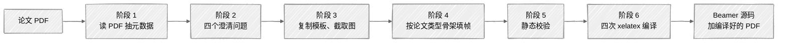

**本附录目标**

- 看清此 Skill 解决的问题:现有 AI 生成 PPT 在学术场景下的不足
- 理解整体设计:六阶段流水线、论文类型骨架、模板四层栈
- 跟着完整安装步骤操作一遍
- 跟随一次完整首次运行的对话
- 了解使用过程中遇到的问题

---

完成本书初稿后,我手中仍有一个未处理的事项:**如何把一篇论文转换为组会汇报的 Beamer 幻灯片**。组会几乎是研究生周更的频率,每次手工制作一套幻灯片需半天到一天。该事项若不自动化,前面章节累积的效率优势会被抵消大半。

本附录介绍我做的新 Skill `paper-to-beamer`。



## F.1 此 Skill 的必要性

我试用过几款"AI 一键做 PPT"工具,放入组会场景后发现三个问题:

**生成内容不符合学术规范**。通用 PPT 工具默认风格更接近工作汇报或商业路演,使用花哨图标、渐变背景、营销腔标题。此类视觉语言在组会上不合适。专业术语、公式表述、引用体例也常与学术规范有差异,放到组会上仍需逐页清理。

**AI 生成图片中的中文字符经常错位或损坏**。这是当前阶段图像生成工具的结构性问题。让它绘制带中文标注的架构图,汉字易出现缺笔画、字形走样、或拼成无法识别的字符。一旦被导师看出难以处理。

**修改成本较高**。AI 生成的 PPT 是"最终产物",想修改一个局部(例如替换某个术语、把某个标注向左移动),多数工具要么不支持,要么修改后即重新生成整页风格。组会汇报需根据导师反馈反复调整。

结论:现阶段做组会汇报最稳健的仍是 LaTeX 的 Beamer。Beamer 默认排版符合学术审美,中文通过 `xeCJK` 加华文楷体可稳定无乱码,源码是纯文本 `.tex`,任一页均可单独修改。配图直接从原始论文 PDF 截取,不使用 AI 生图。讲的就是论文本身,显示原图最贴合内容。

但 Beamer 手写较慢,二十多页汇报全手工至少半天。因此让 AI 撰写 Beamer 源码:**确定性流水线生成,兼顾 AI 速度与 LaTeX 可修改性**。

## F.2 整体设计

### 六阶段流水线

<GhAlert type="note">

**定义 F.1 — paper-to-beamer 的六阶段**

</GhAlert>

>
> - **阶段一**:用 `/pdf` 抽取标题、章节、关键公式与图表位置,存为 JSON
> - **阶段二**:`AskUserQuestion` 一次性提出四个澄清问题,即语言、时长、主题、插图方式
> - **阶段三**:复制字体与主题文件,用 PyMuPDF 三倍缩放截取关键图
> - **阶段四**:按论文类型选骨架,逐帧填入内容
> - **阶段五**:Python 校验脚本做静态检查(括号、环境、引用、图片)
> - **阶段六**:`xelatex` → `bibtex` → `xelatex` → `xelatex` 运行四次完整编译

每阶段有明确输入输出与退出条件,上一阶段通过局部检查后下一阶段才启动。该"拆小步"思路与第 3 章"一次会话只做一件事"一致。

### 论文类型到幻灯结构的映射

不同类型的论文应有不同的讲解方式。架构型重点在模型图,实证型重点在实验结果。让大模型自行决定章节比例,常出现"八页背景两页方法"的失衡。因此在 Skill 中固定了四类骨架。

<div align="center">

| 类型 | 背景 | 方法 | 实验 | 总结 |
|:--|:--:|:--:|:--:|:--:|
| 架构型 | 3 到 4 | 8 到 10 | 3 到 4 | 2 |
| 实证型 | 3 | 3 | 6 | 2 到 3 |
| 综述型 | 3 | 8 | 3 | 2 |
| 理论型 | 4 | 8 | 3 | 2 |

</div>

最常见的架构型,二十五分钟汇报被切分为 2 页概述、3 到 4 页背景、8 到 10 页架构、2 到 3 页训练、3 到 4 页实验、2 页总结,加目录页约 25 帧,满足"一分钟一页"的组会经验。

### 模板四层栈

模板外观与内容分层解耦:

- **引擎层**:固定为 `XeLaTeX + BibTeX`
- **CJK 层**:`xeCJK` 加华文楷体字体文件
- **主题层**:主题配色与自动目录
- **内容层**:Claude 在阶段四逐帧填入的 `.tex`

更换学校或字体时只修改对应层,内容层不必动。

## F.3 安装

#### 确认两件事

`claude --version` 显示版本号说明 Claude Code 已安装。从附赠包中取得 `paper-to-beamer/` 文件夹。

#### 核心安装命令

```bash
cp -r paper-to-beamer ~/.claude/skills/
```

在 `paper-to-beamer/` 父目录中运行。

#### 验证

```bash
ls ~/.claude/skills/paper-to-beamer/
```

看到 `SKILL.md`、`assets`、`references`、`evals` 即安装完成。无需重启 Claude Code。

## F.4 首次运行:完整对话演示

假设有 `bert.pdf`,做一个 20 分钟的中文组会汇报。

#### 第一步:在 PDF 目录打开 Claude Code

`cd` 到 `bert.pdf` 所在文件夹,运行 `claude` 启动会话。

#### 第二步:用自然语言下指令

```
用 paper-to-beamer skill 把 bert.pdf 做成 20 分钟的中文组会 PPT
```

它检测到 `beamer` 与"组会 PPT"关键词后会自动加载 Skill。

#### 第三步:回答四个澄清问题

- **语言**:中文为主加英文术语 / 全英文 / 双语对照(组会选第一个)
- **时长**:15 到 20 分钟 / 25 到 30 分钟 / 40 到 45 分钟(20 分钟选第一档)
- **主题**:保留模板原样 / 去掉校徽保留配色 / 自定义
- **插图方式**:从 PDF 截取 / TikZ 重绘 / drawio 重绘(建议第一个)

不确定时按推荐项选择,组会场景下默认值已足够。

#### 第四步:等待流水线运行完成

它依次执行:`/pdf` 读取论文、PyMuPDF 截图、按类型骨架编写 LaTeX、运行预校验、打印完成报告。几分钟即可完成,不要打断。

#### 第五步:获取工作目录并编译

生成的目录默认为 `paper_writeup/`,内含 `main.tex`、`figs/`、`ref.bib`、主题样式与字体。本地有 TeX Live 时:

```bash
xelatex main.tex
bibtex main
xelatex main.tex
xelatex main.tex
```

无本地 TeX 环境时(多数同学的情况),把整个工作目录拖到 Overleaf 新项目,编译器改为 XeLaTeX,点击 Recompile 即可。

## F.5 使用过程中遇到的问题

<GhAlert type="warning">

**subsection 问题**

</GhAlert>

>
> 首次编写时未意识到主题样式在 `\AtBeginSubsection` 中也注册了目录钩子。生成的 PDF 七十多页,一半是重复目录。后续在 SKILL.md 中加了硬规则:完全禁用 `\subsection{}`,二级切分改用加粗段落或 `block` 环境。

<GhAlert type="warning">

**内容密度上限有时偏紧**

</GhAlert>

>
> "每帧最多两个公式"对 BERT 够用,但对 GAN 极小极大目标或 ResNet 残差块就显得局促。当前处理是拆到下一帧,但会打断推导。下一版做"论文类型敏感"的密度规则,理论型放宽到四个。

<GhAlert type="warning">

**图片抽取需人工核对**

</GhAlert>

>
> PyMuPDF 按矩形坐标裁剪,坐标不准会截到一半。Skill 抽完后用 `Read` 查看缩略图确认,但视觉判断不一定可靠。建议拿到工作目录后手动浏览 `figs/`,裁切不好时让 Claude 重裁。

<GhAlert type="warning">

**模板配色并非万能**

</GhAlert>

>
> 默认配色与字体风格相对固定。若觉得不合适,需自行修改主题样式中的 RGB 值。下一版计划做多模板支持、下拉选择。

## F.6 附赠的 paper_writeup.pdf

附赠包中除 `paper-to-beamer/` 外还有一份独立 PDF,文件名 `paper_writeup.pdf`。这是一份 6 页双栏中文学术论文,标题为《Paper-to-Beamer:一个面向科研组会汇报的论文转幻灯片 Skill 的设计与实现》。所讲内容与本附录一致,形式上为双栏论文格式,含摘要、引言、相关工作、六张图、三张表、十一条参考文献。

**单独制作的原因**。本书的语气是"师兄分享",适合从头到尾阅读。科研同行有时需要**呈现为学术论文形式**的版本。组会上提到"我用了一个自己做的 skill"时,出示一份双栏论文比出示一本书的章节更具说服力。

**打开方式**。普通 PDF。若需修改内容(更换作者、修改配色),LaTeX 源码位于 `paper_writeup_source/`,Overleaf-ready,XeLaTeX 编译。

**该论文的生成方式**。由另一个 Skill `skill-to-paper` 生成,并非手写。`skill-to-paper` 的输入是已有的 Skill 目录,输出是介绍该 Skill 的双栏论文。位于附赠包的 `bonus/skill-to-paper/`。安装方式相同,`cp -r` 到 `~/.claude/skills/`。

<GhAlert type="important">

**教科书与论文**

</GhAlert>

>
> 本附录与 `paper_writeup.pdf` 的关系类似教科书与论文。前者教程性质、循序渐进、适合从头阅读;后者结论性质、压缩、适合快速浏览。同一件事的两种形态,按阅读场景选其一即可。

---

<div align="center">

[← 附录 E · 常见错误速查](appendix-e.md) &nbsp;·&nbsp; [返回目录](../README.md)

</div>
