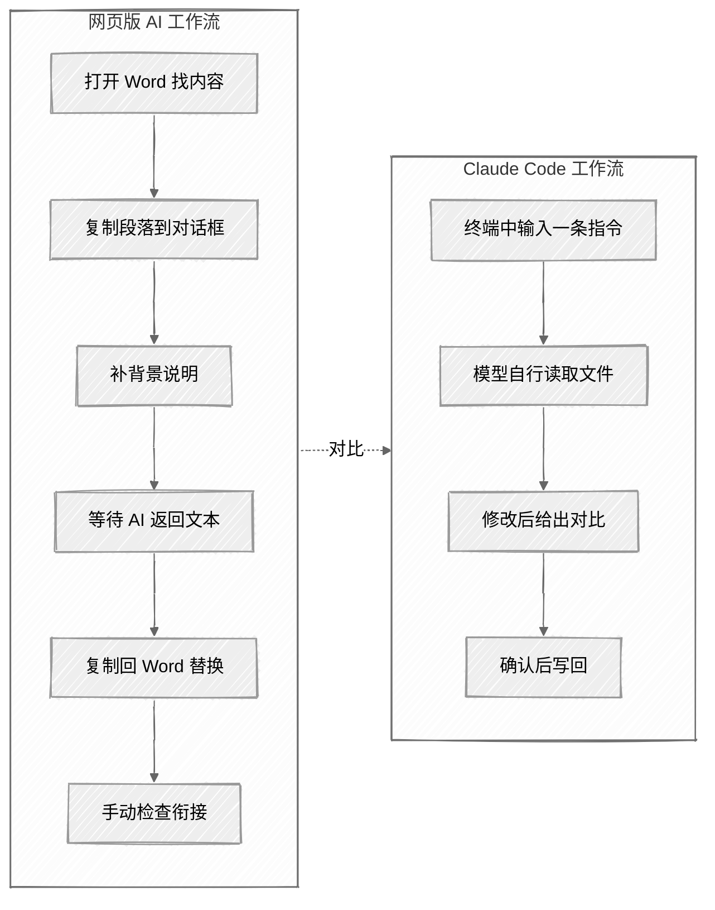

<ChapterAudience>

比较网页版 AI 与 Claude Code 在论文场景下的差别；理解 Claude Code 的核心机制:直接读写本地文件,在终端中执行跨文件操作；完成账号注册、订阅、安装,把论文组织成一个完整项目；掌握首次使用的四条注意事项:模型会出错、需先备份、单次任务单一、指令需具体。

</ChapterAudience>

<video autoplay loop muted playsinline class="academic-figure" aria-label="人维护知识库的失败循环" src="/books/claude-code-paper-writing/figure/01_failure_loop.mp4"></video>

<Subtext>图 1 · 人维护知识库的失败循环</Subtext>


论文提交前一个月,导师一次性给了 40 多条修改意见。其中一部分指向具体位置(如"第三章表 4-2 的最小值标错了"),一部分是较为宏观的判断(如"摘要写得过于琐碎,需要拔高"),还有几条彼此存在矛盾。按以往的做法,逐条阅读、判断、打开 Word 修改,40 多条意见预计两周。

那天晚上的处理方式做了调整。我把这 40 多条意见按章节分组,每条翻译成 Claude Code 能执行的具体指令,再一章一章交给它处理。整套修改用了 4 天完成。

Claude Code 会出错,而且错误较为隐蔽,这一点后文会专门讨论。但在直接读取论文文件、自行定位、给出对比这件事上,它的速度比手工高出不少。40 多条意见里那些机械性的部分,例如统一术语、调整格式、补充过渡句、改写口语化表达,它处理得比我快。省下的时间留给真正需要判断的几条修改意见。



<GhAlert type="note">

**定义 1.1 — Claude Code**

</GhAlert>

>
> Claude Code 是 Anthropic 公司开发的命令行 AI 助手,运行在终端中,可直接读取并修改本地文件、执行终端命令、调用外部工具。与网页版 AI 的区别在于,使用者不需要把文件内容复制到对话框,模型直接操作本地文件系统。
>
> 论文写作中常用的三类能力是:跨文件检索与修改、批量统一格式与术语、执行代码与编译 LaTeX。

## 1.1 网页版 AI 改论文的局限

在使用 Claude Code 之前,我用过 ChatGPT 处理论文修改。功能上可行,但效率上较低。耗时的环节主要在准备材料,AI 本身的处理时间反而不长。

每次打开新对话,第一步是粘贴一段背景介绍,例如"论文方向是 XXX,目前写到第三章"。这段文字不会进入论文,只是在告诉 AI 当前的研究背景。一周需要粘贴七八次。

跨文件任务的成本更高。导师指出"第三章和第四章的变量定义对不上",使用者需要打开两个文件,把相关段落复制到对话框。论文 4 章正文加 1 份参考文献,准备材料就要十几分钟。如果做全文术语一致性检查,一个下午就会耗在这件事上。网页版返回的是一段文本,使用者还要复制回原文件、替换段落、检查前后衔接。

Claude Code 解决了这一系列流程问题。它运行在终端,在论文文件夹下启动后能直接访问所有文件。一句"把全文的因变量统一改成被解释变量",它会自行扫描 4 个文件,2 分钟内完成,每处修改标记清楚,改后直接写回。它还能执行终端命令:让它把 Word 转 LaTeX,它会调用 pandoc;让它编译 LaTeX,它会运行 `xelatex`。

使用半年、累计一百多次会话后我观察到,Claude Code 帮助最大的场景正是论文写作里最机械、最耗时的部分:跨文件一致性检查、格式与术语批量统一、把导师的宏观批注落实到具体段落。

## 1.2 一个完整的例子:跨文件术语排查

抽象描述不易理解,用具体任务走一遍。

论文里"被解释变量"与"因变量"两个词混用,前后章节都有,导师开会时指出过。

网页版的处理流程是:打开 `ch1_intro.docx`,用 Ctrl+F 搜索两个词、记录位置;再依次打开 ch2、ch3、ch4 重复同样的操作;把搜索结果汇总后逐条判断哪些该改、哪些应保留原文(部分是引用原文);最后回到每个文件做替换。4 个文件搜索一遍,30 分钟左右。

Claude Code 中只需输入一条指令:

<div align="center">
  
</div>

2 分钟扫完 4 个文件,返回清单:ch2 中"被解释变量"出现 14 次、"因变量"出现 3 次;ch4 中"被解释变量"出现 8 次、"因变量"出现 21 次,每一处都附上下文。确认没有需要保留原样的引用后,我说"统一改成被解释变量",修改完成后它给出每处的改前改后对比。

整套流程不超过 5 分钟。

<div align="center">

| 网页版 AI | Claude Code |
|:--|:--|
| 逐个打开文件、Ctrl+F 搜索、手工记录位置 | 一句话扫描全部文件 |
| 搜索结果需要使用者汇总成表 | 直接返回按文件分组的清单 |
| 替换需要回到每个文件逐处操作 | 确认后直接写回,改后给出对比 |
| 全程约 30 分钟 | 全程约 5 分钟 |

</div>

其他论文任务流程类似。导师提出"摘要过于琐碎,需要拔高",使用者把该要求翻译成具体指令,模型读取摘要文件、按指令修改、给出改前改后。参考文献需要逐条核查格式时,可以派 3 个并行 Agent 分批处理,40 分钟完成(详见第 10 章)。整篇论文从 Word 转 LaTeX,模型会自行调用 pandoc 完成转换。

## 1.3 起步:从注册到第一次运行

本节给出从零起步的流程:终端基础、账号订阅、安装、项目文件夹、首次启动。每一步只讲必要内容,具体细节可查附录 E 或《Claude Code 第一课》。

### 终端基础

终端是一个用于输入命令的窗口。macOS 中称为"终端"(Terminal),Windows 上使用 PowerShell。打开方式如下:

- **macOS**:按 `Cmd + 空格` 调出 Spotlight,输入 `Terminal` 后回车
- **Windows**:按 `Win` 键搜索 `PowerShell`,选择不带 (x86) 后缀的那一个

打开后看到类似 `yourname@MacBook-Pro ~ %`(macOS)或 `PS C:\Users\YourName>`(Windows)的提示符,光标在末尾等待输入命令。后续操作主要用到三条命令:

| 命令 | 作用 |
|:--|:--|
| `pwd` | 显示当前所在文件夹 |
| `ls`(Windows 用 `dir`) | 列出当前文件夹内容 |
| `cd 文件夹名` | 切换到指定文件夹 |

这三条命令输错不会损坏系统,常见的报错形式是 `command not found`,按上方向键调出上一条命令修改后重试即可。

### 费用与订阅档位

Claude Code 需要 Anthropic 账号,订阅分三档:

<div align="center">

| 方案 | 月费 | 用量 | 适用情况 |
|:--|:--:|:--:|:--|
| Pro | $20/月 | 基础用量 | 入门阶段使用 |
| Max 5x | $100/月 | Pro 的 5 倍 | 论文冲刺期、每日使用时长 2 小时以上 |
| Max 20x | $200/月 | Pro 的 20 倍 | 长期高强度使用 |

</div>

**首次订阅建议从 Pro 起步**。原因是用量配额很难事先估准,Pro 用一两周后若频繁触及上限再升级 Max 5x。升级即时生效,降级下月生效,档位选择的代价较小。

我自己平时使用 Pro,论文冲刺期升 Max 5x 用了两个月,之后降回 Pro。三档功能完全相同,差别只在用量配额。

<GhAlert type="tip">

**国内用户支付**

</GhAlert>

>
> Anthropic 不支持国内银行卡,需要 Visa 或 Mastercard,或通过 iOS App 用美区 Apple ID 礼品卡充值订阅。具体路径可搜索"Claude 订阅 国内支付"找到教程。

### 安装

**macOS 与 Linux** 打开终端,运行:

```bash
curl -fsSL https://claude.ai/install.sh | bash
```

安装完成后输入 `claude --version`,显示版本号即为成功。

**Windows** 先到 [git-scm.com/downloads/win](https://git-scm.com/downloads/win) 安装 Git for Windows(Claude Code 在 Windows 上依赖 Git Bash 运行命令),然后打开 PowerShell:

```powershell
irm https://claude.ai/install.ps1 | iex
```

安装完成后同样运行 `claude --version` 验证。

<GhAlert type="tip">

**首次安装后运行 `claude doctor`**

</GhAlert>

>
> 这是官方提供的环境检查命令,几秒内逐项核查安装路径、版本、依赖、登录状态。绿色表示通过,红色表示异常。首次运行时"登录"那一项为红色属于正常情况,登录步骤紧接着进行。其他项目显示绿色或黄色即可。
>
> 若 `claude --version` 返回 `command not found`,绝大多数情况是 PATH 未配置好。macOS 需要把 `~/.local/bin` 加入 PATH;Windows 重启 PowerShell 通常即可解决(详细方案见附录 E)。

### 把论文组织成一个项目

写过代码的读者对"项目"概念较熟悉,即一个独立文件夹,包含本次工作所需的全部文件。科研读者首次接触 Claude Code 时常见的状态是:论文 Word 在 Documents 中,参考文献 PDF 分散在桌面、下载、邮箱附件,回归代码在 D 盘某个文件夹,导师反馈截图在微信文件夹。每样东西都有,但缺一个集中位置。

Claude Code 启动时以一个文件夹为根目录,**可读可改的范围仅限于该文件夹**。文件分散在五处时它无法帮上忙。正式开始之前的第一件事,是把研究相关文件归到同一个文件夹下,这个文件夹即所谓"项目"。

一个最小可用的论文项目结构大致如下:

```
~/Desktop/thesis/
├── chapters/        # 各章正文(Word 或 .tex)
├── figures/         # 图片
├── references/      # 文献 PDF
├── references.bib   # BibTeX 参考文献库
├── notes.md         # 笔记
└── CLAUDE.md        # 给 Claude Code 读取的项目说明(第 2 章详述)
```

文件夹名称随意,子文件夹也不必拘泥于这五个。关键是**一次研究对应一个文件夹**,路径中尽量**不含空格和中文字符**。`~/Desktop/thesis` 在终端中的可用性优于 `~/桌面/我的 毕业论文/`。

若现有文件分散在多处,首次归拢需要十几分钟:新建一个空文件夹,把论文正文、文献 PDF、数据、笔记从各处转移过来。归拢过程中可以同步审视每个文件是否还在使用、本次研究是否需要。

### 第一次启动

启动 Claude Code 之前需先 `cd` 到项目文件夹:

```bash
cd ~/Desktop/thesis    # 替换为项目实际路径
claude
```

首次运行会自动弹出浏览器进行授权,按提示点击 Authorize 即可(走 OAuth 流程,无需手动复制 token)。登录完成后回到终端,看到对话输入框的光标在闪烁,即可开始对话。

<GhAlert type="warning">

**启动位置决定可访问范围**

</GhAlert>

>
> 启动 Claude Code 之前必须先 `cd` 到项目文件夹。它能读取与修改的内容,完全取决于启动时所在的位置。
>
> 若让它"读 ch3.tex"返回"找不到",先退出会话用 `pwd` 查看启动位置,大概率是没有 cd 或 cd 错位置。

首次会话建议从只读任务开始,例如让它列出当前文件夹的内容:

<div align="center">
  
</div>

它会扫描文件夹列出所有文件,并根据文件名推测用途。确认它能正确读取文件后,再尝试修改类任务。

<GhAlert type="tip">

**建议先安装 PDF 与 docx 两个技能**

</GhAlert>

>
> 大多数论文是 Word 格式,文件夹中也常有 PDF 文献。Claude Code 有两个常用技能:`/pdf` 提取 PDF 全文,`/docx` 读写 Word 文档。安装方法是在对话中说"帮我安装 pdf 这个 skill"与"帮我安装 docx 这个 skill",由它自行完成。仓库 `book-companion-skills/` 目录下也有现成版本,复制到 `~/.claude/skills/` 即可使用。

## 1.4 首次使用的四条注意事项

下面四条都是使用半年后总结的经验,建议从第一天起就遵守。

#### 注意事项一:模型会出错,且错误较为隐蔽

这是全书最重要的一条提醒,放在首位。

某次我让它调整一段方法论描述的语气,要求更正式。它修改完后我扫了一眼,句子通顺度有所提高,直接保存。三天后导师在那段话旁批注:"这个表述不对,'双向固定效果模型'是什么?我们一直用的是'双向固定效应'。"

回去核查发现,Claude Code 在润色过程中把"双向固定效应"改成了"双向固定效果"。词义接近,但本领域有固定用法,改了即为错误。问题是当时未发现,该处只改了一处,夹在一大段修改中,肉眼很难察觉。

另一次更隐蔽。我让它统一文献综述的写法,它在修改过程中删掉了一个引用编号 [17],导致那段话从有据可查的论述变成无出处的断言。若不是后续逐句核对,该错误就会留在交付稿中。

<GhAlert type="warning">

每次 Claude Code 修改完成后,不要只读它给出的总结,需要自行把改前改后逐行对比一遍。它的总结反映的是模型自身认定的修改内容,与实际修改可能存在偏差。

</GhAlert>


#### 注意事项二:修改文件之前需要先备份

Claude Code 直接修改本地文件,**没有自动备份,也没有撤销机制**。修改出现问题时,原文件无法恢复。

某次我让它调整 Word 文档的格式,XML 结构遭到破坏,文件无法打开。当时没有备份,只能从邮件附件中找出之前的版本,花了一整天恢复。从那以后,在它动手之前我会先运行一行备份命令:

```bash
cp thesis.docx "thesis_backup_$(date +%Y%m%d).docx"
```

LaTeX 用户的处境更稳妥。LaTeX 是纯文本,可以用 git 做版本管理,每次修改都有记录,随时可以回退。这也是我后来把整篇论文从 Word 转到 LaTeX 的原因之一(第 8 章详述)。

#### 注意事项三:一次会话只做一件事

不要在一次会话中安排多项任务。"帮我把第三章润色一下、再核对一下引用、顺便把图表标题统一成中文"这类指令它能听懂,但执行过程中容易顾此失彼。润色完忘了核对引用,或者修改图表标题时把正文中某个引用一并改动。

一次会话只做一件事。润色就是润色,核对引用就是核对引用,统一图表标题就是统一图表标题。具体做法在第 3 章展开。

#### 注意事项四:指令需要具体,不能笼统

笼统的指令如"改得更通顺"、"语气更正式"、"逻辑再清楚一点",模型会按自己的理解执行,结果常与预期偏差较大。具体的指令如"把句子拆短,每句不超过 25 字"、"把本研究表明改成本文发现"、"在第二段末尾加一句过渡到下一段的话",执行结果更接近预期。

把笼统的导师反馈翻译成具体指令的方法,在第 3 章末与第 14 章会专门讨论。

## 本章小结

<div align="center">

| 核心概念 | 核心内容 | 常见误解 | 为什么错 |
|:--|:--|:--|:--|
| Claude Code 的本质 | 命令行 AI 助手,直接读写本地文件 | 与 ChatGPT 相同,只是界面不同 | 关键差别是不需要复制粘贴材料,能跨文件操作并执行命令 |
| 最适用的论文任务 | 跨文件一致性检查、批量统一格式与术语、把导师批注落地到具体段落 | 让它从零写论文 | 它擅长机械性收尾,不擅长学术判断 |
| 终端基础 | 三个命令:`pwd` / `ls` / `cd` | 终端只面向程序员,文科生无法使用 | 终端就是一个输入命令的窗口,三条命令足以启动 Claude Code |
| 订阅选择 | Pro 入门,冲刺期升 Max 5x | 起步即购买顶级方案 | 用量需要在 Pro 上摸清节奏,频繁触上限再升级 |
| 项目文件夹 | 一次研究对应一个文件夹 | 文件分散在各处也能使用 | Claude Code 启动时以一个文件夹为根目录,分散即无法访问 |
| 首次启动 | 先 `cd` 到项目文件夹再 `claude` | 任意位置启动均可 | 启动位置决定可访问的文件范围,位置错误即找不到目标文件 |
| 模型出错 | 错误隐蔽,夹在大段修改中 | 看它的总结就够了 | 总结反映的是模型自认的修改,需要使用者自行 diff 验证 |
| 备份纪律 | 修改 `.docx` 前必须备份;LaTeX 加 git 更稳妥 | 模型不会损坏文件 | XML 结构脆弱,一次失败需要半天恢复 |
| 单会话单任务 | 一次只做一件事 | 多任务一并交付更省时间 | 任务混合时容易顾此失彼,后续需要回头补救 |
| 指令具体化 | 把"改得通顺"翻译成"句子不超过 25 字" | 笼统指令同样可用 | 笼统指令的执行结果不可预测,第 3 章详细讨论 |

</div>

下一章讨论如何让 Claude Code 真正"记住"研究背景:通过 CLAUDE.md 与 Memory 系统,把研究方向、术语锁定表、导师偏好等信息固化下来,避免每次重新交代背景。

---

<div align="center">

[返回目录](../README.md) &nbsp;·&nbsp; [第 2 章 · 上下文与记忆机制 →](chap02.md)

</div>
