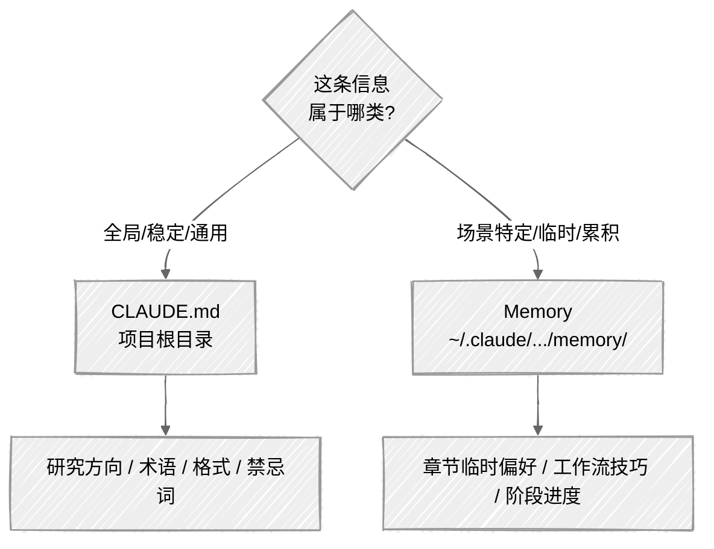

<ChapterAudience>

理解上下文窗口的工作原理及关闭终端后内容清空的原因；掌握 CLAUDE.md 的写法,把启动时自动加载的项目说明固化下来；掌握 Memory 系统的用法,跨会话保留动态信息；区分研究背景、术语表、写作要求的分层管理方式。

</ChapterAudience>

<video autoplay loop muted playsinline class="academic-figure" aria-label="RAG 流程与 Wiki 流程对照" src="/books/claude-code-paper-writing/figure/02_rag_vs_wiki.mp4"></video>

<Subtext>图 2 · RAG 流程与 Wiki 流程对照</Subtext>


第 1 章介绍了 Claude Code 的安装与首次使用注意事项。使用一段时间后会遇到一个共性问题:**关闭终端再重新打开,模型不保留任何之前的内容**。上次告知的研究方向、术语表、导师偏好,全部清零。

第 1 章提到我有段时间把背景介绍存在备忘录中专门粘贴。后来才知道 Claude Code 提供了两套机制处理这一问题:CLAUDE.md 与 Memory。理解清楚之后,重复交代背景的情况就不再出现。

## 2.1 上下文窗口:模型为何"遗忘"

<GhAlert type="note">

**定义 2.1 — 上下文窗口(context window)**

</GhAlert>

>
> 单次对话中模型能处理的最大信息量,以 token 计量。使用者输入的每句话、模型读取的每个文件、模型生成的每段回复都在消耗这个空间。Claude Code 默认 20 万 token(约 12 到 15 万中文字),Max 计划可扩展到 100 万 token。**关闭终端后上下文清空,下一次对话从零开始**。

可以把上下文窗口理解为一张桌子,桌面上能放的文件数量有限,放满后必须取下旧的才能放入新的。单次对话内通常不会触及上限,完成一件具体工作的信息量远低于该容量。

真正的问题出在"下一次对话"。第二天重新打开 Claude Code,前一次对话的全部内容清空。它没有长期记忆,每次对话独立运行,上一次的内容对模型而言相当于从未发生。

我论文写作历时半年多,累计开启一百多次对话,每次第一件事都是粘贴一段三四百字的背景介绍。单次操作两三分钟,次数累积起来时间不少,而且容易遗漏某条约束。某次忘记粘贴术语锁定表,直接导致了第 1 章提到的术语被改事件。

处理方法很直接:把"每次都要交代的信息"写到一个固定位置,让 Claude Code 启动时自动读取。该机制即 CLAUDE.md。

## 2.2 CLAUDE.md:项目级持久说明

<GhAlert type="note">

**定义 2.2 — CLAUDE.md**

</GhAlert>

>
> 放置于项目根目录的纯文本配置文件。Claude Code 在该目录下启动时会自动读取文件的全部内容,相当于每次对话开始前都已接收这份说明。适合写入**不常变动的持久信息**:研究方向、核心方法、术语锁定表、导师固定要求。

### 文件位置与基本内容

文件放在论文文件夹根目录,例如 `~/Desktop/thesis/CLAUDE.md`,任意文本编辑器均可编辑。文件为 Markdown 格式,不需要特殊工具。

起步阶段写三个部分即可:研究方向、术语锁定表、输出格式要求。模板如下:

```markdown
# 项目说明

## 研究方向
本论文研究 XX 因素对 YY 的影响及空间溢出效应。
核心工作:熵值法、双向固定效应、空间杜宾模型。

## 术语锁定表
以下术语不得修改或替换:
- 「被解释变量」(不要改成「因变量」「响应变量」)
- 「双向固定效应」(不要改成「双向固定效果」「TWFE」)
- 「空间杜宾模型」(不要改成「空间回归模型」「SDM」)

## 输出格式
- 使用学术中文,不出现口语化表达
- 不使用导师明确禁止的词汇
- 修改任何内容后给出改前改后对比
```

我的 CLAUDE.md 比上面更详细,约 200 行。除三块基础内容,还包含项目架构、常用命令、代码风格说明,这些是项目本身需要。不必一次写完,起步 30 到 50 行已经够用,使用过程中按需扩充。

### 术语锁定的效果

术语锁定表是 CLAUDE.md 中最实用的一部分,经验来自踩坑。

某次我让 Claude Code 改一段话的措辞,它在润色过程中把论文核心概念换成了近义词。两种说法语义接近,但论文里始终使用前一种,一改章节之间就不一致。另一次,导师明确说某个词不能用(方法与该词的严格含义不对应,易被评审攻击),但 Claude Code 不知道这一背景,改稿时使用了禁用词。

写入术语锁定表之后这类问题不再出现:

<div align="center">

| 无术语锁定(直接说"润色这段") | 有术语锁定 |
|:--|:--|
| "被解释变量"被改成"因变量" | "被解释变量"保持原样 |
| "双向固定效应"被改成"双向 FE" | 保持原样 |
| "空间杜宾模型"被改成"空间计量模型" | 保持原样 |
| 自行删除一处括号注释 | 仅调整语句通顺度,未删内容 |

</div>

<GhAlert type="tip">

**术语锁定表无需写得过长**

</GhAlert>

>
> 先列出最核心的 5 到 10 个术语,尤其是容易被 AI 同义替换的词,后续发现新问题再补充。

### CLAUDE.md 的更新时机

CLAUDE.md 是一份**持续维护的文档**,需要随项目推进不断更新。导师每次开会给出新反馈即追加几行(例如"标题不再使用'策略'一词");发现 Claude Code 反复出现同类错误即追加一条规则(我加过"默认输出格式为 LaTeX",此后未再出错);项目结构调整时同步更新(新增数据文件夹、修改章节编号)。

## 2.3 Memory 系统:跨会话记忆

CLAUDE.md 解决了"每次重启都要交代背景"的问题。使用一段时间后会发现还有一类信息 CLAUDE.md 不便承载。

举两个例子:导师开会时随口说"结论部分用被动语态",指向具体且仅适用于结论那一节,写入 CLAUDE.md 显得琐碎;某次对话中发现 LaTeX 输出比 Word 稳定,该经验下次仍有参考价值,但也不值得专门写入 CLAUDE.md。

这类**零散且有局部价值的信息**由 Memory 系统承担。

### Memory 与 CLAUDE.md 的边界

CLAUDE.md 是使用者手动维护、置于项目文件夹、每次启动均被读取的说明书,适合存放**全局稳定**信息(项目背景、术语表、代码风格、导师基本要求)。

Memory 由 Claude Code 自动管理,存放于其配置目录下,适合存放**场景特定或阶段性**信息(单次对话中提到的偏好、某文件的特殊处理、上次工作进度)。这类信息可能两周后即过时(例如"目前在改第四章"在改完后失去意义),但在有效期内具有价值。

<GhAlert type="important">

**判断标准只有一条**

</GhAlert>

>
> 无论做什么任务都需要知道的信息,放入 CLAUDE.md;仅在特定场景下有用的信息,放入 Memory。



### Memory 的结构与用法

Memory 系统在项目配置目录下建立 `memory/` 文件夹,内含 `MEMORY.md` 索引,指向各具体记忆文件:

```
memory/
├── MEMORY.md                        # 索引
├── feedback_writing_clarity.md      # 导师写作要求
├── feedback_book_writing_style.md   # 文风反馈
└── project_book_claude_code.md      # 项目信息
```

`MEMORY.md` 是简短索引(每条一行的 `[标题](文件)` 加一句话摘要),具体记忆文件存储详细内容。

用法很简单。直接在对话中说"记住:某条信息",Claude Code 会写入 Memory 文件。下次重启后它读取 Memory 即可获知该约束。需要回忆时直接说"看一下你的记忆里有没有关于导师禁用词的记录"。

### 适合存入的内容

**适合 Memory** 的内容包括:导师随口提出的具体要求(例如"结论用被动语态")、阶段性进度(例如"目前在改第 7 章")、使用过程中发现的技巧(例如"LaTeX 输出比 Word 稳定")。

**应写入 CLAUDE.md 而非 Memory** 的内容包括:项目整体背景与架构、核心术语锁定表、常用命令与配置。这类信息属于"无论做什么任务都需要知道的"层级。

## 2.4 实操:创建第一个 CLAUDE.md

#### 第一步:创建文件

```bash
cd ~/Desktop/thesis    # 项目文件夹路径
touch CLAUDE.md
```

#### 第二步:写入基本内容

任意编辑器打开 `CLAUDE.md`,将方括号中的内容替换为本项目情况:

```markdown
# 论文项目说明

## 研究方向
[例:本论文研究 XX 因素对 YY 的影响及空间溢出效应]

## 术语锁定表
以下术语在任何修改任务中保持原样:
- 「被解释变量」(不要改成「因变量」)
- 「双向固定效应」(不要改成「固定效果」)
- 「空间杜宾模型」(不要改成「空间回归模型」)

## 输出格式
- 使用学术中文
- 修改后给出改前改后对比
```

起步阶段写这三块已经足够,后续遇到问题再追加。

#### 第三步:验证生效

启动 Claude Code 后问一句"列一下你从 CLAUDE.md 里读到的信息"。若能复述写入的研究方向与术语表,说明已生效。

<div align="center">
  
</div>

#### 第四步:增量维护

导师给出新反馈即追加到禁忌词表;发现它频繁搞错输出格式即增加一条格式要求;项目结构调整时同步文件说明。每次只追加几行,不做大规模重写。

<GhAlert type="tip">

**CLAUDE.md 可纳入 git 管理**

</GhAlert>

>
> 若论文项目使用 git 管理,CLAUDE.md 可一并提交。这样在更换电脑或重装系统时,CLAUDE.md 会随项目同步,不会丢失。

至此使用者已具备两个工具让 Claude Code 保持上下文:CLAUDE.md 存放稳定信息,Memory 存放零散偏好。下一章讨论指令本身的写法,同样的任务换一种表达方式,执行结果会有明显差异。

## 本章小结

<div align="center">

| 核心概念 | 核心内容 | 常见误解 | 为什么错 |
|:--|:--|:--|:--|
| 上下文窗口 | 单次对话的信息容量,关闭终端即清空 | 模型能跨会话保留全部信息 | 模型本身没有长期记忆,每次对话独立 |
| CLAUDE.md | 项目根目录的持久说明书 | 越长越好 | 越长每次启动消耗 token 越多,仅写入核心信息即可 |
| 术语锁定表 | 列出不能被同义替换的核心术语 | 不写也可 | 缺少锁定表时模型会自行润色,导致术语在全文不一致 |
| Memory 系统 | 跨会话保存零散偏好与阶段性信息 | 与 CLAUDE.md 可互换 | 全局信息进 CLAUDE.md,场景偏好进 Memory,分层维护成本更低 |
| 主动写入记忆 | 直接说"记住:某条" | 必须写代码或编辑文件 | Claude Code 自行写入 Memory,无需手动 |
| 更新节奏 | 收到反馈或发现问题随时追加 | 写完即固定 | 写作过程中反馈持续到来,CLAUDE.md 是持续维护的文档 |

</div>

---

<div align="center">

[← 第 1 章 · Claude Code 简介与适用场景](chap01.md) &nbsp;·&nbsp; [返回目录](../README.md) &nbsp;·&nbsp; [第 3 章 · 提示词的使用经验 →](chap03.md)

</div>
