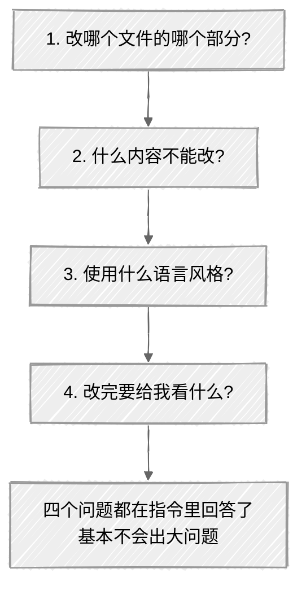
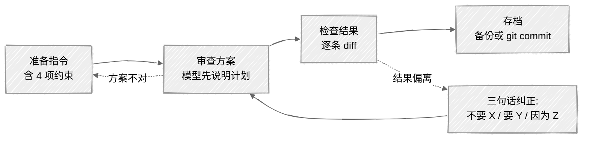

<ChapterAudience>

比较模糊指令与精确指令的差距,理解约束越多、出错越少；掌握"先确认方案再动手"的工作流；掌握术语保护的两个层级:全局锁定加任务级锁定；学会有效打断与纠正的三句话结构:否定、期望、理由；建立"一次会话只做一件事"的纪律；学会把导师反馈翻译成可执行指令。

</ChapterAudience>

第 1 章介绍了安装,第 2 章介绍了让模型记住背景的方法。本章讨论指令本身的写法。同一项任务交给 Claude Code,指令表达方式的差异会直接影响结果质量。

## 3.1 模糊指令与精确指令的差距

> [!NOTE]
> **定义 3.1 — 提示词(Prompt)**
>
> 输入给模型的自然语言指令。**约束越明确(范围、禁忌、风格、交付格式),模型自由发挥的空间越小,出错的概率越低**。

起步阶段我给的指令多为"帮我改一下第三章"。模型确实会做修改,但完成后会发现:未指定的位置也被改了,术语被替换成不想要的版本,格式被调整成它认为更合适的样子。审阅修改十分钟,还原不需要的改动二十分钟,效率不如手工修改一处。

问题在于指令过于笼统。"帮我改一下第三章"对人来说能理解为改措辞、顺逻辑,对 Claude Code 而言意味着把所有它认为可改进的位置全部修改一遍。它不知道使用者只想改某段表述,不知道哪些术语不能动,不知道目标是学术中文。

下面是几组对比:

<div align="center">

| 模糊指令 | 精确指令 |
|:--|:--|
| 帮我改一下第三章 | 修改第三章第 2 节,不改变论点,用学术中文,以下术语不得修改:「被解释变量」「双向固定效应」,改完给我看修改前后的对比 |
| 帮我润色一下摘要 | 润色摘要,去掉具体数值改为定性概括,保留所有引用编号,术语保持原样 |
| 帮我检查一下引用 | 读 references.bib,检查每条是否有作者、年份、期刊名,缺失的标出 |
| 帮我画个流程图 | 用 Draw.io(不要用 Mermaid)画研究框架图,包含数据收集、模型构建、实证检验三阶段,输出 .drawio 文件 |

</div>

<div align="center">
  
</div>

精确指令向 Claude Code 给出了四项信息:**修改范围、判断标准、不可改动项、交付内容**。约束越多,自由发挥空间越小,出错概率越低。

不必每次都写一大段。简单任务(例如"数一下 references.bib 里有多少条引用")一句话足够。但凡涉及修改文本的任务,建议把约束说清楚。

发指令前的检查清单如下:



## 3.2 先确认方案,再动手

这是使用一个多月后才形成的习惯,但**在所有技巧中投入产出比最高**。

某次让 Claude Code 帮我画研究框架图,指令为"帮我画个流程图",它直接用 Mermaid 语法画了出来。我需要的是 Draw.io 格式(导师要求 .drawio 便于后续修改)。这次浪费了十分钟,画完后才告诉它格式不对,它再重画一遍。如果一开始就指明工具,这十分钟可以省下。

更根本的问题是:**为何不让它先说明打算如何做**?

后续养成习惯,复杂任务的指令前会加一句:

```
在动手之前,先告诉我你的方案:
改哪个文件、用什么方法、输出格式是什么。
等我确认后再执行。
```

它会先列出计划:"我打算打开 ch3_method.docx 读第 2 节、用学术中文重写、保留术语不变、输出对比。你确认吗?"使用者扫一眼即可发现是否有误解,在该阶段纠正成本很低(改一句话),不必等到执行完才推翻重来。

第 1 章那次全文术语替换出现过更严重的情况。它不仅替换正文,还把表格标题、图注、BibTeX 文件中的注释一并修改,其中部分是引用原文的内容,不应改动。若指令中包含"先告诉我打算改哪些文件",它会列出受影响的文件清单,看到 BibTeX 时即可阻止。

> [!IMPORTANT]
> **命题 3.1 — 一句话节省大量返工**
>
> "先告诉我你的方案,等我确认再执行"的成本只是多一轮对话,可避免大量返工。该规则我目前几乎每次都使用。

## 3.3 术语保护:防止专业词被替换

> [!NOTE]
> **定义 3.2 — 术语锁定的两个层级**
>
> - **全局锁定**:写入 CLAUDE.md,对所有任务生效
> - **任务级锁定**:在单条指令中额外列出,仅对本次任务生效
>
> 两层叠加使用,可有效防止术语漂移。

第 2 章介绍过 CLAUDE.md 术语锁定表。本节补充另一个角度:**即便已有全局表,具体任务中仍建议再次列出**。

CLAUDE.md 的全局锁定覆盖"所有任务都不能改的词"。部分任务还涉及额外的术语敏感性。例如修改一段方法论描述时,某些词并不在全局表中,但在该上下文下不应被改动。

举例如下。我有一段文字写为"本文采用空间杜宾模型(SDM),以经济距离权重矩阵构建空间关联结构"。让 Claude Code 润色时,它把"经济距离权重矩阵"改成了"基于经济距离的空间权重矩阵"。语义接近,但论文前后几十处使用的都是"经济距离权重矩阵"这一简称,一改即与其他位置不一致。该词未列入全局锁定表(并非核心术语,只是特定技术表述),但本次任务中不应被改动。

处理方法是在任务指令中追加一句:

```
以下词汇在本次修改中保持原样:
「经济距离权重矩阵」「空间杜宾模型」「双向固定效应」
```

全局锁定承担"永远不能改"的层级,任务级锁定承担"这次不能改"的层级。两层结合使用,术语漂移概率可降到很低。

末尾再加一句"若你认为某术语需要修改,先问我,不要自己改",给出"不确定即询问"的提示,优于自行决定。

## 3.4 打断与纠正的方法

Claude Code 在复杂任务中存在走偏的情况。让它改一段话的逻辑,它可能改着改着重写了整段;让它检查引用格式,它可能边检查边删除被认为"多余"的引用。

**发现走偏即应打断**。Claude Code 运行在终端中,按一次 `Esc` 中断当前操作。撤销最近的修改,快速按两次 `Esc` 回退到上一个检查点。

**但打断之后如何表达,比打断本身更关键**。我起步阶段的错误是打断后只说"不对",或者"不是这样",然后模型按自己的理解重做一遍,结果依旧偏离。

后续学到的有效打断方式包含**三句话**:

```
不要重写整段话,我只需要调整第 2 句和第 3 句的逻辑顺序。
原因是:第 2 句说的是结论,第 3 句说的是依据,
应先依据后结论。其他句子保持不动。
```

结构为:**否定**(不要做 X)加**肯定**(我需要 Y)加**理由**(因为 Z)。给出理由后,它不仅知道本次怎么做,还能理解背后的原则,下次遇到类似情况出错概率会降低。

只说"不对"再让它重做,容易出现同类错误,因为它无法判断错在何处。

## 3.5 一次会话只做一件事

第 1 章简短提过,本节展开。

起步阶段我经常一次塞入三四个任务,例如"帮我改第三章逻辑,顺便统一引用格式,再检查术语不一致"。表面上效率更高。实际情况是,它做完前两项,执行第三项时遇到 rate limit,对话被打断,前两项尚未写入文件的成果全部丢失,只能重开对话从头开始。

发生过三四次之后定下规则:**一次对话只做一件事**。判断标准是,需求中包含两个以上"然后"即拆分。

拆开做的另一个好处是,每件事完成后即检查、确认、存档,中途出问题只需回滚该步,不影响之前的工作。

> [!TIP]
> **遇到 rate limit 被打断的处理方法**
>
> 终端中输入 `claude --continue`(简写 `claude -c`)恢复上次会话,它仍保留上下文,从断点继续。跨天的长任务可以让它维护 `checkpoint.md`,上下文压缩后它读取该文件即可知道进度(细节见第 10 章)。

## 3.6 把导师反馈翻译成可执行指令

导师反馈通常是定性的、宏观的,例如"逻辑不清晰"、"太口语化"、"这段拔高一下"。这类表达人能理解,但直接交给 Claude Code 它无法判断具体如何执行。

我的处理流程是:**先自行理解导师的意图,再翻译成具体操作指令**。关键是把定性评价转换成定量操作。

<div align="center">

| 导师原话 | 翻译成 Claude Code 指令 |
|:--|:--|
| 逻辑不清晰 | 第 X 段与第 Y 段之间缺过渡,补一句承上启下;第 Z 段结论放在依据前面,调换顺序 |
| 太口语化 | 替换:「所以」改成「因此」、「其实」删除、「很多」改成「大量」 |
| 摘要太琐碎要拔高 | 去掉具体数值(样本数、百分比)改为定性概括;从罗列做法改为概括贡献 |
| 这部分展开不够 | 第三章第 2 节当前两段,需要补:方法选择理由、数据来源说明、变量构建过程 |

</div>

**翻译过程本身是使用者在思考"导师认为哪里有问题"**。该步骤无法交给 AI 完成,因为它不了解导师的判断标准。但思考清楚之后,执行可以交给 Claude Code,它的速度高于手工。

第 1 章那次 40 多条修改意见即按此方法处理:用一个下午完成翻译,再用四天交给 Claude Code 逐条执行,总耗时比预估节省一周以上。

## 3.7 实操:用提示词模板改写一段论文

下面演示完整流程。假设论文中有一段被导师指出"太口语化,改正式一些"。



#### 第一步:准备指令

```
读一下 ch4_result.docx 的第 2 节。
导师指出这段「太口语化」,需要改成正式的学术表述。
在动手之前先告诉我你的方案。

具体要求:
1. 仅修改口语化词汇与句式,不改论点和逻辑结构
2. 以下术语不得修改:「被解释变量」「双向固定效应」「空间杜宾模型」
3. 改完给我看改前改后对比,标出每处改动
```

该指令使用了几项技巧:先确认方案、限定范围、术语保护、要求对比。

#### 第二步:审查方案

它会回复计划:"我打算读 ch4_result.docx 第 2 节,识别口语化表述替换为书面表达,保留术语。"确认无误后回复"可以开始"。

#### 第三步:检查结果

它完成后会给出对比。逐条审阅,核两件事:**术语是否被改、是否多改了不该改的位置**。如有问题,用 §3.4 的三句话纠正。

#### 第四步:存档

Word 工作流先备份再写入;LaTeX 加 git 工作流直接修改,用 `git diff` 检查差异,无误后 commit。

该四步流程(准备、审查方案、检查结果、存档)适用于大多数修改类任务,使用几次即可形成习惯。

## 本章小结

<div align="center">

| 核心概念 | 核心内容 | 常见误解 | 为什么错 |
|:--|:--|:--|:--|
| 提示词精度 | 范围加禁忌加风格加交付格式 | 简洁更高效 | 简洁等于歧义,模型按自己的理解自由发挥 |
| 先确认方案 | 复杂任务动手前要求列出计划 | 多一轮对话浪费时间 | 一次方案确认能避免一整次返工 |
| 双层术语锁定 | CLAUDE.md 全局加单任务级 | 写一次即可 | 全局管核心术语,任务级管"上下文敏感词" |
| 三句话打断 | 否定加肯定加理由 | 只说"不对"让它重做 | 缺少理由时模型按自己的理解再做一次,错误类型相同 |
| 单会话单任务 | 一次会话只做一件事,需求中两个"然后"即拆 | 多任务并发更省时间 | rate limit 打断时未存档成果会丢失 |
| 反馈翻译 | "逻辑不清晰"翻译成"调换 X Y 段顺序" | 直接把原话交给 AI | 笼统评价 AI 无法定位,翻译过程必须由使用者完成 |

</div>

至此已完整介绍安装、记忆、指令三层基础。前 3 章是基础环节,第 4 章开始进入论文写作的具体流程。

---

<div align="center">

[← 第 2 章 · 上下文与记忆机制](chap02.md) &nbsp;·&nbsp; [返回目录](../README.md) &nbsp;·&nbsp; [第 4 章 · 文献调研与管理 →](chap04.md)

</div>
