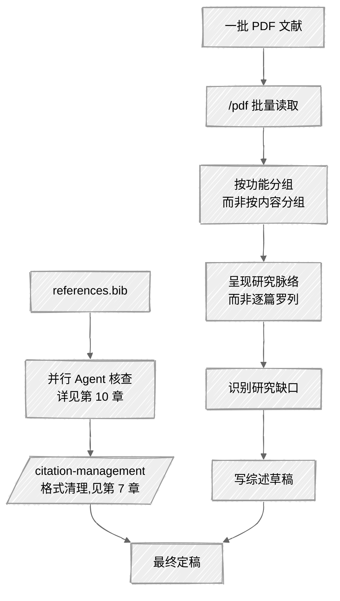

<ChapterAudience>

使用 `/pdf` 批量读取文献,按研究方法或在论文中的功能分组；使用 `ppw-literature` 与 `/arxiv` 检索文献,自动生成核验过的 BibTeX 条目；使用并行 Agent 批量核查上百条引用(细节见第 10 章)；把文献综述从"逐篇介绍"调整为"按方向呈现脉络、明确缺口"。

</ChapterAudience>

<video autoplay loop muted playsinline class="academic-figure" aria-label="一篇论文被拆解成 10 类实体" src="/books/claude-code-paper-writing/figure/04_paper_dissection.mp4"></video>

<Subtext>图 4 · 一篇论文被拆解成 10 类实体</Subtext>


写论文期间,文献综述这一章花掉的时间比实验结果不显著还多。

第二章是文献综述。导师的要求是:"读完这一章,读者应当了解领域经历了怎样的发展、目前存在哪些争议、本研究填补了哪个空白。"三件事各自不易,合在一起更难。

当时我手里有八十多篇参考文献,每篇均已批注。两周写出第一版,导师当天下午退回:"研究脉络体现不出,罗列感强。"再交一版又被退回:"研究缺口不明显,读者难以判断为何要做这项研究。"

被退两次之后我意识到,**读懂每篇文献与写好文献综述是两件不同的事**。读文献是理解每篇文章本身的内容,写综述是把这些文章放在同一个分析框架内,呈现关系,指出值得填补的位置。读完八十篇文献使每篇都熟悉,但不一定能看清整体结构。



## 4.1 借助 AI 整理研究现状

第三次修改文献综述我调整了思路:先把所有文献按主题分组,再分析组与组之间的关系,最后从关系中识别缺口。

以前用 Excel 完成这项工作,一行一篇文献,列字段包括作者、年份、研究方法、核心发现。整理一遍需要三到四天:打开 PDF、找摘要、定位方法论段落、复制信息、粘贴入表、关闭 PDF、打开下一篇。

Claude Code 的 `/pdf` 改变了这一流程。直接在对话中输入 `/pdf 文件名.pdf`,模型即可提取全文文本。第三次修改时,我把所有 PDF 放入同一个文件夹:

<div align="center">
  
</div>

完成后它给出按方法分类的列表,五大类全部识别。Excel 中三到四天的工作,Claude Code 在两小时内完成,其中大部分时间用于核对分类是否准确(一处确实分错,某篇文献同时使用 IV 与双向固定效应,被分到后者,我指出后它重新归类)。模型实际运行时间不超过 20 分钟。

### 按功能分类,而非按内容分类

读完文献到整理成综述之间,有一个过渡步骤:把文献按它们**在综述中的功能**分类。"按内容分类"回答的是"这篇文章研究了什么","按功能分类"回答的是"这篇文章在本论文中起什么作用"。后者对写综述更有用。

举例如下。论文涉及空间杜宾模型,部分文献做技术层面的方法论讨论(如何选择空间权重矩阵),部分文献把该模型应用到其他研究对象。前者引用是为方法选择提供依据,后者引用是为说明该模型在类似情境下被验证有效。两类作用不同,按内容分类时会把它们混在一起,写综述时逻辑会乱。

按功能分类之后写综述就清楚了:方法论部分引用某几篇,应用背景部分引用另几篇。

### ppw-literature 与 /arxiv 用于检索新文献

除整理已有文献外还需检索新文献。以往在 Google Scholar 上逐篇打开看摘要、判断相关性、手工记录 BibTeX,整理一批文献需要不少时间。

`ppw-literature` 接入了 Semantic Scholar,可在 Claude Code 中直接检索文献、显示引用数与摘要、由用户筛选,选定后自动生成核验过的 BibTeX。我前后使用 26 次。触发方式是直接说"帮我找关于 XX 主题的文献",它返回编号列表(标题、作者、年份、引用次数、摘要片段),使用者选定编号,它会先提示一句"请确认所选文献确实支持你要引用的论点,不要仅凭标题判断",确认后生成 BibTeX。

它生成的 BibTeX 仅使用数据库返回的字段,不会自行填充或编造。若某字段(例如页码或卷号)未返回,它直接省略,不会推测。该机制避免了"字段看似完整但部分内容由 AI 编造"的情况。

`/arxiv` 用法类似,但检索的是 arXiv 预印本(涉及较新方法的文献)。两个工具分工明确:期刊与会议论文使用 `ppw-literature`(Semantic Scholar),较新且未正式发表的方法使用 `/arxiv`。

<GhAlert type="warning">

**预印本引用的两条注意事项**

</GhAlert>

>
> 第一,arXiv 上的论文未经同行评审,引用时建议在 BibTeX 的 `note` 字段标注 "arXiv preprint";部分导师或期刊不接受仅引用预印本。第二,若一篇预印本后续正式发表,应换成发表版的引用。正式版的页码、卷号、甚至结论可能与预印本不同。

<GhAlert type="note">

**定义 4.1 — BibTeX**

</GhAlert>

>
> BibTeX 是 LaTeX 排版系统使用的参考文献格式,每条引用以 `@article`、`@book` 等开头,包含 citation key 及 author / year / title 等字段。Word 用户可通过 Zotero 导出。**BibTeX 条目的字段必须与原始文献完全一致,不可由 AI 自行填充推测**。

## 4.2 引用信息层面的批量核查

论文最终参考文献为 156 条。提交前一周,导师要求逐条核对格式与信息。156 条逐条对照打开文献核作者、年份、期刊、卷号、页码,每条 5 分钟,合计 13 小时。提交前一周不可能投入这一时间。

我用并行 Agent 处理了这一任务。具体做法(拆分、指令、汇总)第 10 章详述,本节只讨论结果。三个 Agent 并行运行 40 分钟,识别出 11 处问题:3 处年份错误(引用了预印本年份而非发表年份)、4 处页码不完整、2 处期刊名缩写不统一、2 处 DOI 无法解析(一篇撤回,一篇格式错)。

11 处错误分散在 156 条引用中,手工很难每条都仔细核查。修改环节需要使用者完成(Claude Code 无法判断"被撤回的文章应当如何替换",此为学术判断),但**找出问题的时间从十几小时压缩到 40 分钟**。

<div align="center">

| 手动核查 | 并行 Agent 核查 |
|:--|:--|
| 每条 5 到 10 分钟,156 条约 13 到 26 小时 | 三个 Agent 并行约 40 分钟 |
| 长时间核查容易遗漏 | 每条按同一标准检查 |
| 笔记零散,统计困难 | 自动生成结构化报告 |

</div>

格式层面的核查(作者名规则、期刊名缩写、language 字段缺失等)用 `/citation-management` 处理,详见**第 7 章**。两类核查搭配使用:并行 Agent 处理信息正确性,`/citation-management` 处理格式规范,可在 1 到 2 小时内把 100 多条参考文献整理到位。

## 4.3 文献综述写作的辅助方式

引用核查解决"引用信息是否准确"。接下来是"文献综述本身如何写"。第二章被退两次:第一次"研究脉络不清晰",第二次"研究缺口不明显"。两项均属于综述本身的逻辑问题。

### 研究脉络的含义

缺少研究脉络的综述读起来如下:"学者 A(2010)研究了 XX,发现 YY。学者 B(2015)研究了 XX,发现 ZZ。学者 C(2020)研究了……"逐篇介绍,信息齐备,但彼此无关联。

有研究脉络的综述会写成:早期研究(2000 年代)主要聚焦 A 方面,忽视 B 因素;2010 年代之后有学者把 B 因素纳入,代表性工作是……该类研究又面临 C 挑战;近五年有学者尝试用新方法处理 C,但仍未完全解决,本文的切入点正在此处。

后者把文献置于时间轴与逻辑递进之中。读者读完不仅知道"有哪些研究",还能理解"思路如何发展"以及"为何目前仍有值得研究的问题"。

### 用 Claude Code 梳理脉络

从八十篇文献中提炼脉络的具体做法是,把整理好的文献列表交给它,告知研究问题,让它分析关系与趋势:

```
读这份文献列表,结合我的研究问题,帮我梳理:
1. 这个领域有哪几个主要研究方向
2. 每个方向的发展脉络(不要逐篇介绍,呈现趋势)
3. 现有研究在哪里存在明显缺口

不要逐篇介绍文献,识别关系与趋势。
```

它的输出分为三个方向,每个方向用时间线描述发展过程,最后总结三处缺口。该输出不能直接进入综述,但提供了一个**框架**:领域逻辑大致如此,从 A 到 B 到 C 存在连贯性,本研究处于其中某个位置。

有了框架,我重新组织综述结构,不再逐篇介绍,而是按"三个方向,每方向给出脉络"的结构展开。该版交上去,导师只给一条批注:"可以,细节再打磨。"

### 研究缺口为何容易写不清楚

研究缺口的常见写法是:"现有研究在 XXX 方面存在不足,本文拟……"逻辑上没错,但读起来更像在为本研究找理由,而非告诉读者该缺口为何存在、为何值得填补。

我让 Claude Code 检查综述草稿,任务是指出"研究缺口在哪里、如何表述、读者读完能否理解为何需要本研究"。反馈如下:缺口表述分散在三个段落,未汇聚为一个明确论点。读者需自行把三处拼接才能理解,但多数读者不会这么做。

处理方法是:在综述最后单独写一段,把三个方面的缺口合并成一个表述,明确告知读者"综上,现有研究的局限在于……本文针对这一问题展开"。

<GhAlert type="tip">

**让 Claude Code 扮演"读者视角"而非"导师视角"**

</GhAlert>

>
> 直接让它"评估文献综述写得怎么样"通常会得到"写得不错,逻辑清晰,但有几个地方可以进一步完善"这类回应,实际帮助有限。
>
> 有效做法是给具体任务而非综合评价。例如让它"找出研究缺口在第几段第几句,把那几句话原文引出来",该任务属于"查找"而非"评价"。若它回应"未找到明确的研究缺口表述",说明问题较严重。
>
> 类似的检查包括"列出每段的第一句话"(分析段落结构)、"找出引用了五次以上的文献"(检查是否过度依赖某篇)。这类具体任务比综合评价更有用。

## 4.4 实操:完整文献工作流

走一遍完整流程,从一批 PDF 到综述定稿。

#### 第一步:批量读取文献,按功能分类

```
读取 literature/ 文件夹里所有 PDF,对每篇提取:
作者、年份、研究方法、核心结论(一句话)。
按它们在我论文里的功能分成:
A:直接支持研究假设的
B:提供方法论依据的
C:与本研究对象相关但方法不同的
D:结论与本研究不同,需要解释差异的
写入 lit_by_function.md。研究问题:[替换为实际研究问题]。
```

#### 第二步:补充新文献

某方向文献不足时使用 `/arxiv search "关键词"` 检索,找到感兴趣的预印本先让它判断相关性("这篇与我的研究问题关联度如何?用一两句话说明"),相关再加入文献库与 `references.bib`。

#### 第三步:梳理脉络

```
读 lit_by_function.md,结合我的研究问题:
1. 现有研究分为哪几个方向
2. 每个方向经历了哪些转变(呈现趋势)
3. 哪里存在明显研究缺口
输出到 lit_roadmap.md。
```

该输出是综述的骨架,而非综述本身。

#### 第四步:检查综述草稿

写完后让它做逻辑检查:

```
读 ch2_literature.docx,告诉我:
1. 研究缺口在哪里表述(第几段,原文引出)
2. 每段的第一句话列出来
3. 是否有文献被介绍但未与缺口产生关联
不要修改,只给反馈。
```

<GhAlert type="important">

**诊断阶段不要让它修改**

</GhAlert>

>
> 该阶段需要的是诊断,而非修改。修改属于使用者的判断范围,因为"如何表述才算清晰"涉及对内容本身的理解,不应交给模型决定。

#### 第五步:引用核查与格式清理

综述定稿前进行一次引用核查。引用 50 条以上使用并行 Agent(第 10 章),格式问题使用 `/citation-management`(第 7 章)。涉及学术判断(版本选择、撤回文献的替换)的环节由使用者决定,不交给模型自动处理。

五步走完后,文献工作的主体即完成。从检索到核查每一步均有工具支持,但**哪些文献值得引用、研究缺口的论述是否准确,这两件事仍需使用者完成**。

## 本章小结

<div align="center">

| 核心概念 | 核心内容 | 常见误解 | 为什么错 |
|:--|:--|:--|:--|
| `/pdf` 批量读取 | 一条命令读完文献夹中所有 PDF | 仍需逐篇手工打开 | Claude Code 原生支持批量,时间从数日压缩到两小时 |
| 按功能分组 | 关注每篇文献"在本论文中起什么作用" | 按内容分组足够 | 按内容分组会让方法论文献与应用文献混在一起,写综述时逻辑混乱 |
| 并行 Agent 核查 | 156 条 40 分钟核查完成 | 大批量任务只能逐条进行 | 单线程会被频率限制打断,并行 Agent 自动分批合并 |
| 不自动修改引用 | 让它先报告,确认后再改 | 自动修改更省事 | 引用信息中有些只有使用者知道正确答案 |
| 梳理脉络 | 让它分析方向的演化路径 | 让它直接写综述 | "理解每篇文献"与"写好综述"是两件不同的事,后者仍需使用者完成 |
| 让它做"查找"而非"评价" | 给具体任务(找缺口在第几段) | 让它做综合评价 | 综合评价不包含可操作的信息 |

</div>

下一章讨论章节写作:从研究问题到章节框架,如何为 Claude Code 准备材料,逐节完成内容。

---

<div align="center">

[← 第 3 章 · 提示词的使用经验](chap03.md) &nbsp;·&nbsp; [返回目录](../README.md) &nbsp;·&nbsp; [第 5 章 · 章节写作 →](chap05.md)

</div>
