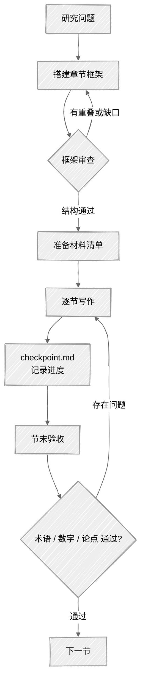

<ChapterAudience>

写章节之前先做框架审查:每节独立回答一个问题,节间逻辑递进；逐节写作时把数据、结果、论点、上下文一并提供给 Claude Code,不让它凭空生成；用 `checkpoint.md` 记录跨会话进度；用语气约束抑制 AI 痕迹,再用自查识别排比与空洞修饰；把导师定性反馈翻译成可执行指令,按章节分天处理。

</ChapterAudience>

<video autoplay loop muted playsinline class="academic-figure" aria-label="28 个 skill 按四阶段划分" src="/books/claude-code-paper-writing/figure/05_skill_map.mp4"></video>

<Subtext>图 5 · 28 个 skill 按四阶段划分</Subtext>


文献综述完成后进入正文各章节。本论文正文四章(第三章至第七章),每章逻辑不同:第三章为研究设计,第四与第五章为实证分析,第七章为结论。这四章累计对话超过两百次,最密集的时段是冲刺期处理导师批量修改意见的四天(第 1 章提及)。



## 5.1 从研究问题到章节框架

动笔之前先有框架。框架与大纲不同(大纲在开题报告中已有),框架是指**本章具体写几节、每节回答什么问题、节与节之间的关系**。

未想清楚框架就动手的代价较高。第七章一开始分五节:研究结论、政策建议、理论贡献、研究不足、未来展望。看似完整,但写到第三节时发现"理论贡献"与"研究结论"内容大量重叠(结论本身即隐含贡献),写出来后阅读体感冗余。

我把五节草稿交给 Claude Code 让它分析结构(指令为"指出哪两节内容重叠、每节核心论点一句话概括、合并三节的方式")。分析较为到位:第一节与第三节有四处重叠,第四节与第五节也存在重叠("不足"自然引向"展望")。它建议合并为三节:研究结论与贡献、政策建议、局限与展望。

按该结构重写。原本五节八千字,合并为三节后五千字,但<u>信息量未减少,删除重复内容后每段都有新内容</u>。导师反馈:"这一版好多了,紧凑。"

<GhAlert type="important">

**Claude Code 既能帮助写作,也能用于分析结构**

</GhAlert>

>
> 把已有草稿或大纲交给它做诊断,价值往往高于让它直接生成内容。写作过程中容易陷入细节,无法看清整体结构;它可一次性读完整章,给出全局反馈。

### 框架审查的固定流程

我后续形成的习惯是,每写一章之前让 Claude Code 做"框架审查":把研究问题与章节大纲交给它,让它检查三件事:每节是否独立、节间逻辑是否连贯、是否遗漏关键问题。**仅提供结构反馈,不替我撰写内容**。

<u>五分钟完成审查,可避免后续写了三四千字才发现需推翻重来的情况</u>。

## 5.2 逐节写作:如何向 AI 提供材料

<GhAlert type="note">

**定义 5.1 — 章节框架**

</GhAlert>

>
> 写作动手前对一章内部结构的规划:分几节、每节回答哪个独立问题、节与节之间的逻辑关系(递进、并列、因果)。框架不等同于开题大纲,而是对具体内容安排的确认。

框架确定后开始逐节写作。**关键原则:不让 Claude Code 凭空生成,要为它提供材料**。

材料指实验数据、分析结果、图表、思路笔记。<u>Claude Code 可以把这些组织成通顺的学术段落,但材料本身必须由使用者提供</u>。若不提供任何材料直接说"帮我写第三章第二节",输出必然是泛泛而谈。

每节写作前先准备一份"材料清单",示例如下:

```
帮我写第四章第 2 节「基准回归结果」,材料:
1. 回归表格在 tables/table4_2.tex,先读取
2. 核心发现:被解释变量系数 0.342,1% 水平显著
3. 控制变量中人口密度与经济发展水平显著,产业结构不显著
4. 论点:直接效应显著且方向符合预期
5. 需要与第三章第 3 节的研究假设呼应
6. 术语不得修改:「被解释变量」「双向固定效应」

先告诉我你打算怎么组织,确认后再写。
```

该指令包含数据来源(表格文件)、核心发现(具体数字)、论点(表达诉求)、上下文(呼应位置)、术语约束。**有了这些材料,输出内容才具备具体支撑**。

### 中间结果落盘

正文写作通常持续多日。一次会话写完一节,次日再开新会话写下一节。问题在于,昨天写到一半被打断时(rate limit 应对见第 10 章),第二天重开 Claude Code 不再记得昨天的进度。

处理方法使用 checkpoint:在指令中加一句"完成每个步骤后把进度存到 checkpoint.md(已完成 / 进行中 / 待完成 / 遇到的问题)"。下次打开让它先读取该文件即可知道从哪里继续。

文件结构简单(按已完成、进行中、待完成、问题四块列出),但解决了跨会话连续性问题:<u>上下文每次清空,文件不会</u>。

### 一次写一节,完成后验收

正文同样建议一次只写一节(原因见第 3 章),完成后做一轮验收:

```
读刚才写的第四章第 2 节,检查:
1. 是否存在术语锁定表外的替换
2. 具体数字(系数、显著性水平)是否与表格一致
3. 论点是否与第三章的研究假设呼应
列出问题,不要自动修改。
```

验收通过后再进入下一节,可保证每节质量。

## 5.3 学术语气与术语控制

Claude Code 未加约束的输出会带有典型 AI 痕迹:用词整齐、句式对称、爱用排比、习惯在段尾加总结。学术论文需要克制精确,这些痕迹会显得突兀。

几种典型的 AI 痕迹如下:

**三段式排比**:"该指标反映了 XX 的水平,体现了 YY 的程度,揭示了 ZZ 的趋势",三个动词并列读起来像公文,改成"该指标反映 XX 的水平"即可。

**过渡句过密**:每段之间都有一句"在此基础上,我们进一步分析了……",直接进入下一段即可。导师对我说过"过渡句过多,删掉直接说事"。

**万能连接词**:"值得注意的是"、"具有重要意义"、"进一步表明",使用频率过高时显得空洞。

处理方法是在指令中加入明确的语气约束(用学术中文、不使用排比、不用空洞修饰、段间不加过渡句、每句传达新信息)。<u>这些写入 CLAUDE.md 的输出格式要求后,每次启动都会被读取</u>。

### 抑制 AI 痕迹的检查方法

写完一段让 Claude Code 自查 AI 痕迹(查找排比句、空洞修饰、冗余过渡句、重复前文)。

<GhAlert type="warning">

**它检查自己的输出时存在维护偏向**

</GhAlert>

>
> 自查可识别明显问题,但有时它会认为自己的输出没有问题。更可靠的做法是使用者通读一遍,把读起来不像人写的句子标出。

术语控制在第 2 章与第 3 章讨论过,这里补一条:**每个写作任务的指令中,除 CLAUDE.md 的全局术语锁定表外,把本节涉及的特定术语单独列一遍**。例如写方法论那一节时,"经济距离权重矩阵"、"空间杜宾模型"、"工具变量法"单独列出。双重保险,比事后纠正省力。

## 5.4 导师反馈的处理流程

这套处理流程把原本两周的工作压缩到了四天。

第 1 章提到论文提交前导师一次性给了 40 多条修改意见。以往遇到这种情况是直接打开论文逐条修改、改到哪算哪。这次调整了做法:**先不动手,用半天对意见做结构化整理**。

### 三步整理加一步执行

**第一步:按章节分组**。我的分组是:第三章 8 条、第四章 6 条、第五章 12 条、第七章 9 条、全局 7 条。第五章问题最多,可能需要较大修改,应优先处理。

**第二步:按类型分类**。同一章中部分意见属于"改一处"(替换词、改数字),部分属于"改一段"(重写逻辑),部分属于"改整节"(结构调整)。按工作量排序,先做小的,再做大的。<u>小的完成后整章面貌更清晰,处理大的修改时判断更稳</u>。

**第三步:翻译成 Claude Code 可执行的指令**。导师的表达通常是定性的,Claude Code 需要具体操作指令。例如:

导师说"第五章逻辑碎"翻译为:

```
读 ch5_analysis.docx,列出 5 节每节的第一句与最后一句。告诉我:
1. 节间逻辑是什么(递进 / 并列 / 因果)
2. 哪两节内容可以合并
3. 节间是否缺过渡
不要修改,只给分析。
```

导师说"太啰嗦"翻译为:

```
读第五章第 3 节,标出:
1. 哪些句子重复前面已说过的信息
2. 哪些描述性表述可以用一个数据替代
3. 是否存在连续两段说同一件事
列出,不要自动删除。
```

**第四步:分天执行**。40 多条意见分为四天:

<div align="center">

| 时间 | 章节 | 工作内容 |
|:--:|:--|:--|
| 第 1 天 | 第三章(8 条) | 6 条小修改加 2 条逻辑调整 |
| 第 2 天 | 第四章加第五章前半 | 第四章 6 条加第五章小修改 |
| 第 3 天 | 第五章后半加第七章 | 第五章结构调整加第七章 9 条 |
| 第 4 天 | 全局加通读 | 跨章节 7 条加全文通读 |

</div>

每天完成后更新 `checkpoint.md`,即使某天会话被打断,次日衔接不会遗漏。

<GhAlert type="tip">

**"理解导师意图"与"决定如何改"不可省略**

</GhAlert>

>
> 四天的工作量,纯手工估计两周。Claude Code 把"执行"部分压缩较多,但"理解导师意图"与"决定如何改"的时间不可省。半天的结构化整理看似无产出,但保证后续四天执行顺畅:每条意见改什么、如何改、用什么指令,均已清晰。

## 5.5 实操:用 /docx 修改 Word 章节

多数论文为 Word 格式,五步流程如下:

1. **备份**(命令见第 1 章)
2. **读取**:`/docx 读 ch5_analysis.docx 第 3 节,列每段第一句`。先读取再修改,确认其正确识别文档结构
3. **修改**:给出具体指令,列出要改的段落与不能改的术语
4. **检查对比**:重点核三件事,术语是否被改、引用编号是否被删、数字是否被改动。这三类最隐蔽
5. **验证文件**:用 Word 打开确认格式无误

<GhAlert type="warning">

**Word 文件存在 XML 损坏风险**

</GhAlert>

>
> 详见第 8 章。每次修改完打开核查一次,发现问题用备份恢复。若频繁遇到格式损坏,考虑迁移至 LaTeX。

<u>该五步流程(备份、读取、修改、检查、验证)适用于所有 Word 文档修改任务</u>,使用几次即可形成习惯。

## 本章小结

<div align="center">

| 核心概念 | 核心内容 | 常见误解 | 为什么错 |
|:--|:--|:--|:--|
| 框架审查 | 写作前确认每节独立问题、节间递进 | 边写边搭建框架 | 写到中段发现重叠需推翻三四千字 |
| 提供材料 | 数据、结果、论点、术语约束、上下文 | 让它凭空生成 | 缺少材料的输出是泛泛而谈 |
| `checkpoint.md` | 用文件记录跨会话进度 | 依赖 Claude Code 自行记忆 | 上下文每次清空,文件才是可靠载体 |
| 节末验收 | 改前改后核对术语、数字、论点 | 看它的总结即可 | 总结反映模型自认的修改,需检查实际改动 |
| 抑制 AI 痕迹 | 指令中禁排比、空洞修饰、过渡句 | 写完再改 | 起始约束的成本低于事后纠正 |
| 反馈翻译 | "逻辑碎"翻译为"列首尾句、判断节间关系" | 把导师原话直接发给它 | 定性反馈模型无法执行,需拆为"找 / 列 / 标" |
| 分天执行 | 按章节切分,每天一章 | 一天连续完成 | 长任务挤在一天质量会下降 |

</div>

下一章讨论图表。

---

<div align="center">

[← 第 4 章 · 文献调研与管理](chap04.md) &nbsp;·&nbsp; [返回目录](../README.md) &nbsp;·&nbsp; [第 6 章 · 图表制作 →](chap06.md)

</div>
