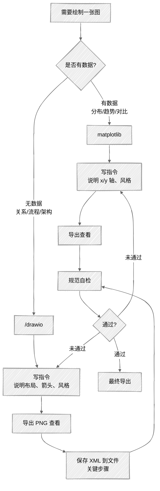

<ChapterAudience>

用 matplotlib 生成数据驱动的统计图(直方图、折线图、分组柱状图、核密度图)；用 `/drawio` 绘制研究框架图、方法流程图等概念关系图；理解 Draw.io MCP 的 session 状态不持久,必须及时把 XML 保存到本地文件；图表定稿前用字号、配色、元素重叠、分辨率四项标准做规范自检。

</ChapterAudience>

本论文共有 9 张图与 14 张表。表格多数是回归结果表,从 Stata 导出后格式即基本确定。图是耗时的部分。

研究框架图、空间溢出效应示意图、变量关系图,这几张图导师反复改了几版。第一版用 PowerPoint,导师指出线条粗细不统一、字号有大小差异、对齐依赖目测。第二版换 Visio,被指出配色过多、不像学术论文。经过三版调整后开始使用 Claude Code。

用 Claude Code 制图分为两条路线:用 Python 代码生成统计图(折线、柱状、散点、分布),用 Draw.io 绘制概念关系图(研究框架、方法流程、变量关系)。两条路线都使用过,合计累积一百多次会话。



## 6.1 用代码生成学术图表

我首次让 Claude Code 制图是绘制分布直方图。论文第四章需要观察核心被解释变量是否存在偏态。指令为一句话:

```
读 data/panel_data.csv,绘制 Variable-A 的分布直方图。
学术论文风格,宋体,300dpi,保存为 figures/fig4_1.png。
```

它用 matplotlib 写了一段代码运行。第一版有几个细节需要调整(x 轴标签与柱子重叠、图例遮挡数据、字号偏小),把问题反馈后第二版即可使用。整个过程不超过十分钟。

若自行编写 matplotlib,仅查中文字体配置、坐标轴间距、分辨率设置就需要翻半小时文档。Claude Code 把这些参数处理掉,使用者只需说明目标外观。

### 中文字体的处理

matplotlib 默认不支持中文。未指定中文字体时,图上中文字符显示为方块。

首次遇到该问题,Claude Code 自行尝试了几种字体:SimHei 在 macOS 上不被识别;Arial Unicode MS 能显示中文但风格不符;最终采用 macOS 自带的华文宋体(STSong),导师认可。Windows 通常使用 SimSun,Linux 需要自行安装字体包。

> [!TIP]
> **把字体写入 CLAUDE.md**
>
> 把最终确定的字体路径写入 `CLAUDE.md`,后续制图自动使用正确字体,不再重复配置。

### 从简单图到复杂图

建议从最简单的图开始。第一张图绘制单变量直方图或折线图,确认字体、字号、分辨率均正常,再处理多子图、多系列的复杂图。

本论文最复杂的一张是空间溢出效应分解图,需要在一张图中绘制直接效应、间接效应、总效应三条线,每条线带置信区间阴影。一开始让 Claude Code 一次画完,代码较长,出问题时定位困难。我的做法是分步推进:先画一条线确认样式,再加第二条线调整颜色与图例,再加置信区间阴影。每一步都在上一步基础上修改几行,出问题时易于定位。

> [!WARNING]
> **图像生成后需自行核对数字**
>
> 生成的代码可能无语法错误、图片也能正常生成,但内容可能错。某次让它绘制三个子样本对比图,东部与中西部数据被画反。代码无报错,图看上去完整,但柱子标的数值与原始数据不符。若不逐个核对,错图会直接进入论文。

### 实操:核密度估计图

用一个稍复杂的例子完整走一遍:核密度估计(KDE)图,展示变量分布随时间的演变。

本论文第三章需要展示核心被解释变量在不同年份与区域的分布演变。导师要求 2×2 四个子图(全样本、东部、中部、西部),每个子图绘制 2014、2017、2020、2023 四条核密度曲线。

把数据列、子图布局、年份、线型、字体、分辨率在指令中一次性说明,它会编写一段调用 `scipy.stats.gaussian_kde` 加 `matplotlib` 的代码运行。实际使用中 `bw_method='silverman'` 是最常用的带宽选择方法,使用者不需要记忆,模型会自动选择。

用代码绘图这条路线适用于所有有明确数据的图表。折线、柱状、散点、箱线、分布,只要能说明 x 轴、y 轴、数据来源,即可绘制。

> [!NOTE]
> **定义 6.1 — 矢量图**
>
> 矢量图(Vector Graphics)用数学公式描述线条、曲线与填充,代表格式有 PDF 与 SVG。与位图(PNG、JPG)不同,矢量图无论放大多少倍均不失真。LaTeX 排版的论文建议保存 PDF,Word 排版用 300dpi PNG 即可。

## 6.2 流程图与架构图

研究框架图是论文中较难处理的图。它没有数据,完全依赖使用者把概念间的关系想清楚,再用方框与箭头表达。

本研究框架图共经历五个版本。前三版用 PowerPoint,导师反馈方框大小不统一、间距不等、箭头方向不清晰、颜色过多。第四版起改用 `/drawio`。

> [!NOTE]
> **定义 6.2 — Draw.io**
>
> Draw.io 是开源矢量绘图工具,专为流程图、架构图设计。底层文件格式是 XML。Claude Code 通过 MCP 协议调用,可在对话中用自然语言创建与修改图表。

### 首次使用 /drawio

首次用 `/drawio` 绘制研究框架图,指令按层级描述每一层有几个方框、写什么字、用什么箭头连接、风格是黑白还是彩色、字号多少。Claude Code 创建 Draw.io session,绘出图表。导出 PNG 后第一版基本结构正确,但方框大小不一(文字长度不同导致自动适应了宽度)、间距不均。让它统一方框宽度并对齐间距,修改两轮即可定稿。

至此一切顺利,问题出现在第二天。

### 经验:Draw.io MCP 的 session 状态会丢失

第二天打开 Claude Code,想在前一天的研究框架图上加路径系数标注。`/drawio` 返回提示:未找到已打开的图表,需要重新创建。

前一天调好四十多分钟的图,无法恢复。

<div align="center">
  
</div>

Draw.io MCP 的 session 是临时的,存于内存,不会自动保存到磁盘。关闭 Claude Code 或切换到新对话 turn,session 即消失。同一次对话中反复修改、导出、查看一切正常,显得图已"保存",但实际上只存在 session 内存中,从未写入文件。

> [!WARNING]
> **每次修改满意后立即把 XML 保存到本地**
>
> ```
> # 每次修改满意后:
> /drawio 把当前图的 XML 导出到 figures/framework.drawio
>
> # 下次重新打开:
> /drawio 读取 figures/framework.drawio,继续编辑
> ```
>
> 文件是持久的,session 丢失也能恢复。每次大改之前再加一个日期版本(`framework_20260315.drawio`),相当于手动版本管理。

### Draw.io 与代码绘图的差别

数据图与概念图适合不同工具。matplotlib 擅长有数据的统计图,Draw.io 擅长无数据的关系图与流程图。LaTeX 的 TikZ 包输出的图与论文字体完全一致,但学习成本较高。无 TikZ 基础时,Draw.io 导出 PNG 或 PDF 已足够。

<div align="center">

|  | matplotlib | Draw.io(/drawio) | TikZ |
|:--|:--|:--|:--|
| 适合的图类型 | 数据驱动的统计图 | 流程图、架构图、关系图 | 所有类型(学习成本高) |
| 编辑方式 | 编写 Python 代码 | 自然语言加 XML | 编写 LaTeX 代码 |
| 中文支持 | 需配置字体 | 原生支持 | 需配置 ctex |
| 输出格式 | PNG / PDF / SVG | PNG / PDF / SVG | PDF(原生矢量) |

</div>

我的实际做法是:数据图用 matplotlib,概念图用 Draw.io。

## 6.3 图表规范自检

导师退回图最常指出的三个问题是:"字太小了"、"颜色太多了"、"挤在一起看不清"。这三类问题在九张图中出现过七次。后续总结出一套自检流程,每张图定稿前过一遍。

### 字号

学术论文图表最终打印在 A4 上。屏幕上显得清楚的字号,打印出来可能小到难以辨识。最小字号不低于 10pt。坐标轴标签、图例文字建议 12pt,标题 14pt。

把"标题 14pt、标签 12pt、刻度 10pt"写入 CLAUDE.md,后续制图自动按规范执行。

### 颜色

学术配色两条原则:黑白打印仍可辨识,色觉障碍人群可分辨。

起初我用蓝、红、绿三色,导师反馈"打印出来红色与绿色几乎深浅相同"。后改为灰度配色:深灰(`#333333`)、中灰(`#888888`)、浅灰(`#CCCCCC`)。灰度不足以区分时,辅以不同线型(实线、虚线、点线)或不同标记(圆点、方块、三角)。

> [!TIP]
> **灰度模式自检**
>
> 把图片转为灰度模式查看一次。macOS 可在预览中转换,Windows 可用画图工具。若转灰度后两组颜色混在一起,说明配色需调整。

### 元素重叠

三类常见重叠:数据标签与数据点重叠、图例与数据区域重叠、坐标轴标签相互重叠。

数据标签重叠多见于柱状图。告知 Claude Code 把临近标签上下错开,用细线指向对应柱子。图例重叠时,将其移到图右侧外部或左下角。x 轴类别过多挤在一起时,把标签旋转 45 度,或改用水平条形图。

### 自检清单

每张图定稿前过一遍此清单:

<div align="center">

| 检查项 | 具体标准 |
|:--|:--|
| 字号 | 打印在 A4 上最小不低于 10pt |
| 黑白可读 | 转灰度后不同数据系列仍可区分 |
| 元素重叠 | 标签、图例、数据点互不遮挡 |
| 对齐 | 方框大小统一、间距均匀、箭头方向一致 |
| 分辨率 | PNG 至少 300dpi,或直接使用 PDF 矢量 |
| 字体 | 图表字体与正文字体一致 |

</div>

该清单也可写入 CLAUDE.md,每次生成图后让它对照检查。它可通过读图做基本视觉检查,但准确性不如使用者本人。先让它自查识别明显问题,再使用者通查一遍,重点核查打印效果。

## 6.4 实操:用 /drawio 绘制研究框架图

本节用一个完整例子走一遍 `/drawio` 流程。以本论文研究框架图为例(已脱敏):核心解释变量位于最上方,通过三条路径影响被解释变量(一条直接、两条经中介变量),右侧一个调节变量。动手之前先把结构想清楚——若使用者尚未明确变量关系,绘出的图只会让读者更困惑。

#### 第一步:创建图表

启动 Claude Code,把布局(每层有几个方框、写什么字)、箭头关系(指向、实虚线、标注)、风格(白底黑边、字号 14pt、居中)在一次指令中说明。指令越具体,第一版越接近目标,后续修改轮数越少。

#### 第二步:导出 PNG 后立刻保存 XML

```
/drawio 导出为 PNG,保存到 figures/framework_v1.png
/drawio 把当前图的 XML 保存到 figures/framework.drawio
```

**第二行不可省略**,前述教训即出现在这一步。每完成一轮修改、每次满意后均执行一次保存。

#### 第三步:修改调整

根据第一版的问题给修改指令(例如"两个中介变量方框间距过散"、"所有方框统一大小"、"调节变量箭头指向直接效应虚线的中点")。不必给出精确像素值,描述目标效果即可。修改后再次保存 XML,文件名加版本号(`framework_v2.drawio`),便于回退。

#### 第四步:最终导出与跨天恢复

确认无误后导出最终版本:

```
/drawio 导出为 PNG,分辨率 300dpi,保存到 figures/fig3_1_framework.png
/drawio 导出为 PDF,保存到 figures/fig3_1_framework.pdf  # LaTeX 使用
```

文件名建议采用"章节号_序号_描述"格式(`fig3_1_framework`),便于在文件夹中识别所属章节。

数日后若导师让修改该图,无需重新绘制——`/drawio 读取 figures/framework_v2.drawio` 即可从文件恢复,所有调好的格式都保存在 XML 中。

> [!TIP]
> **风格参数模板化**
>
> 若需绘制多张图,先把最复杂的一张图风格调好(方框样式、箭头粗细、字号、配色),把这套参数写入一条指令模板,后续其他图直接复用。导师看到全文图风格一致,观感明显提升。

## 本章小结

<div align="center">

| 核心概念 | 核心内容 | 常见误解 | 为什么错 |
|:--|:--|:--|:--|
| 数据图与概念图 | matplotlib 画统计图,`/drawio` 画框架图 | 一个工具覆盖全部 | matplotlib 不擅长方框关系,Draw.io 不擅长画分布 |
| 中文字体 | 在 CLAUDE.md 中固定宋体路径 | 每次制图临时配置 | 中文显示为方块是常见报错,固化到 CLAUDE.md 后不再反复配置 |
| 矢量与位图 | LaTeX 用 PDF,Word 用 300dpi PNG | 全部使用 PNG | PDF 放大不失真,论文打印效果更佳 |
| Draw.io session | 必须立即把 XML 保存到 `.drawio` 文件 | 同一对话中可反复改即等同保存 | session 是内存态,关闭 Claude Code 后即消失 |
| 数字核对 | 每张图均核对柱子数值与图例 | 代码无报错即放心 | 模型可能把东部与中西部数据画反,肉眼看到的是完整图 |
| 黑白可读 | 灰度模式预览一遍 | 屏幕能区分即可 | 红绿在黑白打印中深浅几乎相同 |
| 风格模板化 | 调好一张图的参数后复用 | 每张图重新调样式 | 风格一致比每张图单独漂亮更重要 |

</div>

下一章讨论引用与参考文献。

---

<div align="center">

[← 第 5 章 · 章节写作](chap05.md) &nbsp;·&nbsp; [返回目录](../README.md) &nbsp;·&nbsp; [第 7 章 · 引用与参考文献 →](chap07.md)

</div>
