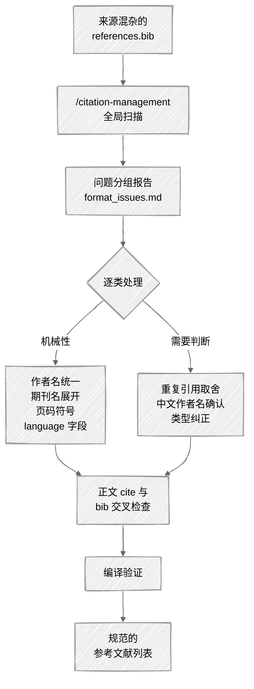

<ChapterAudience>

理解 BibTeX 条目的格式问题(字段缺失、作者名混乱、期刊名缩写)虽然不影响编译,但影响最终呈现；用 `/citation-management` 自动扫描格式问题,效率比手工逐条核查高十倍以上；把参考文献统一到 GB/T 7714 规范,特别是中文文献的 `language` 字段；用正文 `\cite{}` 与 `.bib` 文件的交叉检查识别拼写错误与多余条目。

</ChapterAudience>

本论文最终定稿时参考文献为 156 条,BibTeX 来源较杂:从知网导出的、从 Google Scholar 复制的、对照期刊网站手工录入的、用 Zotero 抓取的,四种来源、四种风格混在同一个 `references.bib` 文件中。

打开该文件,肉眼即可发现问题。同一个人名出现三种写法("Zhang, Wei"、"Wei Zhang"、"张伟"),期刊名混用缩写与全称。更隐蔽的是,两条引用其实是同一篇文章,一条来自知网、一条来自 Google Scholar,citation key 不同,因此未被发现重复。

这些问题若仅有一两条不影响编译。但 156 条中夹着十几处格式不统一,提交时参考文献列表呈现混乱:上一行作者为"张伟",下一行为 "W. Zhang",再下一行变为 "Zhang, W."。答辩委员翻到那几页,第一印象会打折扣。

第 4 章讨论了 156 篇引用的信息层面核查(年份、DOI、撤回文献),本章关注另一个维度:**格式是否规范**。信息正确但格式不统一,答辩同样会被指出。



## 7.1 BibTeX 格式管理

写论文前我对 BibTeX 的认识仅限于"它是 LaTeX 的参考文献格式"。知网导出选 BibTeX、复制到 `.bib`、编译能识别,即视作通过。这种"能编译就行"的处理方式,在提交前一周才显现成本。

> [!NOTE]
> **定义 7.1 — BibTeX**
>
> BibTeX 是 LaTeX 配套的参考文献数据库格式,以 `.bib` 文件存储。每条引用由类型(如 `@article`、`@book`)、唯一的 citation key、以及 author、title、journal、year 等字段组成。

一条 BibTeX 引用形式如下:

```bibtex
@article{zhang2021spatial,
  author  = {Zhang, Wei and Li, Ming},
  title   = {Spatial Spillover Effects of Regional Policy},
  journal = {Journal of Econometrics},
  year    = {2021}, volume = {225}, pages = {134--158},
  doi     = {10.1016/j.jeconom.2021.03.005}
}
```

正文使用 `\cite{zhang2021spatial}` 引用。不同类型文献的必填字段不同,该规则不必使用者自行记忆,格式检查时 Claude Code 会按类型自动判断缺失字段。

### 来源不同导致的格式差异

我的 156 条引用来自四个渠道,同一篇文章会出现四种 BibTeX 写法,每种均能编译通过,但最终在参考文献列表中呈现差异明显:

<div align="center">

| 字段 | 知网导出 | Google Scholar | Zotero | 手工录入 |
|:--|:--|:--|:--|:--|
| author | Zhang Wei | Zhang, Wei and Li, Ming | Zhang, Wei and Li, Ming | W. Zhang, M. Li |
| title | 区域政策的空间溢出... | Spatial Spillover... | Spatial spillover... | Spatial Spillover... |
| journal | 计量经济学报 | J. Econometrics | Journal of Econometrics | J Econometrics |
| year | 2021 | 2021 | 2021 | (漏填) |

</div>

> [!WARNING]
> **同一篇文献被录入两次,肉眼几乎无法识别**
>
> 同一篇文章若被录入两次(一次知网、一次 Google Scholar),两个 citation key 不同,正文中均被引用,最终列表里同一篇文献会出现两次。我的 156 条中存在 3 组这样的重复,提交前三天 Claude Code 做格式检查时才被识别。

最理想的做法是从一开始即统一格式。但论文写作历时半年多,BibTeX 是分散加入的,提交前做一次集中清理几乎不可避免。

## 7.2 引用核查:自动识别错误引用

第 4 章讨论过信息层面的核查(年份、DOI、撤回),本节关注格式:BibTeX 写法是否符合统一规范。

### 格式问题的三个层次

**字段缺失**。部分条目缺必填字段,编译不报错(参考文献列表中留空),但提交时被发现。我的 156 条中有 4 条缺 year(手工录入漏填)、2 条缺 journal(实为会议论文,误用 `@article` 类型,应改为 `@inproceedings` 加 `booktitle`)。

**字段内容不规范**。字段有值但写法不统一。BibTeX 规范的作者名格式为 "Last, First and Last, First",但知网导出为 "Last First",手工录入有时为 "F. Last"。LaTeX 均能解析,但解析结果不同,反映到列表中即同一人名三种显示。

**中英文混排问题**。中文文献需要 `language = {chinese}` 字段,否则 LaTeX 按英文规则排版。知网导出通常带该字段,Google Scholar 不带,手工录入更少考虑。

### 第一轮格式扫描

格式核查不需要并行(不涉及网络请求,速度快)。一条指令完成:

```
/citation-management 读取 references.bib,做格式检查:
1. 缺少必填字段的条目(按类型判断)
2. 作者名格式是否统一为 "Last, First and Last, First"
3. 期刊名是否全部使用全称
4. 重复引用(标题相似度超过 80%)
5. 中文文献是否都有 language 字段
分类写入 format_issues.md,不要自动修改。
```

两分钟扫完 156 条。结果为:6 条缺必填字段、23 条作者名格式不统一、14 条期刊名混用缩写与全称、3 组重复引用、9 条中文文献缺 language 字段。

我原以为自己的 BibTeX 大致没问题(编译一直正常),但"编译正常"与"格式规范"之间的差距超出预期。

### 逐类修复

按类别处理。缺必填字段的 6 条优先处理(影响最大),逐条查原始文献补全。重复引用 3 组,每组保留信息更完整的一条;删除前先扫描所有 `.tex` 文件,把正文中引用被删条目的 `\cite{}` 替换为保留条目的 key。该步骤交给 Claude Code 处理最合适,它可跨文件操作。

它识别出 5 处正文引用需替换(3 组重复中有 2 组在正文中均被引用过),逐一替换完成,每处给出对比。

### 正文引用与 bib 的交叉检查

格式扫描完成后再做一步:让 Claude Code 对比正文中所有 `\cite{}` 与 `references.bib` 中所有 citation key,识别不匹配项。

我的情况是:正文中有 2 个 `\cite{}` 的 key 在 `.bib` 中不存在(拼写错误,少一个字母);`.bib` 中有 8 条引用在正文中从未被引用(早期加入,后续正文删除引用但未删 BibTeX 条目)。

拼写错误必须修复(编译时显示问号,答辩老师一眼即可看到)。多余条目不影响编译,但使用 `\nocite{*}` 时会污染列表,清理更稳妥。该步骤检查不到一分钟,识别的问题手工排查很难发现。

## 7.3 批量格式统一(GB/T 7714)

国内高校学位论文的参考文献格式通常要求遵循 GB/T 7714。

> [!NOTE]
> **定义 7.2 — GB/T 7714**
>
> GB/T 7714 是国家标准《信息与文献 参考文献著录规则》,规定了各类文献在参考文献列表中的显示格式。LaTeX 中通常用 `gbt7714` 宏包实现该格式要求。

宏包仅负责渲染,不负责 BibTeX 源文件本身的质量。`gbt7714` 对中文与英文文献使用不同的排版规则(中文作者名直接显示汉字,英文显示 "Last F M" 格式),依赖 `language` 字段判断语言。因此让参考文献列表符合 GB/T 7714 的关键是 BibTeX 源文件规范、完整、中英文区分明确。

### 中文文献的四项要求

中文文献在 BibTeX 中需要注意:

1. **language 字段**:必须为 `language = {chinese}`
2. **作者名**:直接写中文("张伟"),不要拼音格式("Zhang Wei")
3. **标题**:用中文原标题,不要英文翻译版
4. **期刊名**:用全称,不要缩写

### 批量修正

分两步。第一步处理 language 字段缺失(判断依据明确,含中文字符即为中文文献),让 Claude Code 自动扫描添加,9 条全部补上。

第二步统一作者名与期刊名,分中英文写规则。**关键约束**:

> [!IMPORTANT]
> **不确定的内容让它标记,不要推测**
>
> 中文作者名从拼音还原回中文存在还原错误的可能("Zhang Wei"可能是张伟、张维、张威)。让它标记而非直接替换,最终标记 7 条需手工确认,逐一查知网原始记录。英文部分 23 条作者名格式、14 条期刊名缩写展开、8 条页码连字符修正较为机械,处理结果准确。

修正前后对比:

<div align="center">

| 字段 | 修正前 | 修正后 |
|:--|:--|:--|
| author | W. Zhang, M. Li | Zhang, Wei and Li, Ming |
| author | Zhang Wei(拼音) | 张伟、李明(中文原名) |
| journal | J. Econometrics | Journal of Econometrics |
| journal | 计量经济 | 计量经济学报(全称) |
| pages | 134-158 | 134--158 |
| language | (缺失) | chinese |

</div>

### 学校的额外要求

GB/T 7714 是国家标准,各校在此基础上有细化要求(中文文献排在英文前面、DOI 必显示、学位论文标注城市等)。提交前对照学校的格式模板查看一遍参考文献部分,按样例对照,效率高于阅读 GB/T 7714 原文。

## 7.4 实操:用 /citation-management 核查引用

完整流程六步,从备份到编译验证。

#### 第一步:备份原始文件

任何修改前先备份(备份命令见第 1 章,备份策略详见第 8 章)。

#### 第二步:全局格式扫描

启动 Claude Code,进入论文文件夹:

```
/citation-management 读取 references.bib,做格式检查:

1. 缺少必填字段的条目(@article 需 author/title/journal/year;
   @inproceedings 需 author/title/booktitle/year;
   @book 需 author/title/publisher/year;
   @phdthesis 需 author/title/school/year)
2. 作者名格式(英文 "Last, First";中文用原名)
3. 期刊名是否全称
4. 重复引用(标题相似度超过 80%)
5. 中文文献是否有 language = {chinese}
6. 字段名是否全小写
7. 页码是否统一用 --

按类别分组写入 format_issues.md。每条写清 citation key、问题、当前值。
不要自动修改。
```

> [!TIP]
> **指令写得详细的原因**
>
> "检查格式"过于笼统。若不指明具体检查项及每项标准,模型按自己的理解处理,可能遗漏使用者关心的部分(例如中文文献 language 字段)。把检查项与标准列清楚,结果才会贴近预期。

#### 第三步:审阅问题列表

`format_issues.md` 格式大致如下:每个类别下列出问题条目的 citation key、当前值、建议改法。重复引用一栏通常标注"标题相似度 92%,疑似同一篇文献"。

通读一遍,标记哪些可自动修复(页码、期刊名展开),哪些需手工判断(中文作者名确认、重复引用取舍)。

#### 第四步:分批修复

机械性修改一次性让 Claude Code 执行:

```
读取 references.bib,做以下修改:
1. 14 条期刊名缩写展开为全称
2. 统一英文作者名为 "Last, First" 格式
3. 统一页码使用 --
4. 给 9 条中文文献加 language = {chinese}
5. 字段名转小写
修改前后对比写入 format_changes.md。
```

机械修改完成后处理需手工判断的部分:重复引用 3 组逐组确认、缺 year 的 4 条逐条查原始发表信息、中文作者名 7 条查知网原始记录。每条一两分钟,合计半小时左右。

#### 第五步:正文引用交叉检查

```
扫描所有 .tex 文件中的 \cite{},提取所有 citation key。
读 references.bib,提取所有条目的 citation key。
对比两个列表:
1. 正文引用但 .bib 不存在的 key(拼写错误)
2. .bib 存在但正文从未引用的条目(多余)
写入 cross_check.md。
```

#### 第六步:编译验证

重新编译 LaTeX,翻到参考文献页,检查:是否显示问号、中文作者名是否为中文、英文作者名格式是否统一、期刊名是否全部为全称。

我在最终编译验证时发现一条中文文献的标题在 `.bib` 中为英文翻译(知网导出选了英文格式),渲染出来一条中文作者名加一个英文标题,显得违和。改回中文原标题即可。

> [!IMPORTANT]
> **每完成一批修改即编译一次**
>
> 不要等所有修改完成后才编译。某次我删除重复引用后未立即编译,后续又做了一批作者名修改,编译时发现 3 个 `\cite{}` 显示问号,是删重复引用时遗漏了一个 citation key 替换。若删除后立即编译,当时即可发现。

### 时间成本

六步合计约 1 小时(扫描 2 分钟、审阅 10 分钟、自动修复 5 分钟、手工处理 30 分钟、交叉检查 1 分钟、编译验证 5 分钟,加上备份与存档)。手工完成同样的工作量保守估计 4 到 8 小时,且难以保证每条都核查到位:人工进行到第 100 条时注意力下降,后续 56 条质量不在同一水平。自动化扫描第 1 条与第 156 条按相同标准处理。

## 本章小结

<div align="center">

| 核心概念 | 核心内容 | 常见误解 | 为什么错 |
|:--|:--|:--|:--|
| BibTeX 格式问题三层 | 字段缺失、内容不规范、中英文混排 | 编译通过即无问题 | 编译可过不等于参考文献列表呈现规范 |
| 重复引用 | 同一文献录入两次,citation key 不同 | 肉眼可识别 | citation key 不同时几乎无法用眼睛发现 |
| 不自动修改 | 第一轮先报告,确认后再改 | 一次改完最省事 | 期刊名展开可能出错(JDE 对应哪一种),中文作者名还原可能错 |
| GB/T 7714 与 language | 中文文献必须 `language = {chinese}` | 宏包能自动识别中文 | 宏包依赖 language 字段,未填即按英文渲染 |
| 正文 cite 与 bib 交叉 | 识别拼写错误与多余条目 | 编译无报错即无问题 | 拼错的会显示问号,多余条目污染 `\nocite{*}` |
| 边改边编译 | 每完成一批修改即编译一次 | 全部改完再编译省事 | 多批修改混在一起,问号无法定位到具体批次 |

</div>

下一章讨论提交前的另一个环节:格式排版与文件管理,包含 Word 风险、备份策略、Word 转 LaTeX 的过程。

---

<div align="center">

[← 第 6 章 · 图表制作](chap06.md) &nbsp;·&nbsp; [返回目录](../README.md) &nbsp;·&nbsp; [第 8 章 · 格式排版与文件管理 →](chap08.md)

</div>
