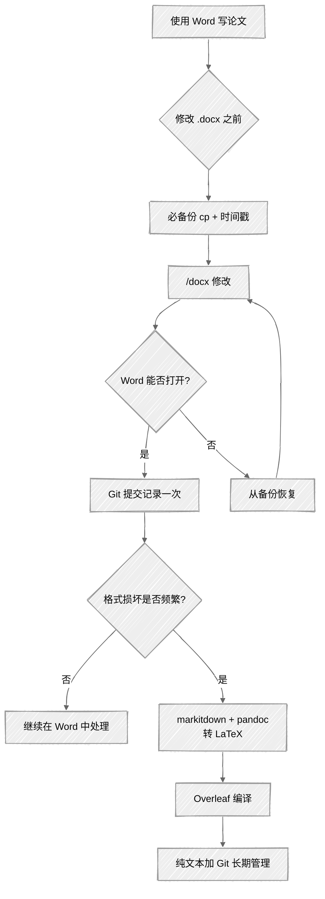

<ChapterAudience>

理解 Word 文档(.docx)底层为 ZIP 压缩包内的 XML,Claude Code 编辑时存在格式损坏风险；修改 Word 文件之前必须备份,"不备份就不动手"是底线规则；用 Git 加纯文本 `.tex` 做版本管理,逐行追踪每次改动；用 pandoc 与 `/markitdown` 完成从 Word 到 LaTeX 的迁移。

</ChapterAudience>

<video autoplay loop muted playsinline class="academic-figure" aria-label="empirical-design 到 stata-plan 的工作流" src="/books/claude-code-paper-writing/figure/08_design_to_stata.mp4"></video>

<Subtext>图 8 · empirical-design 到 stata-plan 的工作流</Subtext>


用 Claude Code 写论文的过程大致分为三个阶段。前两个月在 Word 中操作,用 `/docx` 改章节、调格式、统一术语。中间一段时间频繁遇到文件损坏,修复成本上升。最后一个月把整篇论文从 Word 转到 LaTeX,在 Overleaf 上定稿。回顾下来,66 次 `/docx` 会话中相当一部分时间用于处理格式损坏与修复 XML,实际修改内容的会话比预想少。

若仍在使用 Word,前两节的备份方法建议立即采用;若已在考虑迁移到 LaTeX,后两节可节省摸索时间。



## 8.1 Word 文档操作的风险

第 5 章实操部分介绍过用 Claude Code 修改 Word 的五步流程:备份、读取、修改、检查、验证。本节讨论"备份"与"验证"两步不可省略的原因。

### 一次未备份,三小时手工修复

我首次在 Word 上遇到问题是改第五章实证分析。任务并不复杂——把稳健性检验的表述理顺、统一几个术语,Claude Code 很快完成,我扫了一眼对比认为无问题即继续下一项任务。

第二天打开文件发现:前一天修改的那节正常,但同一文件中另外两节的格式全部出错。段落间距改变,几个表格边框消失,页眉章节标题不对。当时未备份,Claude Code 直接覆盖原文件,无法回到修改前状态。那天晚上花了三个多小时逐段手工修复,部分格式凭印象调整,完成后心里仍不踏实。

<GhAlert type="warning">

**不备份就不动手**

</GhAlert>

>
> 任何 Word 文档操作的第一步必须是备份。该规则的强度是"不备份就不动手",并非可选项。Claude Code 直接覆盖原文件,出问题时未备份只能依赖记忆手工修复。

```bash
cp ch5_analysis.docx "ch5_analysis_backup_$(date +%Y%m%d_%H%M%S).docx"
```

可读日期格式优于时间戳数字(备份多时仍能一眼定位时间点)。原则是:**不覆盖原文件,只创建副本;一天改多次即备份多次**。

<GhAlert type="note">

**定义 8.1 — .docx**

</GhAlert>

>
> `.docx` 是 Microsoft Word 的文件格式,底层为 ZIP 压缩包,内含若干 XML 文件描述文字、格式与表格。该二进制加 XML 的结构使得程序化编辑容易引发 XML 解析错误或格式损坏,稳定性低于 LaTeX 的纯文本格式。

### Word 文件容易出错的原因

Claude Code 修改 Word 文件实际是在操作 XML——把 `.docx` 解压、改 XML、重新打包。中文文档的 XML 有几处容易出问题:

- **中文标点的全角编码**:偶尔被替换成半角或转义出错
- **特殊字符的转义**:数学表达式、不等式可能破坏 XML 编码导致文件无法打开
- **Run 分片**:Word 把同一句话中加粗、字体不同的部分拆成多个片段存储;查找替换跨片段时格式信息容易丢失

某次让 Claude Code 做术语替换,大部分正确,但两处修改后字体变成宋体,其他部分仍为仿宋——即 run 分片导致的问题。

### 损坏症状与应对

<div align="center">

| 损坏程度 | 症状 | 应对 |
|:--|:--|:--|
| 轻度 | 间距、字体、边框走样,文件可打开 | 用备份恢复或手工调整 |
| 中度 | Word 提示"文件存在问题,是否修复",部分表格或图丢失 | 先尝试 Word 自动修复,失败用备份 |
| 重度 | 文件无法打开 | 只能用备份,未备份基本无法挽回 |

</div>

论文写作期间遇到三次文件无法打开。前两次有备份,恢复后重改半小时完成;第三次未备份,即上述手工修复三小时的情况。从那以后操作 Word 之前必先运行备份命令,无例外。

### 减少损坏的做法

若论文必须使用 Word(学校模板要求):**每改一小块即验证一次**(一节甚至一段就用 Word 打开查看)、**避免一次性大改**(十处分十次改)、**复杂格式文档只让 Claude Code 改纯文字部分**(不动表格、嵌入图、数学公式相关的格式)。

66 次 `/docx` 会话中约 40 多次为修改内容,其余二十多次用于处理格式问题或验证文件。该比例提示 Word 格式本身即为不稳定因素。

## 8.2 备份策略

### 手动备份与按日期分文件夹

最基础的备份即 `cp` 复制。一天内修改多个文件时可建立按日期分类的备份文件夹:

```bash
mkdir -p backups/$(date +%Y%m%d)
cp ch5_analysis.docx "backups/$(date +%Y%m%d)/ch5_analysis_$(date +%H%M%S).docx"
```

每天的备份在一个以日期命名的文件夹下,结构清晰。

### 让 Claude Code 自动备份

手动备份的问题是容易遗忘。改着改着忘记备份,出问题时才意识到。处理方法是把备份规则写入 CLAUDE.md,让它每次启动均读取:

```
## 文件操作规则
- 修改任何 .docx 文件之前,先创建备份到 backups/
- 备份文件名格式:原文件名_YYYYMMDD_HHMMSS.docx
- 修改完成后,提醒我用 Word 打开验证
```

<GhAlert type="tip">

**更可靠的方式:Hook**

</GhAlert>

>
> 第 11 章会讨论 Hooks(自动化触发器):设置一个 Hook 让 Claude Code 每次修改 `.docx` 之前自动执行备份脚本,连提醒都不需要。在掌握 Hook 之前,写入 CLAUDE.md 已经够用。

### 用 Git 做版本管理

文件多时单靠 `cp` 备份难以维护。十几个文件每个有若干备份版本,存放在一起难以查找。Git 是程序员管理代码的工具,管理论文同样适用:每次提交记录一个完整快照,可随时回到任一历史版本。

```bash
cd ~/thesis && git init && git add . && git commit -m "initial draft"

# 每次改完一章
git add ch5_analysis.docx
git commit -m "ch5: rewrite robustness section"

# 改错时查历史,恢复某个版本
git log --oneline
git checkout abc1234 -- ch5_analysis.docx
```

<GhAlert type="note">

**定义 8.2 — Git 与版本管理**

</GhAlert>

>
> Git 是分布式版本控制系统,记录每次提交的完整快照。对纯文本(例如 `.tex`)可用 `git diff` 逐行显示两个版本的差异,是论文写作中管理修改历史的最可靠工具。

`.docx` 是二进制格式,Git 能保存版本但无法显示具体改动。迁移到 LaTeX 后 `.tex` 为纯文本,Git 可逐行显示差异,效率更高。

### 备份的频率与云端

每次让 Claude Code 修改文件之前备份一次,每天结束工作时 Git 提交一次。前者保证单次操作出问题可回退,后者保证可恢复至任一天的工作状态。

本地备份只能防范操作失误,无法防范硬盘故障或电脑丢失。Git 推送至 GitHub、Gitee 或学校 GitLab 提供云端备份。未使用 Git 时可用网盘自动同步(坚果云、百度网盘、OneDrive)。

<GhAlert type="important">

**本地与云端两份是底线**

</GhAlert>

>
> 我同学论文定稿当天电脑蓝屏、硬盘无法读取。她之前开启 OneDrive 同步,从云端恢复了完整版本。硬件故障概率虽不高,但本地一份加云端一份可应对。

## 8.3 从 Word 迁移到 LaTeX

我并非一开始即使用 LaTeX。与多数文科社科同学一样,从开题到初稿全程在 Word(学校模板为 Word、导师批注用 Word 修订模式、同学传阅亦为 Word)。LaTeX 当时对我而言属于"听说过但未使用"的工具,认为仅适用于理工科。

促使我切换的是一次表格修改。第五章一个回归结果表,导师要求加一行空间溢出效应系数。让 Claude Code 添加后,Word 打开时表格后半部分错位:列对不齐、单元格边框消失、表下注释跑到下一页。用备份恢复后重新修改,尝试三种方式均失败,最后在 Word 中手工添加该行,原本五分钟的工作花了一个多小时。

那晚翻使用记录,最近两周 `/docx` 会话**近一半时间用于处理格式修复**。论文近 100 页、20 多个表、十几个图、大量数学符号与脚注,文档越复杂,Claude Code 修改时出格式问题的概率越高。继续下去,修复格式的时间会上升,可能超过手工修改。

### LaTeX 的关键优势

LaTeX 文件是纯文本 `.tex`,Claude Code 修改时操作的即文本本身,不需要处理 XML,不存在二进制损坏风险。表格在源码中即一行行文字加 `&` 与 `\\`,添加一行数据即插入一行文本,格式不会错位(格式由表头列定义决定,与内容分离)。LaTeX 与 Git 配合也较佳——`git diff` 可精确显示改动行。

<div align="center">

| 维度 | Word (.docx) | LaTeX (.tex) |
|:--|:--|:--|
| 文件格式 | 二进制压缩包(ZIP 加 XML) | 纯文本 |
| 编辑方式 | 解压、改 XML、重新打包 | 直接修改文本 |
| 损坏风险 | 高(XML 实体、run 分割、编码) | 低(语法错误会报错,不会静默损坏) |
| 表格修改 | 容易错位 | 稳定 |
| Git 对比 | 仅能识别文件已变 | 逐行显示具体改动 |

</div>

另一个因素是:**Claude Code 对 LaTeX 的支持优于对 Word 的支持**。LaTeX 源码是文本加标记,与代码相似,Claude Code 生成 LaTeX 表格、公式、引用的语法正确率较高。

迁移也有风险。论文当时已写 80%,转 LaTeX 意味着所有格式设置(字体、行距、页边距、页眉页脚)需重新配置。我花了一晚检索学校 LaTeX 模板,发现某位学长在 GitHub 上传了一份,框架可用,Overleaf 试编译通过,给我提供了起点。

## 8.4 实操:用 markitdown 加 pandoc 转 LaTeX

实际转换用了约两天。核心工具为 `/markitdown`(微软开发的格式转换)与 `pandoc`(通用转换工具)。

<GhAlert type="note">

**定义 8.3 — pandoc**

</GhAlert>

>
> pandoc 是通用文档格式转换工具,支持 Word、LaTeX、Markdown、HTML 等数十种格式互转。常用命令为 `pandoc input.docx -o output.tex --wrap=none`。

#### 第一步:安装工具与备份原文件

`/markitdown` 让 Claude Code 协助安装,pandoc 用 `brew install pandoc`(macOS)。所有 Word 文件先备份至单独文件夹。

#### 第二步:用 markitdown 预览

```bash
markitdown ch5_analysis.docx -o ch5_preview.md
```

转为 Markdown 是中间检查环节——纯文本可读,核查正文内容是否完整、表格是否丢失、图片引用是否保留。

#### 第三步:pandoc 正式转 LaTeX

```bash
pandoc ch5_analysis.docx -o ch5_analysis.tex --wrap=none
```

转换出的 `.tex` 大部分结构正确,但通常需要清理:自动生成的多余标签、表格格式不对(使用 longtable 而非 tabular,缺三线表)、图片路径需更新、中文偶尔乱码。这些问题让 Claude Code 批量修复即可。

数学公式若在转换中丢失,把原 Word 中的公式截图发给 Claude Code 让它写 LaTeX 代码——常见的回归方程、模型设定基本一次即可写对。

#### 第四步:填入模板与上传 Overleaf

清理后的 `.tex` 放入学校 LaTeX 模板(主文件用 `\input{}` 或 `\include{}` 引入各章)。参考文献需要 `.bib` 文件(Zotero 直接导出,手工写的引用用第 7 章的并行 Agent 批量转换)。

打包 ZIP 上传 Overleaf 点击编译。报错日志会指出具体哪一行什么问题,可读性优于 Word 的"文件已损坏"。

我首次在 Overleaf 编译整篇论文一次即成功,PDF 输出正文完整、表格正确、引用标号自动生成、目录页码均无误。

### 学习成本

若仅用 LaTeX 写论文(而非自行设计模板),需要学习的内容不多。核心命令:`\section{}` 分节、`\textbf{}` 加粗、`\cite{}` 引用、`\ref{}` 交叉引用、`\begin{table}` 与 `\begin{figure}` 画表插图。公式稍复杂,但 Claude Code 对 LaTeX 公式的支持较好——使用者说明公式的数学含义,它写出代码。

我从完全不会 LaTeX 到能在 Overleaf 上独立编辑论文,大约三天(第一天跟入门教程过基本语法,第二天迁移,第三天处理细节)。

<GhAlert type="tip">

**不值得迁移的情况**

</GhAlert>

>
> 论文已定稿或接近定稿时,迁移 LaTeX 的性价比不高,做好备份、每次小改小验即可。论文仍在写作中期、有大量表格、公式、交叉引用、用 Word 频繁遇到格式问题时,迁移值得。

`/markitdown` 共开了 8 次会话,整个迁移约两天完成。与后续节省的格式修复时间相比,这两天的投入有回报。

## 本章小结

<div align="center">

| 核心概念 | 核心内容 | 常见误解 | 为什么错 |
|:--|:--|:--|:--|
| .docx 为 ZIP 加 XML | 修改 .docx 实际在修改 XML | 看上去是文档即等同于文档 | 中文标点、特殊字符、run 分割均可能使 XML 静默损坏 |
| 不备份就不动手 | 修改 Word 之前 `cp` 一份带时间戳备份 | 偶尔遗忘没事 | 一次覆盖即需数小时手工修复 |
| 损坏的三档症状 | 轻度调格式、中度修复、重度只能用备份 | 文件能打开即正常 | 中等损坏外观正常,表格已悄然错位 |
| Git 提交节奏 | 改前 `cp`、改后 `commit` | 整章改完后一次性 commit | 出问题时 commit 颗粒过大,回退会丢失整章 |
| LaTeX 并非只面向理工 | 文科社科论文用 `.tex` 同样可行 | 学习曲线高 | 写论文仅需 5 个命令,三天即可上手 |
| markitdown 加 pandoc | 两天即可完成 Word 全文迁移 | 必须从头重写 | 工具可迁移主体内容,后续调整表格与公式即可 |

</div>

下一章讨论 Skills:什么是 Skill、与普通提示词的区别、如何安装、如何自行编写。

---

<div align="center">

[← 第 7 章 · 引用与参考文献](chap07.md) &nbsp;·&nbsp; [返回目录](../README.md) &nbsp;·&nbsp; [第 9 章 · Skills 的安装与自建 →](chap09.md)

</div>
