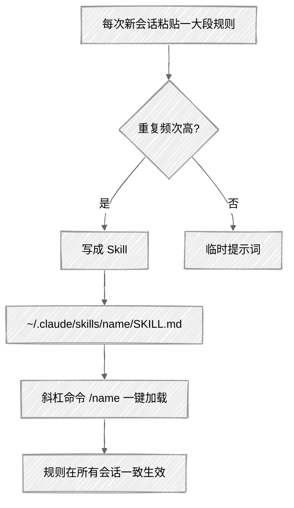

<ChapterAudience>

理解 Skill 的本质:把可复用规则体系存为文件,斜杠命令一键加载；使用几个常用现成 Skill:`/pdf` 读文献、`/drawio` 画图、`/arxiv-database` 检索论文、`/citation-management` 管理引用；从零编写一个属于自己的 Skill,把导师反复批改的写作要求固化下来；走一遍安装与验证流程。

</ChapterAudience>

第 2 章讨论过"每次粘贴背景"的问题。论文写作中存在另一类类似情形:<u>写作规则也需要每次粘贴</u>。术语锁定、表述规范、禁止句式、段落要求,合计两千多字,每次开新会话都需复制粘贴。

Skill 即解决该问题的功能。把规则写成一个文件,后续用斜杠命令调用。我后续在社区找到一个现成的中文学术润色 Skill `/humanizer-zh`,安装后每次开新会话输入一个斜杠命令,两千字的规则即可加载。



## 9.1 Skill 是什么

<GhAlert type="note">

**定义 9.1 — Skill**

</GhAlert>

>
> Skill 是 Claude Code 的可复用指令单元。每个 Skill 是 `~/.claude/skills/` 下的一个文件夹,内含 `SKILL.md` 规则文件。斜杠命令(例如 `/humanizer-zh`)被调用时,Claude Code 自动读取并在当前会话执行。核心价值:持久化、可复用、可共享,免去每次粘贴提示词。

Skill 与普通提示词的差别如下:

<div align="center">

| 普通提示词 | Skill |
|:--|:--|
| 每次会话需手动粘贴 | 文件已保存,斜杠命令一键调用 |
| 通常一两句话 | 可包含数百行规则、模板、检查清单 |
| 会话结束即消失 | 持久化存储,跨会话可用 |
| 共享需复制粘贴 | 整个文件夹拷贝即可 |
| 适合一次性指令 | 适合反复使用的规则体系 |

</div>

可类比说明:普通提示词类似每次到图书馆口头告知管理员需要什么类型的书,Skill 类似办理借阅卡,刷卡即可。

## 9.2 安装现成的科研 Skill

按实际使用频率介绍几个。

### /humanizer-zh:中文学术润色

我使用频率最高的 Skill。内置一整套学术中文写作规则:术语保护(防止自行替换)、AI 痕迹抑制(规避典型套话与对仗句式)、句式控制(句子不超过 25 字)、格式统一。<u>安装后输入一个 `/humanizer-zh`,两千多字规则一秒加载</u>。它自带检查清单,润色完成后会自查:术语是否被改、是否存在 AI 痕迹句式、引用编号是否丢失。

### /pdf:读取 PDF 文献

使用次数超过 100 次。最常用的场景是核对引用:直接说"读这篇 PDF 第 12 页,找关于工具变量选取的那段话"。它还可合并 PDF、提取表格、加水印、对扫描件做 OCR。某次拿到九十年代的扫描版文献,文字无法选中,`/pdf` 自动做了 OCR,大部分内容成功提取。

### /drawio:绘制流程图与框架图

使用次数超过 100 次。以往使用 Visio 绘制一张图需一两个小时,现在用文字描述图的结构,例如"绘制双向固定效应模型估计流程,从数据清洗到最终结果",它直接生成图文件。生成的是矢量图,放大不模糊,可直接嵌入论文。本论文 15 张图中有 10 张以此方式起稿。

### /arxiv-database:检索 arXiv 论文

使用 90 次。<u>文献综述阶段帮助最大</u>。某次检索 `spatial econometrics panel data`,返回 47 篇。让 Claude Code 按摘要分为纯方法论、有实证应用、综述类三类,每类附简要总结,据此决定哪些需精读。<u>半小时完成,以往需要一整天</u>。

### /citation-management:管理参考文献

使用 16 次,每次都很关键。可检索 Google Scholar 与 PubMed,提取完整元数据,生成 BibTeX。本论文一百多篇引用提交前批量核查,它识别出 11 条格式问题(3 个作者名拼错、2 个期刊缩写不一致)。

### /docx、/markitdown、/pyzotero

`/docx` 处理 Word 文档(读取批注、改修订),使用 66 次。`/markitdown` 把 PDF、Word、PPT、Excel 转为 Markdown,使用 8 次。`/pyzotero` 连接 Zotero 文献库,直接读取条目与标签,使用 12 次。

以上 Skill 覆盖了科研写作中最常见的操作。按自身需求选几个即可。

## 9.3 自行编写 Skill

现成 Skill 覆盖通用操作,但部分需求具有个性化特征。例如导师对论文有一套特定的批注习惯与格式偏好。

### 自建的理由

我的导师开会反复提同一批要求:标题需抽象化、每段开头一句话点核心论点、不使用"本章将介绍"等套话、表格使用三线表。这些要求分散在不同次会议记录中,<u>每次让 Claude Code 改论文都需从笔记翻出来粘贴,常有遗漏,改完又被指出同类问题</u>。

后续把所有批注汇总成一个 Skill,此后每次润色前先调用,所有要求自动加载。

### 文件结构

在 `~/.claude/skills/` 下创建一个文件夹,名称即斜杠命令名,内含一个 `SKILL.md`。文件开头写名称与适用场景,后续是具体规则。

我把导师要求分为五部分:

**标题规范**:体现学术抽象性,层层递进,避免"XX 在 YY 中的应用"格式。

**段落结构**:每段开头一句话点核心论点,一段不说三件事,句子超过两行即断开。

**术语锁定表**:论文中所有不能被修改的术语,旁列错误替换。<u>反面例子很重要,因为 Claude Code 常会替换成被认为"更顺"的同义词</u>。

**应避免的写法清单**:导师明确反对的写法,每条附正面修改示例。

**检查清单**:润色完成后逐条核查:术语是否被动、是否存在超长句、标题是否足够学术化、引用编号是否丢失。

整个 SKILL.md 一百多行。第一版只有几十行,每次导师提出新要求即追加一条。

<GhAlert type="tip">

**自建 Skill 的几条经验**

</GhAlert>

>
> - **反面例子比正面例子更重要**:"避免写成 'XX 技术在 YY 领域的应用研究'"比"标题需要学术化"明确得多
> - **规则逐步累积**:第一版只写最核心的,后续每次遇到问题再追加一条
> - **检查清单置于末尾**:Claude Code 会自动对照核查
> - **导师原话直接写入规则**:比转述准确

## 9.4 实操:安装 3 个科研必备 Skill

#### 第一步:安装

<u>最简单的方式是在对话中说"帮我安装 pdf 这个 skill",它会自动下载并放到正确位置</u>。安装 `/arxiv-database` 与 `/citation-management` 操作相同,每个几秒。

若是他人分享的 Skill 文件夹,把整个文件夹拷贝到 `~/.claude/skills/` 即可。

#### 第二步:验证

```
/pdf
读一下 ~/Desktop/sample_paper.pdf 的第一页,告诉我标题与摘要。
```

能正确返回标题与摘要即成功。缺依赖会提示安装。

#### 第三步:扩展

需要新功能时直接说"我需要一个能画流程图的 Skill",它会推荐 `/drawio`。未使用的 Skill 放置不影响系统,不占用资源,仅在调用时加载。

<GhAlert type="important">

**优先级建议**

</GhAlert>

>
> - **首选 `/pdf`**:科研场景频率最高
> - **文献综述阶段安装 `/arxiv-database` 与 `/citation-management`**:检索论文与生成 BibTeX
> - **制图阶段安装 `/drawio`**:快速生成流程图初稿
> - **使用 Zotero 的安装 `/pyzotero`**:直接读取文献库

## 本章小结

<div align="center">

| 核心概念 | 核心内容 | 常见误解 | 为什么错 |
|:--|:--|:--|:--|
| Skill 的本质 | `~/.claude/skills/name/SKILL.md` 加斜杠命令 | 比普通提示词更智能 | 即持久化的指令文本,优势在于"不必重新粘贴" |
| 持久化 | 一次写好,每次会话均可调用 | 每次会话需重新粘贴 | 存于文件系统,不删即一直存在 |
| 反面例子 | 比正面规则更具约束力 | 仅写"应当如何"即可 | 反面例子才能锁定边界 |
| 自建 Skill | 把导师反复批改的要求固化 | 等导师不再批改时再写 | 越早写越省事,每次新批注即追加一条 |
| 安装 | 一句话完成 | 必须懂 Git | Claude Code 自行放置到正确目录 |

</div>

下一章讨论如何让多个 Agent 协作完成一个大型任务,把第 4 章 156 篇引用核查的过程从技术角度展开。

---

<div align="center">

[← 第 8 章 · 格式排版与文件管理](chap08.md) &nbsp;·&nbsp; [返回目录](../README.md) &nbsp;·&nbsp; [第 10 章 · 并行 Agent →](chap10.md)

</div>
