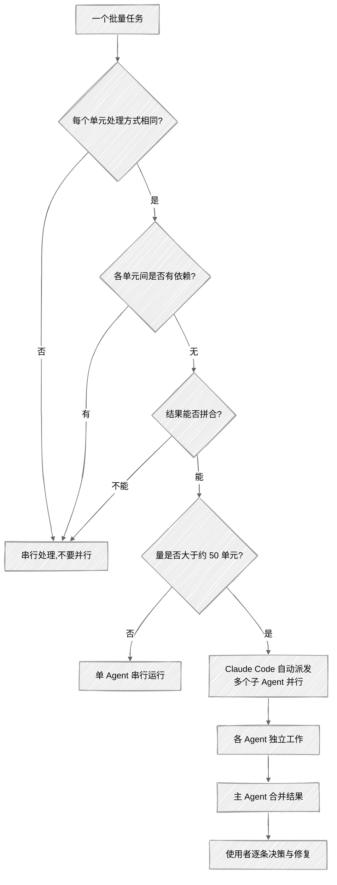

<ChapterAudience>

判断一个任务能否并行:可分割(各单元无依赖)加可合并；走一个完整实战:3 个并行 Agent 在 40 分钟内核查全部参考文献；学会处理中断与续接:`checkpoint.md`、`claude --continue`；理解 rate limit 的规律与应对方式。

</ChapterAudience>

写论文到后期会遇到一类任务:工作量大、每一步处理方式相似、需要投入大量时间。例如所有参考文献逐条核查、7 章正文术语一致性排查、40 张图表格式逐一检查。共同特征是**每条、每章、每张图的处理方式几乎一致,彼此之间没有依赖**。<u>第 52 条引用的核查结果不影响第 53 条的核查方式</u>。

并行 Agent 的适用场景即在此。第 4 章介绍过 156 条引用 40 分钟核查完成,那一节讨论的是"发生了什么"。本章从技术角度展开:如何判断能否并行、如何编写指令、中断如何续接、结果如何汇总。



## 10.1 哪类任务适合并行

<GhAlert type="note">

**定义 10.1 — 并行 Agent**

</GhAlert>

>
> Claude Code 在一次对话中自动派发多个子 Agent,每个处理同一批量任务的不同子集,彼此独立工作,最后由主 Agent 汇总。**适用条件**:任务可分割(无依赖)且结果可合并。

### 两项判断条件

**可分割**:能拆成独立小块,每块单独完成不需了解其他块的结果。156 条引用拆 3 批可行,第 52 条核查不依赖第 53 条。"先写完第三章再据此写第四章引言"则不能并行,因为第四章依赖第三章输出。

**可合并**:各小块结果易于汇总。引用核查结果是每条的状态(正确或有问题),三批拼接即为完整报告。若结果之间存在交叉(第三章发现的术语会影响第五章定义),合并需大量协调,并行收益打折扣。

判断方法:<u>**若把任务交给三个互不认识的助理各做一部分,最后只需把三份结果拼接、无需协调,该任务即适合并行**</u>。

### 不适合并行的任务

- **逻辑连贯的写作**:三个 Agent 分别写第三章三节再拼接,论证递进会出现断裂
- **需要全局视角**:全文行文风格统一,每个 Agent 只看自己那章无法判断整体
- **涉及交叉依赖的修改**:第三章引用了第五章公式编号,两个 Agent 分别修改各自看不到对方变化,引用会断

<GhAlert type="warning">

**我犯过一次此类错误**

</GhAlert>

>
> 让两个 Agent 分别润色第三、四章。第三章末尾有"如下一章所述,空间杜宾模型可解决该问题",第四章 Agent 把空间杜宾模型那节标题改成了"空间计量模型的设定"。两个 Agent 各自做的都对,拼接后预告与实际内容不一致。后续花半小时手工核对衔接,本可由一个 Agent 顺序处理两章避免。

### 科研中常见的并行场景

**适合**:参考文献核查(分 3 批)、图表格式检查(40 张图分 4 批)、数据核对(20 个回归表分批)、英文翻译(不同段落分给不同 Agent,但术语对照表必须提前发给每个 Agent)。

**不适合**:处理导师批注(批注存在内在逻辑,"第三章 A 问题"与"第五章 B 问题"可能同源,需一个 Agent 通读理解整体意图)。

### 收益与代价

收益是时间可压缩到原来的二分之一到三分之一。

代价方面有三项。**每个子 Agent 都消耗使用额度**:三个并行 40 分钟相当于一个 Agent 跑两小时。**Agent 之间无法通信**:A 发现某文撤回时 B 与 C 不知道,需在汇总时处理交叉发现。**准备成本不值得**:任务量小(不到 50 个重复单元)时,拆分时间超过节省时间。<u>经验阈值是 50 个单元以上才有明显时间收益</u>。

<div align="center">

| 适合并行 | 不适合并行 |
|:--|:--|
| 每单元处理方式相同 | 处理方式随上下文变化 |
| 单元间无依赖 | 后续依赖前面输出 |
| 结果易于拼合 | 结果间存在交叉引用 |
| 任务量超过 50 个单元 | 拆分时间超过节省时间 |

</div>

## 10.2 引用核查的并行实战

### 拆分与指令

156 条决定分 3 批。**为何 3 批而非 5 或 10**?两项考虑:每批量需充分(每批 50 条,Agent 工作十几分钟,过小时编写指令的时间会超过 Agent 工作时间);并行数量受额度限制(Claude Code 自动决定,通常 2 到 3 个)。

具体如何分批不需使用者操心,**在一个对话中说清任务**即可:

```
读取 references.bib,对每条引用核查:
- 作者姓名拼写
- 发表年份
- 期刊或会议名是否完整(不要使用缩写)
- 卷号、期号、页码
- DOI 是否可解析
有问题的写入 citation_check_report.md。
```

它收到指令后判断 156 条数量较大,派发几个子 Agent 分头核查,最后合并报告。<u>整个过程不需手动分批、指定输出格式或编写限频处理</u>。

<div align="center">
  
</div>

<GhAlert type="important">

**核查标准需写清楚**

</GhAlert>

>
> 不写检查项时它会做最基础的检查,可能遗漏使用者关心的部分(例如"作者拼写"、"DOI 可解析")。把每个维度列清楚,结果才会贴近预期。

### 启动与汇总

不必手动开多个终端。指令发出后 Claude Code 自动派发子 Agent 后台并行,对话窗口显示"启动 Agent 处理第 1 到 52 条"、"第 53 到 104 条"。约 40 分钟后返回汇总报告:156 条中 145 条无问题,11 条存在问题(3 处年份错、4 处页码不完整、2 处期刊名缩写、2 处 DOI 失效)。

### 处理问题

修改环节由使用者完成。Claude Code 告知"Smith et al. (2019) 的实际发表年份是 2020",但需使用者确认该信息(同一篇文章会议版 2019、期刊版 2020,引用哪一个取决于正文引用的具体内容)。年份或页码错误的查到正确信息后让 Claude Code 修改 BibTeX;撤回的文献找类似研究替换;DOI 格式错的去除多余空格即可。

从开始运行到完成 11 条修改约两小时(并行核查 45 分钟、汇总几分钟、使用者处理一小时)。除时间节省外,**每条按同一标准核查,不会遗漏**,<u>不存在"核查到第 120 条注意力下降"的情况</u>。

### 可复用的五步流程

1. 判断"可分割加可合并"两项条件
2. 在指令中写明核查标准、输出文件名、输出格式
3. 发给 Claude Code 让它自行决定拆分与派发
4. 等待汇总,过程中不要插入其他对话
5. 收到报告后逐条决策修复,学术判断由使用者完成

不仅适用于引用核查。表格数据核查、图表格式检查、多章节术语一致性等均可。**关键是第一步的判断:能否拆、能否拼**。

## 10.3 长任务的中断与续接

<u>并行 Agent 通常几十分钟完成,多数情况不需处理中断</u>。但任务特别大(核查两三百条引用)或电脑休眠、终端关闭时,可能遇到中断。

**用 `claude --continue` 续接**:终端中输入 `claude --continue` 恢复上次会话上下文,告知"从上次停的位置继续"通常可继续工作。

<GhAlert type="warning">

**`--continue` 恢复的是最近一次会话**

</GhAlert>

>
> 中断后若开新会话做其他事,再用 `--continue` 恢复的即为新会话。长任务被打断后直接 `--continue`,不要先开其他会话。

**checkpoint**:跨天大任务可在指令中要求维护 `checkpoint.md` 记录进度(第 5 章提过),上下文被压缩后它读取 checkpoint 即可知道进度。

**Rate limit**:遇到限频时 Claude Code 自动等待后继续,不需在指令中写"等两分钟再继续",它内部处理,使用者感知到的是偶尔暂停后自动恢复。

<GhAlert type="tip">

**多数情况一次对话可完成**

</GhAlert>

>
> 引用 200 条以内、术语排查 10 章以内通常一次对话即可完成,无需考虑中断。

## 10.4 实操:全文术语一致性检查

7 章论文中导师要求做全面术语一致性检查。

#### 第一步:分析任务

**检查阶段可以并行**(每章独立扫描),**统一修改阶段必须串行**(替换跨章节,并行会让不同 Agent 改成不同结果)。

#### 第二步:发送指令

```
读取论文 7 章(ch1.tex 到 ch7.tex),识别所有专业术语,
检查同一概念在不同章节是否使用不同表述。重点:
- 同义词混用(「被解释变量」与「因变量」)
- 英文术语大小写(「Panel Data」与「panel data」)
- 缩写首次出现是否给全称
列出每个不一致的术语:各章使用了什么、出现次数。
```

它派发几个子 Agent 分头扫描,约 25 分钟返回汇总。

#### 第三步:基于结果决策

返回的报告大致如下:

```
1. 「被解释变量」与「因变量」
   - 第 1 到 3 章:被解释变量 23 次、因变量 2 次
   - 第 4 到 5 章:被解释变量 8 次、因变量 15 次
   - 第 6 到 7 章:因变量 12 次、被解释变量 0 次

2. 「Panel Data」、「panel data」、「面板数据」
   - 第 1 到 3 章:面板数据 18 次、Panel Data 3 次
   - 第 4 到 5 章:面板数据 10 次、panel data 5 次
   ...
```

使用者决定每个术语统一使用哪个(按学科惯例与导师偏好)。

#### 第四步:执行替换

```
按以下规则全文替换:
- 「因变量」改为「被解释变量」
- 「Panel Data」与「panel data」改为「面板数据」
- 「IV 估计」与「IV 方法」改为「工具变量法」
替换前备份所有 .tex 文件。替换后告诉我每个文件改了几处。
```

**该步骤串行**:替换跨章节,需要一个 Agent 统一处理才能保证一致。

#### 第五步:验证

替换完成后再跑一次术语检查验证。若仍有遗漏(藏在表格或脚注中第一轮未覆盖),再处理。

### 时间对比

手工检查 7 章五万字需三到四小时,且难以保证不遗漏。并行 Agent 从指令到替换完成并验证共约一小时,**覆盖度也更高**:<u>它能扫到脚注、表格标题、图注中的术语,这些位置肉眼容易遗漏</u>。

同样的处理方式适用于图表格式检查、数据核查、参考文献格式统一等场景。

## 本章小结

<div align="center">

| 核心概念 | 核心内容 | 常见误解 | 为什么错 |
|:--|:--|:--|:--|
| 适合并行的两项条件 | 可分割加可合并 | 任务大即应并行 | 连贯论证规模大但不能拆,强拆会导致逻辑断裂 |
| 编写指令 | 把核查标准、输出格式说清楚 | 一句话即可 | 不写检查项时模型做最基础的检查,关心维度可能被遗漏 |
| 自动派发 | Claude Code 自行决定派发几个子 Agent | 需手动开多个终端 | 在一个对话中描述,分批由模型决定 |
| 串行收尾 | 替换、合并需一个 Agent 处理 | 替换也可并行 | 替换跨章节,并行会让不同 Agent 改成不同结果 |
| `--continue` | 中断后续接上次会话 | 必须重新运行 | 续接后告知"从上次停的位置继续"即可 |
| 并行的代价 | 额度成倍消耗 | 并行即单纯加速 | 三个 Agent 跑 40 分钟相当于一个跑两小时的额度 |

</div>

下一章讨论 Hooks。

---

<div align="center">

[← 第 9 章 · Skills 的安装与自建](chap09.md) &nbsp;·&nbsp; [返回目录](../README.md) &nbsp;·&nbsp; [第 11 章 · Hooks →](chap11.md)

</div>
