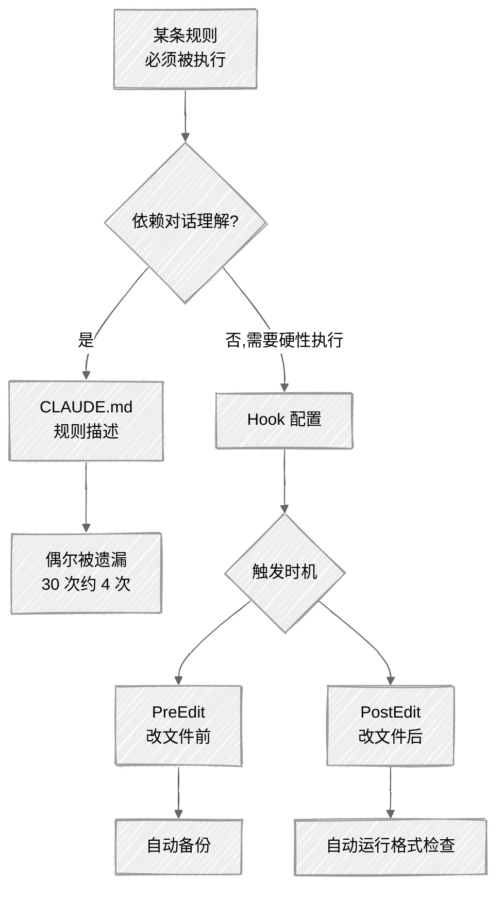

<ChapterAudience>

理解 Hook 的本质:系统级自动化触发器,把"建议性"规则改为"强制执行"；区分 Hook 与 CLAUDE.md:前者嵌入执行流程不可跳过,后者是对话提示偶尔被忽略；配置 PreEdit Hook:修改 `.docx` 文件前自动备份；配置 PostEdit Hook:修改 `.tex` 文件后自动运行格式检查脚本。

</ChapterAudience>

第 8 章讨论备份策略时给出的解决方案是把备份规则写入 CLAUDE.md。该方法可行但有漏洞:CLAUDE.md 中的规则属于建议,Claude Code 会尽量遵守但偶尔会忽略。我做过统计,写入 CLAUDE.md 之后的 30 次会话中,约 4 次它忘记先备份直接修改文件。概率不高,但出现一次即需投入时间恢复。

Hook 把"建议"改为"强制"。设置一条规则告知"每次修改文件之前必须先执行某命令",它会在每次编辑触发之前自动运行该命令。该机制位于 Claude Code 底层,与对话理解能力无关。



## 11.1 Hook 是什么

<GhAlert type="note">

**定义 11.1 — Hook**

</GhAlert>

>
> Claude Code 的系统级自动化触发器。指定事件发生时,Claude Code 在继续执行前会强制运行预设的终端命令。Hook 配置存储在 Claude Code 设置文件中,**独立于对话上下文,不受上下文长度或注意力影响**。常用事件:PreEdit(改文件前)、PostEdit(改文件后)。

类似 Git 的 pre-commit hook(提交代码前自动检查),原理一致,区别在触发事件:Git 是"提交时触发",Claude Code 是"编辑文件时"、"发消息时"等与 AI 交互相关的事件。

### Hook 的三个组成部分

**事件**:何时触发。最常用的两种为 PreEdit(修改之前)、PostEdit(修改之后)。

**匹配条件**:对哪些文件生效。例如只匹配 `.docx`:`*.docx`。不设条件即对所有文件生效。

**要执行的命令**:一条普通终端命令(`cp`、`grep`、`python` 运行脚本等)。

<GhAlert type="tip">

**无需自行编写配置语法**

</GhAlert>

>
> Hook 的配置是结构化格式,但不需要使用者自行编写。在对话中告知 Claude Code"我想配置一个 Hook,每次修改 .docx 文件之前自动备份",它会写好配置并放到正确位置。使用者只需确认方案是否正确后同意执行。

### Hook 与 CLAUDE.md 的区别

CLAUDE.md 中的规则属于**对话层面**:Claude Code 读到后尽量遵守,但本质是文字提示,对话复杂时可能被忽略。

Hook 属于**系统层面**:嵌入执行流程,每次准备编辑文件前系统先检查匹配的 Hook,有则先执行 Hook 命令再允许编辑。不依赖对话理解、不受上下文长度影响、不会被遗忘。

类比说明:CLAUDE.md 中写"修改前备份"类似笔记本上的待办事项,工作前看一眼提醒;Hook 类似门上的锁,出门时可能忘看待办,但不可能不开锁就出门。

<div align="center">

| CLAUDE.md | Hook |
|:--|:--|
| 对话层面的文字提示,偶尔被忽略 | 系统层面的强制执行,不可跳过 |
| 依赖理解能力 | 不依赖对话 |
| 适合软性偏好与风格 | 适合硬性必须执行的操作 |

</div>

<GhAlert type="important">

**两种方式搭配使用**

</GhAlert>

>
> 风格类规则("使用学术语气"、"保留特定术语")写入 CLAUDE.md,需要语义理解。操作类硬性要求("改文件前备份"、"改完运行检查脚本")用 Hook,机械性操作不需要语义。

## 11.2 修改文件前自动备份(PreEdit)

这是我配置的第一个 Hook,也是使用频率最高的。每次 Claude Code 准备修改 `.docx` 之前,自动复制一份到 backups/ 文件夹(文件名带时间戳),备份完成后才允许修改。

### 需要该 Hook 的原因

第 8 章讨论过 Word 风险,再补充一个实际例子。某天晚上我连续修改第三、五、七章 Word 文件,改到第七章时已凌晨一点多,导师要求"把空间权重矩阵描述简化,与第三章保持一致"。Claude Code 修改完成后我快速扫了一眼即继续下一条意见。

第二天早晨打开第七章发现:它不仅简化了空间权重矩阵,还把前面两段模型设定的表述一并修改,用词与其他章节不一致。想回退时发现备份停留在前一天下午三点——夜间那一轮密集修改一次都未备份。CLAUDE.md 中虽写有"修改前先备份",但凌晨注意力集中在导师意见上,根本未想起。

此事之后配置了 PreEdit Hook,备份就不再需要操心。

### 配置过程

无需查找配置文件或编写语法。直接在对话中说:

```
帮我配置一个 Hook:每次修改 .docx 文件之前,
自动备份到 backups/ 文件夹,
文件名格式「原文件名_年月日_时分秒.docx」。
```

它会告知方案(PreEdit Hook、匹配 `.docx`、触发时执行什么命令),确认后即配置完成。

几个细节:**备份文件夹位置**:放在项目内便于查找,但需在 `.gitignore` 中加 `backups/` 排除,避免被 Git 追踪。**时间戳格式**:可读的"年月日_时分秒"(`ch7_method_20260315_013042.docx`)比 Unix 时间戳数字更便于查找,按文件名排序即按时间排序。**文件夹不存在时**:生成的命令会包含创建文件夹的操作,无需提前建立。

### 配置完成后

整个备份变为全自动。说"把第七章的空间权重矩阵描述简化",Claude Code 准备修改 `ch7_method.docx` 时系统检测到 `.docx` 触发 PreEdit Hook 自动备份,备份完成后才开始修改。整个过程多两到三秒,几乎无感。

<div align="center">
  
</div>

该 Hook 使用三个多月,备份文件夹累积 200 多个文件。其中 7 到 8 次确实需要回退(Claude Code 改错内容、我自己认为不如原版、导师要求保留旧版),每次都很快——找时间最近的版本复制回原位即可。

迁移到 LaTeX 后我也配置了 `.tex` 的 PreEdit Hook,但策略较宽松——只备份大改动(小改动 Git 提交即可),因为 `.tex` 是纯文本,`git diff` 可逐行显示差异。

## 11.3 写完章节后自动格式检查(PostEdit)

第二个 Hook 是 PostEdit:修改完文件后自动运行格式检查。

### 需求来源

我有一套润色规则(第 9 章中提到的那个 Skill)——术语不可擅自修改、规避某些对仗句式、段落不超过 8 句。Skill 可大幅降低问题但无法完全消除。起初我用肉眼检查,每次它写完一节 3000 字内容,我从头到尾读、查找破折号与超长段落,每次十几分钟。

后续想到的方案:让 Claude Code 编写一个简单脚本,每次修改 `.tex` 后自动运行——扫描破折号、特定句式、段落句数,发现问题列出"第几行、什么问题、原文"。

### 配置过程

第一步让 Claude Code 写检查脚本,告知需检查的项目:中文破折号、对仗句式、段落超 8 句。它写好后我在几个定稿章节上试运行确认逻辑无误——中间调了两次:第一次它把 LaTeX 注释中的破折号也标了出来,让它排除 `%` 开头行与 `lstlisting` 环境;第二次段落计数按空行分,但 LaTeX 中有些空行用于排版(`\bigskip` 前后),不应作为分界。

第二步配置 Hook:

```
帮我配置一个 Hook:每次修改 .tex 文件之后,
自动运行刚才那个检查脚本,把结果输出到终端。
```

PostEdit 类型,匹配 `.tex`。每次修改完 `.tex` 系统自动运行脚本,结果显示在对话中。

### 实际效果

写作流程变为:让 Claude Code 写一节,它完成后 Hook 自动触发运行检查,结果显示出来。有问题当场让它修改("第 47 行有破折号改成逗号"),无问题进入下一节。

按以往手工检查每次十几分钟、15 章乘以 4 节乘以 15 分钟约为 15 小时。有了 Hook 之后我只看结果列表 30 秒即可判断。**Skill 已挡住大部分违规,Hook 起兜底作用——若有遗漏由 Hook 兜住**。

### 检查项可逐步扩展

我的脚本起初为三条规则,后续不断追加:写到第六章发现它偶尔在正文中使用分点列表,加一条检测 `\begin{itemize}` 与 `\begin{enumerate}` 是否出现在不应出现的位置;写到第八章做脱敏检查,加一条搜禁忌关键词;写到第十章加一条统计字数低于 2500 字时提醒。目前 7 条规则均为写作过程中逐条追加。

每次追加新规则的流程一致:在对话中告知 Claude Code 需检查的内容,它修改脚本,使用者运行一遍确认。Hook 配置不需变动——它只是"修改 .tex 后运行此脚本",脚本内容更新后 Hook 自动运行新版本。

<GhAlert type="important">

**检查脚本并非万能**

</GhAlert>

>
> 文本匹配能识别破折号、特定句式、特定关键词,但无法处理"这段写得不够具体"、"这个例子是编的还是真实的"、"段落逻辑衔接是否通顺"等语义问题。
>
> 我的工作流分两层:第一层 PostEdit Hook 识别硬性规则违规,第二层使用者自行通读评估内容质量。Hook 处理第一层,使用者集中精力于第二层。

## 11.4 实操:配置自动备份 Hook

从零配置 PreEdit Hook 的完整流程。

#### 第一步:确认当前配置

```
我想配置一个 Hook,看一下当前是否已有配置?
```

它读取设置文件后告知。若无即从头开始,若有先查看现有配置避免冲突。

#### 第二步:用自然语言描述需求

无需语法,自然语言即可:

```
帮我配置一个 PreEdit Hook:
- 每次修改 .docx 文件之前触发
- 备份到当前目录下的 backups/ 文件夹
- 备份文件名:原文件名_YYYYMMDD_HHMMSS.docx
- backups/ 不存在则自动创建
```

它会给出方案,确认三件事:触发时机是否正确(应为 PreEdit 而非 PostEdit,备份必须在修改前)、匹配条件是否正确(`.docx` 不要写成 `.doc`)、命令是否正确(包含创建文件夹、复制、时间戳)。无误后让它执行。

#### 第三步:测试

创建一个测试文件让 Claude Code 修改:

```
在当前目录创建 test_hook.docx 写一句话。
然后修改这个文件,内容改为「这是修改后的内容」。
```

Hook 配置正确时,`backups/` 应出现带时间戳的备份文件,内容为修改前的版本。

若备份未出现,配置可能有问题,让 Claude Code 检查:

```
我刚配置的 PreEdit Hook 似乎没触发,帮我检查配置。
```

多数为小问题(匹配条件写成 `.doc`、备份路径错),修改后再测试。

#### 第四步:日常使用与维护

测试通过后 Hook 持续工作,后续修改 `.docx` 均自动备份,无需额外操作。

备份会持续增加(三个月累积 200 多个)。每月清理一次让 Claude Code 处理:

```
清理 backups/ 中超过 30 天的备份。先列出来让我确认再删。
```

#### 第五步:扩展

迁移到 LaTeX 后再配置一个 `.tex` 的 PreEdit Hook(方法一致)。然后顺手把第 11.3 节的 PostEdit 格式检查也配置上:

```
帮我配置 PostEdit Hook:每次修改 .tex 后自动运行检查脚本,
结果输出到终端。
```

两个 Hook 配置完成后工作流变为:让 Claude Code 修改文件,改前自动备份(PreEdit),改后自动检查格式(PostEdit)。使用者只关注内容本身。

## 本章小结

<div align="center">

| 核心概念 | 核心内容 | 常见误解 | 为什么错 |
|:--|:--|:--|:--|
| Hook 为系统级触发器 | 嵌入执行流程,不依赖对话 | 与 CLAUDE.md 等价 | CLAUDE.md 是软约束偶尔被忽略,Hook 是硬约束不可跳过 |
| PreEdit 与 PostEdit | 修改之前与之后触发 | 二者差别不大 | 备份必须 Pre,检查用 Post,时机错配即失效 |
| 自然语言配置 | 在对话中描述需求 | 必须懂配置语法 | Claude Code 自行写配置,使用者只需确认方案 |
| 备份策略三层 | 手动 → CLAUDE.md → Hook | CLAUDE.md 即可 | 30 次会话遗漏 4 次,关键操作需 Hook 兜底 |
| 脚本加 Hook | 脚本可扩展,Hook 不变 | 改规则需重配 Hook | Hook 只调用脚本,脚本可随时修改 |
| Hook 并非万能 | 文本匹配处理硬性问题 | 它能检查论证逻辑 | 语义问题仍需使用者通读评估 |

</div>

下一章讨论 MCP 工具扩展。

---

<div align="center">

[← 第 10 章 · 并行 Agent](chap10.md) &nbsp;·&nbsp; [返回目录](../README.md) &nbsp;·&nbsp; [第 12 章 · MCP 工具扩展 →](chap12.md)

</div>
