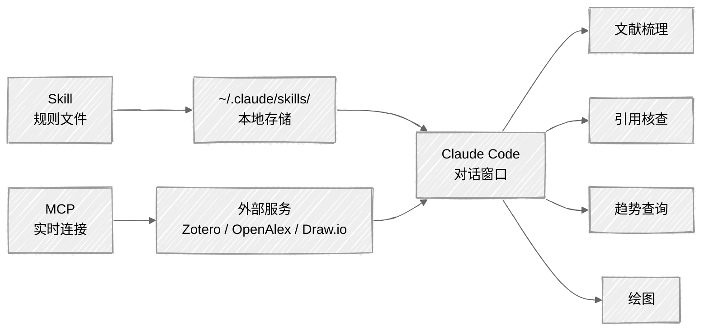

<ChapterAudience>

理解 MCP 的本质:让 Claude Code 连接外部服务；区分 Skill(规则文件)与 MCP(实时连接)；使用 `/pyzotero` 连接 Zotero 文献库做梳理、核查、框架生成；使用 OpenAlex MCP 查询发表趋势、引用关系、作者信息；看清各文献工具的分工。

</ChapterAudience>

第 9 章介绍了 Skill,第 6 章使用 Draw.io 时也提到 MCP——Claude Code 通过 MCP 连接 Draw.io,输入 `/drawio` 即可创建编辑图表。本章单独讨论 MCP,因为它可连接的工具远不限于 Draw.io。Zotero、开放学术数据库、邮件日历均可接入。对从事文献工作的研究生最实用的是 Zotero MCP 与学术数据库 MCP。



## 12.1 MCP 是什么

Skill 与 MCP 经常被混为一谈。**Skill 是预先写好的指令文件,告知 Claude Code 遇到某类任务该如何处理**。**MCP 是协议,让 Claude Code 连接一个正在运行的外部服务,实时读取与操作该服务上的数据**。

> [!NOTE]
> **定义 12.1 — MCP(Model Context Protocol)**
>
> 让 Claude Code 与外部服务(Zotero、学术数据库、Draw.io 等)建立实时连接,读取并操作这些服务上的数据。**MCP 依赖外部服务保持运行,断网或服务宕机即不可用**,这是它与本地 Skill 文件的本质区别。

举例如下。`/pdf` 这个 Skill 处理 PDF 时文件位于本地电脑,Claude Code 直接读取。但 Zotero 文献库的数据存于 Zotero 服务器,Claude Code 无法直接访问——MCP 在两者之间建立通道:Zotero 一侧运行一个服务,Claude Code 通过 MCP 协议与该服务通信,读取条目、标签、附件。Draw.io MCP 同理:Draw.io 负责渲染,Claude Code 通过 MCP 指挥它创建方框与箭头。

> [!IMPORTANT]
> **Skill 是规则,MCP 是连接**
>
> 部分工具同时使用两者:`/pyzotero` 这个 Skill 的规则文件中写了如何与 Zotero 交互,实际连接 Zotero 的通道是 MCP。**Skill 安装后即可使用,MCP 还需外部服务保持运行**。

作为使用者无需关注技术细节——服务启动、连接参数均由 Claude Code 处理。只需了解:部分功能需要 MCP(连接 Zotero、学术数据库),其依赖网络。

我使用过的 MCP 主要为三个:Draw.io 绘图(第 6 章讨论过)、Zotero 文献库、学术数据库检索。后两个本章重点讨论。

### 为什么不直接使用 Zotero

当然可以打开 Zotero 客户端手动浏览、手动导出 BibTeX。但若希望 Claude Code 在写综述时自行查询文献库是否有某篇文献、自动拉取某标签下的所有条目,**它需要能"读取"Zotero 内容**。无 MCP 时只能依靠使用者手动粘贴。

可类比为助手与资料室:无 MCP 时,助手在门外,使用者每次进入资料室取文件递给它;有 MCP 后,助手获得钥匙,自行进入查找。

## 12.2 接入 Zotero 文献库

> [!NOTE]
> **定义 12.2 — Zotero**
>
> 开源文献管理工具,可存储论文 PDF、录入元数据、添加标签与笔记、云端同步。通过 MCP,Claude Code 能实时读取 Zotero 中的元数据与笔记,做自动筛选、分组、摘要。

我使用 Zotero 三年,论文相关条目四百多篇。`/pyzotero` 之前 Zotero 与 Claude Code 是两个独立环境——查询单篇文献信息需手动复制粘贴;批量操作("按方法分类这 20 篇")需在 Zotero 中手动导出后再让 Claude Code 读文件。来回粘贴效率较低。

`/pyzotero` 之后,说"列出所有标记了'核心文献'标签的条目",几秒后返回列表,每条带作者、标题、年份、期刊名。

### 我用 /pyzotero 做的三类工作

**文献梳理**。第三稿综述需按主题重新分组,让 Claude Code 直接从 Zotero 拉取标签下的文献,按发表年份与方法分组。返回结果使我注意到一条之前未关注的规律:2019 年之前以传统面板回归为主,之后空间计量方法密集出现,该时间节点成为"方法演进"那段的核心线索。

**核查引用**。论文中的引用需确认 Zotero 内的信息与 BibTeX 是否一致。在对话中说"查 Zotero 里有没有这篇文章",它对照完成后告知结果。某次它发现 BibTeX 中写的是 2020 年,Zotero 中 PDF 标注的为 2021 年正式见刊。

**生成文献框架**。让 Claude Code 从 Zotero 拉取"方法论"标签下所有文献(30 篇),按每篇核心贡献生成简要摘要表。该表后续成为第二章方法论综述的骨架。

> [!WARNING]
> **Zotero 中的信息质量直接决定输出质量**
>
> Claude Code 读取的是已存的元数据:作者、标题、年份、期刊、标签、笔记。若标签混乱(同一主题使用"空间计量"、"spatial"、"空间模型"三个标签),筛选结果也会混乱。**使用 `/pyzotero` 之前先用一个下午整理标签体系**——此项工作与 Claude Code 无关但直接影响后续质量。

> [!TIP]
> **MCP 读元数据,不读全文**
>
> `/pyzotero` 读取的是元数据(标题、作者、摘要、标签、笔记)与附件列表,不会自动读取 PDF 全文。读取全文使用 `/pdf`。`/pyzotero` 的价值在于"从几百篇中快速筛选并组织",而非"替代阅读每一篇"。

若使用 Mendeley、EndNote 等其他工具,目前没有对应的 MCP。替代方案是导出 BibTeX 让 Claude Code 读取——功能有所缺失(无法实时同步、读不到笔记),但基本查询与分组仍可完成。

## 12.3 接入学术数据库:OpenAlex MCP

第 4 章讨论过 `/arxiv-database` 与 `ppw-literature`(接入 Semantic Scholar)覆盖大部分文献检索场景。但有一类场景它们处理不佳:**领域整体图景**——某关键词十年发表趋势、某篇论文被哪些后续研究引用、某作者的所有发表记录与合作关系。

OpenAlex 是开放学术数据库(2.5 亿以上的论文元数据)。它与 Semantic Scholar 的区别在于:后者偏重单篇检索与引用,OpenAlex 偏重**整个学术图谱的结构化查询**——查询"空间杜宾模型"在不同年份的发表数量、查询某篇论文的引用树(谁引用、引用者又被谁引用)。

Claude Code 通过 MCP 连接 OpenAlex,不需自行注册账号或配置 API。

### 我用 OpenAlex 做过的工作

**查询研究趋势**。综述引言需要写"领域近年研究热度",让 Claude Code 查询"spatial econometrics panel data"在 2015 到 2025 年的年度发表数。结果是:2015 年约 200 篇,2020 年达到 400 多篇,2023 年突破 600 篇。这组数据直接进入第一章研究背景,用于说明领域处于快速增长期。

**查询引用关系**。导师问"这篇 2018 年方法论文章之后是否有学者质疑过方法",我让 Claude Code 用 OpenAlex 查询被引列表并按引用方式分类。共 47 篇引用,3 篇明确提出改进建议、1 篇指出小样本下的局限。这 4 篇加入综述完善"方法局限性"一段,导师反馈:"补得好,方法选择更有说服力。"

**查询作者信息**。让它查询"spatial Durbin model"领域引用数最高的前 10 位作者及代表作。帮助确认了一件事:我原以为某位学者是该方法的提出者,实际上他只是最早把该方法应用到区域经济的人,方法本身的提出者是另一位。该错误若未被发现写入论文即为硬伤。

### 工具搭配的完整流程

我的文献流程最终成型如下:

OpenAlex 查全景(趋势、核心作者、引用网络)→ `/arxiv-database` 检索最新预印本(方法论部分多数尚未正式发表)加 `ppw-literature` 检索已发表期刊论文 → 文献存入 Zotero 加标签 → 写综述时用 `/pyzotero` 按标签拉取文献加 `/pdf` 读取全文。

<div align="center">

| 工具 | 擅长场景 | 典型用法 |
|:--|:--|:--|
| OpenAlex MCP | 领域全景、趋势、引用网络、作者 | "近五年发表趋势"、"这篇被哪些研究引用" |
| `/arxiv-database` | arXiv 预印本 | "最新空间计量方法论文章" |
| `ppw-literature` | 已发表论文加 BibTeX | "查找关于工具变量的实证研究" |
| `/pyzotero` | 个人 Zotero 文献库 | "列出标记为核心文献的条目" |
| `/pdf` | 单篇 PDF 全文 | "读这篇的方法论部分" |
| `/citation-management` | 核查并清理 BibTeX | "检查 references.bib 格式" |

</div>

每个工具解决一个环节,串联使用即为完整流程。OpenAlex 擅长结构化查询但返回元数据,需要查看具体内容仍需 `/pdf`。`/pyzotero` 擅长查询本地库,但无法检索新文献。

> [!WARNING]
> **OpenAlex 的局限**
>
> 以英文文献为主。中文期刊覆盖率较低,知网中很多文章在 OpenAlex 中无法查询到——做全景分析可用,查询具体中文文献不可用。被引数据与 Web of Science、Scopus 存在差异,论文中引用被引次数建议以 Web of Science、Scopus 为准。
>
> OpenAlex 是开放数据库,不需要机构订阅,对没有 Web of Science 权限的同学是较好的替代选项。

## 12.4 实操:用 /pyzotero 同步文献库

#### 前提

已有 Zotero 账号、文献库已有内容(未使用过则先到 zotero.org 注册下载、把文献导入)。

#### 安装与连接

```
帮我安装 pyzotero 这个 skill
```

首次连接需要 Zotero 用户 ID 与 API 密钥(在 Zotero 网站设置页创建),按 Claude Code 提示操作即可。

> [!TIP]
> **建议选择只读权限**
>
> 创建 API 密钥时选择 read-only。读取文献只读权限即够用,若出现意外不会误删 Zotero 数据。

连接后验证:`/pyzotero 列出最近添加的 5 篇文献`,能返回信息即说明连接成功。

#### 按标签筛选与分组

最常用的功能。前提是在 Zotero 中已给文献打标签("核心文献"、"方法论"、"实证研究"等):

```
/pyzotero 列出所有标记了「方法论」标签的文献,
按发表年份从早到晚排序,每篇显示作者、标题、年份、期刊名。
```

返回的列表是文献梳理的原始素材。继续让它分组:

```
按研究方法分成几组(面板回归、空间计量、工具变量等),
每组列出属于该组的文献。
```

分组结果**需使用者核查一遍**——约 10% 到 15% 需手工调整(标题中同时提及多种方法的容易分错)。调整完后写入文件作为综述骨架。

#### 生成文献摘要表

```
/pyzotero 读取「核心文献」标签下所有文献,
对每篇列出:作者、年份、标题、Zotero 笔记。
基于这些信息为每篇文献写一句话概括其核心贡献。
```

**摘要质量取决于笔记的详细程度**——若只存 PDF 未写笔记,它只能根据标题推测,准确率较低。我的习惯是每读完一篇文献在 Zotero 中写两到三句笔记(做了什么、用了什么方法、核心发现),有了笔记后摘要质量明显提高。

#### 持续同步

Zotero 是动态库,不需特殊操作——下次调用 `/pyzotero` 即读取最新数据(MCP 是实时连接)。**注意**:若在 Zotero 客户端修改了标签或笔记,需先同步到 Zotero 服务器,Claude Code 才能读取(默认自动同步,关闭后需手工点击同步)。

> [!IMPORTANT]
> **学术判断必须由使用者完成**
>
> Claude Code 协助的是"整理"与"初稿"。哪些文献重要、哪些观点存在争议、本研究填补什么空白——这些 Claude Code 无法给出答案。它能把四百篇文献的信息拉取出来分组列表,但**如何从这些信息中提炼出有价值的综述内容是使用者的工作**。

## 本章小结

<div align="center">

| 核心概念 | 核心内容 | 常见误解 | 为什么错 |
|:--|:--|:--|:--|
| MCP 是连接 | 让 Claude Code 接入外部服务读取数据 | 与 Skill 等价 | Skill 是本地规则,MCP 是实时连接,断网不可用 |
| `/pyzotero` 用途 | 文献梳理、引用核查、生成框架 | 它能替代撰写综述 | 它读取的是元数据与笔记,综述写作的判断必须由使用者完成 |
| 元数据与全文 | `/pyzotero` 读元数据,`/pdf` 读全文 | 一个工具搞定 | 元数据用于分类整理,全文阅读需要不同工具 |
| 标签体系 | 使用 Zotero 前先整理标签 | 工具能自动识别同义词 | 同义标签会让筛选漏文献,需先统一 |
| OpenAlex 用途 | 全景查询:趋势、引用、作者 | 它能替代知网 | 中文期刊覆盖低,全景分析可用、具体中文文献不可用 |
| 工具搭配 | OpenAlex → arxiv/ppw → Zotero → /pdf | 使用一个即可 | 每个工具只解决一个环节,串联才是完整流程 |

</div>

下一章从另一个角度讨论工具背后的思维方式:科研写作的基本要求。

---

<div align="center">

[← 第 11 章 · Hooks 自动化触发器](chap11.md) &nbsp;·&nbsp; [返回目录](../README.md) &nbsp;·&nbsp; [第 13 章 · 科研写作的基本要求 →](chap13.md)

</div>
