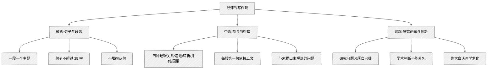

<ChapterAudience>

把"逻辑清晰"翻译成三条具体要求:一段一个主题、句子要短、不堆砌从句；看清段落连贯背后的四种逻辑关系,用 Claude Code 扫描逻辑断裂；学会节与节、章与章之间的过渡写法；区分"AI 能帮你写"与"AI 不能替你想"的边界；用"先大白话再学术化"让自身判断作为内核。

</ChapterAudience>

前十二章讨论工具用法,本章换方向讨论写作本身。

用 Claude Code 写论文半年多后我意识到:<u>工具再好,若使用者不了解什么是好的论文写作,它帮助改出来的内容仍是"通顺的废话"</u>。通顺是 AI 的强项,但通顺与清晰之间存在一段差距,这段差距是导师帮我跨过去的。

导师开会时经常说一些看似朴素的话:"你摘要写得太琐碎"、"你这个标题不准确"、"读者读到这里能否跟上"。起初我以为只是修改意见,后来发现背后是一套完整的写作逻辑。这套逻辑与 Claude Code 结合使用,效果优于单独使用任一方:使用者明确何为好的写作,模型负责快速执行。



## 13.1 论文逻辑需让读者能跟上

导师批评论文最多的一句是"逻辑不清晰"。我原以为自己写得清楚:每段都有内容、前后有过渡句。导师指着论文说:"你自己读,读到第三段时还记得第一段在说什么吗?"我试读后确实不记得。

后来总结导师的"逻辑清晰"包含三条具体要求:**一段只讲一件事,句子要短,不堆砌从句**。

### 一段一个主题

每一段开头用一句话说清这段在讲什么,所有句子围绕这一意思展开。若写到中段发现在说另一件事,即应另起一段。

我曾写过一段实验结果,同时塞入三件事:评估指标 A 提升幅度、A 的计算方式、与上一章假设的呼应。导师反馈"这一段过满,读者读完不知道你最想强调什么",要求拆成三段。原本一段 240 字变成三段共 350 字。字数虽多但并非冗余,每个论点表达得更透彻。

Claude Code 在此可提供的帮助是:把段落发给它判断"这段讲了几个主题",若超过两三个即应拆。每节写完加一步检查("逐段分析每段讲了几个主题,超过两个建议在哪里断开,不要改内容只做分析"),两三分钟完成,可识别写作时因脑中已有完整思路而觉自然但读者跟不上的位置。

### 句子要短

导师的判断标准是:"一句话超过两行,你自己读读看能否一口气读完不换气。不能即断开。"

学术写作的常见问题是塞长句,把原因、条件、限定、补充全塞进一句。例如:

> 由于本文所设计的多模块系统在实际测试中存在模块之间的信息传递损耗且评估维度之间存在较强的相互依赖关系,因此在实验设计中需要同时控制模块间的交互效应和评估维度的耦合影响,以避免因忽略上述因素导致的评估偏差。

80 字三层嵌套,读到"以避免"时已忘记前文内容。断开后改为:

> 系统的多个模块之间存在信息传递损耗。同时,评估维度之间有较强的相互依赖。基于这两个特征,实验设计需要同时控制模块交互效应和维度耦合影响。

三句话信息量相同,每句一个信息点。让 Claude Code 拆长句需提供标准("找出超过 50 字的句子逐句改短,每句只传达一个信息点,不用"由于…因此"长句式,术语保持原样")。我用该方法过了一遍第三章,原本平均每句 38 字改后 23 字,导师反馈"读着舒服多了"。

### 不堆砌从句

长句的问题是信息量过大,从句堆砌的问题是修饰层过多:

> 为了验证前文所提出的基于方法 A 的系统 B 多模块协同机制假说的鲁棒性……

四层修饰。导师指出:"把修饰语去掉看核心意思是什么。若核心只需一句,修饰即应分到其他句子。"核心是"为了做鲁棒性验证",修饰可在前文交代清楚,该句无需重复。改为"第四章提出了基于方法 A 的协同机制假说。本节对该假说进行鲁棒性验证。"两句话各一层修饰,可读性明显提升。

<GhAlert type="important">

**这三条改变了我使用 Claude Code 的方式**

</GhAlert>

>
> 以前让它写段落只关注内容对错,现在加一条"每段只讲一件事,句子不超过 25 字"。加上该条之后写出来的内容更清晰,导师退回重改的次数也减少。

## 13.2 上下文连贯的具体写法

导师另一个常提的问题是"上下文不连贯"。我以为连贯就是加过渡句,每段结尾加"接下来讨论……"、"在此基础上……"。导师指出:"这些过渡句是空的,读者看完不知道为何要接着读下去。"

后续理解了:**连贯不靠一句话实现,而是靠前后段落之间的逻辑关系实现**。<u>过渡句只是逻辑关系的外在表现,逻辑关系本身不成立时,加多少过渡句都没用</u>。

### 段落之间的四种逻辑关系

写得好的论文段落间常见的关系仅四种:**递进**(前面说 A,进一步说 B)、**转折**(前面说 A,但有问题 C)、**并列**(除 A 外,还有 B)、**因果**(因为 A,所以 B)。

每写完一段开始下一段之前,先问自己:这段与上一段是什么关系?若说不清楚,即说明缺一环逻辑,要么补一段过渡,要么调整顺序。

第三章有两段,第一段写"基准模型在五个评估维度的测试结果如表 3-1 所示",第二段直接跳到"本文采用方法 A 对系统进行优化"。导师问:从测试结果到优化方案中间发生了什么?为何看完测试就决定使用方法 A?中间缺的一环是:基准测试显示指标 X 与 Y 得分偏低,方法 A 恰好针对这两个维度具有优势。

这种逻辑断裂在自行写作时很难发现:<u>脑中存在完整推理链,但只把结论写到纸上</u>。Claude Code 可用于扫描断裂:

```
读第三章到第五章全文,逐段检查相邻两段的逻辑关系,
标递进 / 转折 / 并列 / 因果。判断不出关系的标"可能断裂"。
列出所有"可能断裂"的位置,不要改内容。
```

它标出 11 处可能断裂,6 处确实存在问题(4 处我之前完全未注意到),5 处属于正常主题切换。补齐后导师反馈"读起来顺多了"。

### 每段第一句承接上文

导师教的实用技巧:**每段第一句最好包含上一段的某个关键词或概念**,使读者从上一段读到这一段时有抓手。

上段尾句"基准测试显示,系统在指标 X 维度上得分偏低",下段首句可为"指标 X 偏低的主要原因是模块间信息传递存在损耗"。"指标 X 偏低"是从上段继承的概念,读者看到该词即知道仍在接续上段内容。若首句为"本文采用方法 A 对系统进行优化",虽然意思正确,但读者需自行建立"指标 X 偏低"与"方法 A"之间的联系。

让 Claude Code 检查:

```
读第四章全文,逐段检查每段第一句是否包含上一段的关键概念。
不包含的判断前后段是否存在逻辑断裂,列出可能断裂的位置。
```

它列出的位置约一半确实需要调整,另一半是正常主题切换(小节分界)。能识别一半已具实用价值。

### 节与节、章与章之间的过渡

段落连贯属于微观层面,节间衔接属于宏观层面。导师的做法是:**上一节末尾提出一个"尚未解决的问题",下一节开头回应该问题**。

第四章 4.1 节"方法 A 优化结果"、4.2 节"鲁棒性验证"。原 4.1 末尾写"以上是方法 A 的优化结果,下面进行鲁棒性验证"。导师指出这是"报菜名",读者知道接下来要做什么,但不知道为什么。改为"方法 A 优化后指标 X 提升 15 分,但提升是否稳定尚需验证。换一组测试数据或调整参数,效果是否成立?"读者带着该疑问自然想读下去,4.2 第一段正好回答。

<GhAlert type="tip">

**节末过渡公式**

</GhAlert>

>
> 上节末尾等于上节结论加一个未解决的问题;下节开头等于回应该问题加本节要做的工作。

章与章之间是更大尺度的过渡。每章开头几句应快速回顾上一章做了什么、指出接下来做什么、说明原因。第五章原开头只有一句"本章对系统进一步优化"。导师反馈"第四章不也在优化吗?读者分不清两章区别"。改为"第四章通过方法 A 提升了指标 X 与 Y,但指标 Z 仍偏低。本章引入方法 B,专门针对 Z 的短板优化"。读者一看即知两章为递进关系,每章回答一个独立问题。

这些技巧可由 Claude Code 协助执行,但**方向需使用者确定**。使用者知道两段缺少哪一环逻辑,让它补上;使用者知道章节开头应回顾什么,让它写。若使用者自己不知道缺什么就让它写过渡句,它写出来的会是空洞套话。

## 13.3 AI 能帮助写作,但不能替代思考

导师有一句话我后续越想越觉重要:"做了工作不等于创新,你做的内容需要提炼。"

背景是我论文写了较多"自己做了什么":用了什么方法、跑了什么实验、得到什么结果。导师指出:你做了这些工作我知道了,**但创新点在哪里?"做工作"与"创新"之间差一步提炼**:做的这些事解决了哪个别人未解决的问题?推进了什么认知?

该步提炼是 AI 无法替代的。

### 研究问题必须自行提出

写第一章"研究问题"时我偷懒让 Claude Code 撰写。它给出三个问题,格式标准看似合理,我差点直接使用。导师问"这是你想的还是 AI 写的?"我老实说了。导师指着第二个问题:"'系统 A 是否能提升审计效率'——这个已有学者验证过了,你仍在问'是否能',论文即在重复别人的工作。你应当问的是'在新的场景和新的方法下,系统 A 在哪些维度上有优势、哪些维度仍不足、原因为何'。"

两个问题表面差几个字,但前者写出来是验证性研究(别人做过你再做一遍),后者是推进性研究(在别人基础上向前推进一步)。**这种学术判断需读过几十篇文献、对该领域积累足够时间才能形成,AI 读不出使用者的领域积累**。

### 学术判断不能外包

除研究问题外,还有几件事不能交给 AI:使用什么方法、为什么使用该方法、如何解释实验结果、负面结果说明什么。

我有过教训。某维度实验未提升,我让 Claude Code 撰写讨论,它写"该维度未提升可能是测试样本数量不足"。逻辑上说得通,但放入论文中不对:我测试集有几百条数据并不算小,**该维度评估依赖外部知识库而本系统未接入**。未核查即使用,评审会问"你几百条数据还说样本不足?"。<u>AI 给出的是通用解释,论文需要的是"针对你的系统"的解释</u>。

<GhAlert type="warning">

**涉及"为什么"的判断不应直接使用 AI 初稿**

</GhAlert>

>
> 凡涉及"为什么"的学术判断,Claude Code 写的初稿都不直接使用,先自己想清楚原因,再让它把我的解释改成学术表述。

### 创新点需自行提炼

我论文做了三件事:设计了多模块协同架构、在新场景验证、针对低分维度提优化方案。哪些算创新,哪些只是工作量?

导师帮我梳理:架构若比已有方案有明显优势是**方法创新**;新场景本身不算创新,但若发现与已有结论不同的规律即**发现创新**;优化方案若能说清为何该维度难、本方法为何能解决,即**认知创新**。每一步都需要使用者对文献的深入了解:"新架构相对旧方案优势在何处"需读过用旧方案的文献才能说清,"低分维度为何难"需要理论框架解释。

<u>Claude Code 能把已经想清楚的创新点写成流畅段落</u>,但**想清楚是什么本身是使用者的工作**。

### 先大白话,再学术化

后续养成的习惯是:**每次让 Claude Code 写涉及学术判断的段落之前,先自己用大白话写一段说清"我想表达什么"**,即便粗糙、口语化亦可。然后把大白话作为材料给它,让它改成学术表述:

```
我要写第一章的创新点。我的大白话版本:
「这篇论文有三个新的地方。第一……第二……第三……」

请把这段改成学术论文的表述方式。
要求:保留我的核心论点,只调整语言风格。不要添加我未提到的内容。
```

看似多了一步(先写大白话),但效果优于让它直接写。**因为自己写的大白话中已包含想表达的内容、侧重、逻辑,AI 只是协助调整表达方式,内核来自使用者**。

<GhAlert type="important">

**导师的一句话**

</GhAlert>

>
> "你使用什么工具不重要,你的脑子里有没有内容才重要。脑子里有内容用什么工具都能写出好论文,脑子里没内容工具越好暴露得越快。"
>
> 这句话我写在 CLAUDE.md 开头,每次打开 Claude Code 时查看一次,提醒自己先想清楚再动手。

整体而言:**先了解何为好的,再用工具去实现,顺序不能颠倒**。若先学了工具用法但不知道何为好的论文逻辑、好的段落衔接、好的创新点表述,工具只会帮助更快生产平庸的文字。

## 本章小结

<div align="center">

| 核心概念 | 核心内容 | 常见误解 | 为什么错 |
|:--|:--|:--|:--|
| 一段一个主题 | 每段开头一句话点明,后续围绕该意思展开 | 一段写得越满越好 | 读到第三件事时已忘记第一件 |
| 句子要短 | 25 字以内,每句一个信息点 | 长句显得正式 | 嵌套三层逻辑读到结尾即忘开头 |
| 段落连贯 | 递进、转折、并列、因果四选一 | 加过渡句即连贯 | 过渡句空洞时读者仍跟不上 |
| 第一句承接 | 下段第一句包含上段关键词 | 完全换主题更显层次 | 缺抓手时读者需自行拼接 |
| 节末过渡 | 提出一个未解决的问题 | "下面讨论……"即可 | 报菜名读者不知道为何读下去 |
| 研究问题 | 必须自行提出,AI 提不出 | AI 写得很标准能用 | "是否能"与"在哪些维度上"差一字差一篇论文 |
| 先大白话 | 使用者写大白话,模型改学术表述 | 直接让它写省事 | 直接写出的初稿缺少使用者的判断 |

</div>

下一章讨论与 AI 协作的工作方式。

---

<div align="center">

[← 第 12 章 · MCP 工具扩展](chap12.md) &nbsp;·&nbsp; [返回目录](../README.md) &nbsp;·&nbsp; [第 14 章 · 人机分工的边界 →](chap14.md)

</div>
