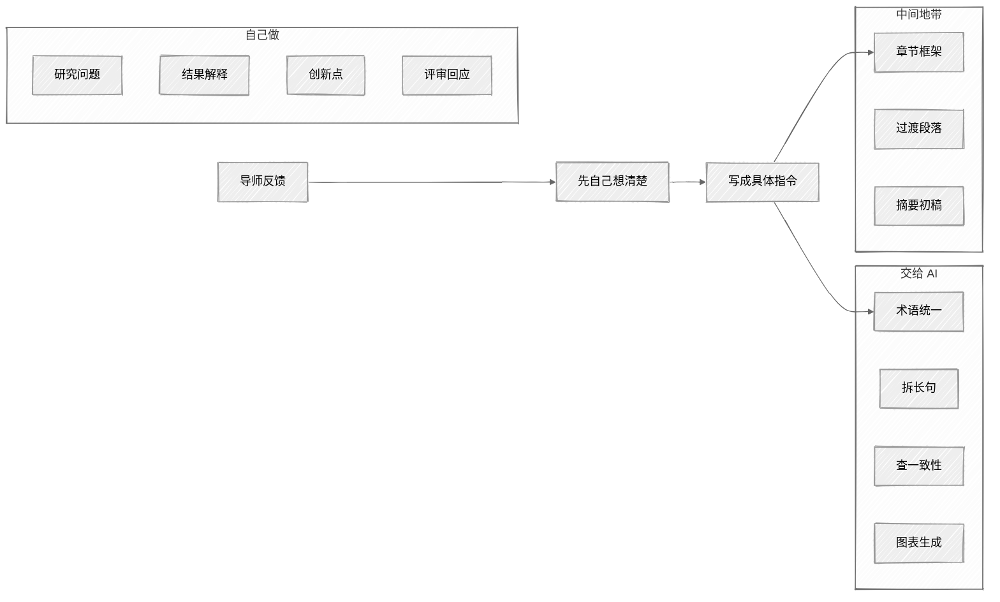

<ChapterAudience>

明确人机分工的边界:哪些任务适合交给 AI、哪些必须自行完成；看清四类最易出问题的环节:文献评述、数据描述、结果解释、引用匹配；建立检查习惯,识别 AI 生成内容中的隐蔽错误；持续优化指令模板与 CLAUDE.md,使协作越用越顺。

</ChapterAudience>

使用 Claude Code 半年多后,我对"AI 辅助写论文"的认识与起步阶段完全不同。<u>它能做的事越多,使用者需要监督的也越多</u>。本章讨论分工边界、风险点,以及如何把协作打磨得越来越顺。



## 14.1 使用者主导,AI 执行

某次让 Claude Code 撰写文献综述中的一段评述,指令仅为"评述一下这几篇文献的研究方法"。它写得流畅,还指出几篇文献的"方法局限性"。我准备直接使用,后续回原文核查,发现其中一条说某篇文献"未控制时间固定效应",但该研究使用的是一阶差分法,本身即等价于控制了时间趋势。表面合理,实际错误。

此事之后我给自己定了一条规则:Claude Code 写的任何涉及学术评价的内容(优点、缺点、创新点、不足),均回到原始文献核查一遍。<u>它可以帮助写初稿,但哪些保留、哪些修改、哪些删除,决定权在使用者</u>。

### 三档分工

<div align="center">

| 交给 AI | 中间地带 | 必须自己做 |
|:--|:--|:--|
| 术语统一、格式排版 | 章节框架设计 | 研究问题与方法选择 |
| 拆长句、查一致性 | 过渡段落 | 实证结果解释 |
| 引用格式核查 | 摘要初稿 | 创新点提炼 |
| 大白话改成学术表述 | 文献评述初稿 | 学术评价验证 |
| 生成图表 | 导师意见执行方案 | 回应评审质疑 |

</div>

**适合交给 AI** 的事项有明确标准、对错可判定:术语统一、拆长句、查一致性、生成图表、把大白话改成学术表述。

**必须自己做** 的事项需要领域理解、无标准答案:研究问题、研究方法、结果解释、创新点判断、评审质疑回应、学术评价验证。

**中间地带** 可让 AI 给建议、做初稿,但最终判断由使用者完成:章节框架、过渡段落、摘要提炼。

<GhAlert type="important">

**"必须自己做"那一列不可外包**

</GhAlert>

>
> 不论使用多久、多熟练,这一列均不可外包。

### 不要因效率而跳过思考

一类心理陷阱是:因 AI 处理事情很快,使用者开始跳过"自己先想清楚"。

导师某次说"第五章的结论太弱"。若直接把这句话交给 Claude Code,它会把结论写得很"强",加入夸大表述。但导师"太弱"的意思是:结论未把本文的边际贡献与已有研究做对比。想清楚后,我给的指令为:

```
修改第五章结论段。在每个核心发现之后,补充一句与已有研究的对比
(例如「xxx 研究的系数为 0.2,本文为 0.34,可能因为本文用了更新的数据」)。
以下文献可对比:[列出 3 到 4 篇]
不要夸大本文的贡献,使用客观的比较语气。
```

效果优于直接说"写强一点"。<u>**这十分钟思考不是浪费,它保证了修改后的内容是使用者真正理解并认可的**</u>。

## 14.2 对结果负责的始终是使用者

使用 AI 辅助写论文不违反学术规范。前提是研究问题、研究方法、实验数据、核心结论均由使用者完成。AI 协助打磨的是表达方式,类似请师兄帮看一遍论文。

但有一条原则:<u>AI 生成的任何内容,在使用之前,需要理解它、核查它、对它负责</u>。若评审问"这段话的依据是什么",使用者不能回答"AI 写的我没细看"。

### 四个高风险环节

**文献评述**:Claude Code 可能编造文献观点。让它评述空间计量方法演进时,它说某篇 2019 年论文"首次将空间杜宾模型应用于区域创新溢出",我查阅后发现该研究使用的是空间滞后模型,并非空间杜宾。每一句对文献的评述都需回到原文核实。

**数据描述**:它有时会编造具体数字。例如数据为 300 样本,它可能写成"约 300 个样本,时间跨度 2015 至 2021 年",其中年份是推测的。

**结果解释**:AI 给出的解释是通用性的,放入论文若与数据特征矛盾,即会暴露。

**引用匹配**:它可能添加一个"看似合适"但实际不支持论点的引用。某次它在一段话后加了引用编号,我查阅后发现引用内容并非同一件事。

### 三步检查习惯

每次 Claude Code 写完或改完一段:

1. **对比改前改后**,确认未顺手修改不该改的位置(术语保护见第 3 章)
2. **涉及学术判断的内容**(文献评述、结果解释),回原始材料核实
3. **新增的引用**,查原文确认是否支持论点

三步合计约十分钟,但可避免答辩时被问住。

<GhAlert type="tip">

**在 CLAUDE.md 中加一条规则:不确定的内容标 [需核实]**

</GhAlert>

>
> ```
> 涉及数据、文献或实证结果的段落,
> 若信息不来自我提供的材料,在句末标注 [需核实]。
> ```
>
> 无法保证 100% 标注,但能降低它默默编造的概率。

我个人的做法是在致谢中写一句"论文写作过程中使用了 AI 辅助工具,用于格式调整与语言润色"。这样表述诚实且准确:核心学术工作由本人完成,AI 协助的是格式与语言。

## 14.3 持续提升协作效率

### 把好用的指令存为模板

起步阶段每次都从头写指令,后续发现很多任务是重复的。把指令整理成模板存为文本文件,每次填入具体内容即可。例如改章节模板:

```
修改 [文件路径] 的第 [X] 节。
要求:
- 不改变论点
- 用学术中文
- 不得修改的术语:[术语列表]
- 完成后给我看修改前后的对比
先告诉我方案,确认后再执行。
```

30 秒发出,不会漏掉关键约束。附录 A 列出了我常用的模板。

### 从每次错误中更新 CLAUDE.md

它犯过的错,我都会思考:这是偶发还是 CLAUDE.md 中缺少规则?若是规则缺失,即补一条。它顺手删过引用编号,加一条"修改正文时保留所有引用编号"。它改过图表标题格式,加一条"图表标题格式为:图 X-Y:标题内容"。

CLAUDE.md 是持续生长的文件。我起步阶段十几行,半年后一百多行。<u>每条规则背后都对应一次具体问题</u>。

### 控制单次会话的范围

一次会话只做一件事(原因与判断标准见第 3 章)。简易方法是:描述任务时若使用了两个以上"然后",即拆为两次会话。

### 建立反馈闭环

每完成一个任务,用一分钟思考三个问题:本次的指令是否够清楚?输出是否有需要返工的部分?下次同类任务的指令需要调整什么?

若是指令问题(遗漏某项约束),即更新模板。若是任务难度问题(AI 做不好的学术判断),后续此类任务由使用者自行完成。

<u>协作效率的提升依靠每次具体问题后的一个小调整,而非一次性大改进</u>。

## 本章小结

<div align="center">

| 核心概念 | 核心内容 | 常见误解 | 为什么错 |
|:--|:--|:--|:--|
| 三档分工 | 交给 AI、中间地带、必须自己做 | 都可让 AI 尝试 | "必须自己做"那一列只能由使用者判断 |
| 不直接转发导师原话 | 先理解再写成具体指令 | "按此意见改"省事 | 导师意见是概括的,AI 自由发挥不一定正确 |
| 四类高风险环节 | 文献评述、数据描述、结果解释、引用匹配 | AI 写得合理即可用 | 评述会编、数据会推测、解释会通用化、引用会贴错 |
| 三步检查 | 对比、核实、查证 | 看一遍无问题即用 | 错误隐蔽,粗扫遗漏较多 |
| 模板化 | 把成熟指令存为模板 | 每次重新写 | 重复输入容易遗漏约束 |
| CLAUDE.md 是活文件 | 每次出现问题后追加一条 | 一次性写好即可 | 规则需随经验积累生长 |

</div>

下一章进入第五部分,讨论科研 Skill 的设计纪律:把"先想清楚再动手"固化为可执行的工作流。

---

<div align="center">

[← 第 13 章 · 科研写作的基本要求](chap13.md) &nbsp;·&nbsp; [返回目录](../README.md) &nbsp;·&nbsp; [第 15 章 · 科研 Skill 的设计纪律 →](chap15.md)

</div>
