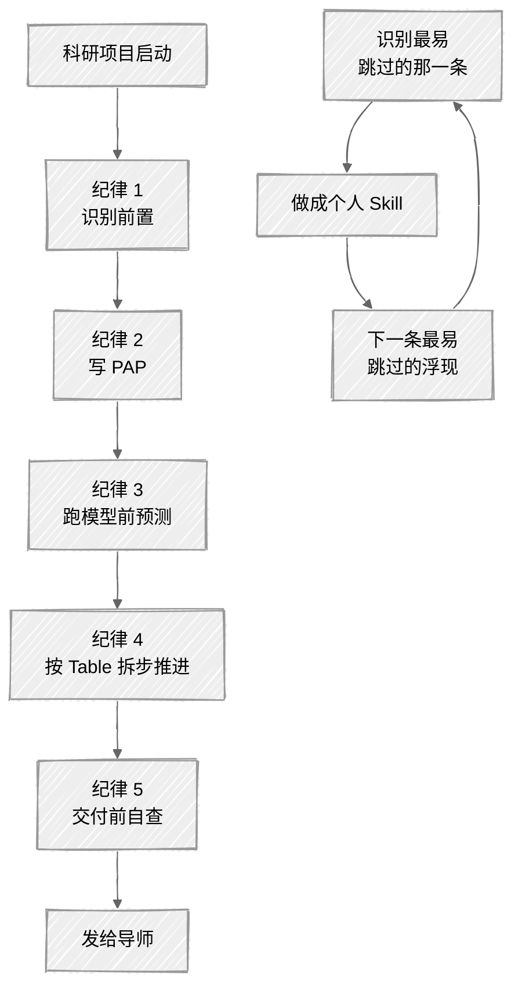

<ChapterAudience>

运行代码前先确定研究问题:把识别策略与证伪条件放在动手之前；拿到数据前先撰写分析方案(PAP)；运行模型前先预测结果:用预先承诺规避事后调整 spec 凑结果；拆分小步,逐步确认；交付前先自行扮演审稿人；把这些纪律装入个人 Skill:把最易跳过的那一条做成自用工具。

</ChapterAudience>

第 9 章介绍了如何安装现成 Skill 与自行编写 Skill。前十四章讨论了工具用法与心态。本章把工具用法再向上推一层,讨论设计纪律。

逐步认识到一件事:安装几十个 Skill 不会让论文自动变好,使论文变好的是**一套愿意每次都遵守的纪律**。Skill 只是这套纪律的载体,把"应做但易遗忘"的步骤转化为强制提醒。

这套思路来自开源工具集 Superpowers。我把它的核心纪律对照科研场景翻译一遍——剪掉不适用的部分,补上科研独有的内容,得到下述五条。每条对应一类反复出现的问题,每条都指向下一个值得编写的 Skill。



## 15.1 运行代码前先确定研究问题

> [!NOTE]
> **定义 15.1 — 识别前置**
>
> 在动手处理数据、运行模型之前,先把研究问题、识别策略、潜在威胁、证伪条件四件事写清楚。该步骤的定位是把"该研究为何能成立"这条逻辑链展开核查一次,既非文献综述,也非研究设计的全部。

我首次遇到问题是在做空间杜宾模型时。手里有一份省级面板数据,导师建议尝试空间溢出效应。我下载完数据即让 Claude Code 运行模型,权重矩阵采用经济距离的倒数,结果方向符合预期,主系数显著,把表格放入论文初稿提交。

第二天导师提出两个问题:为何使用经济距离而非地理距离?经济距离基于哪一年的 GDP?我答不上来。这两个选择属于**识别策略的关键设定**,并非技术细节。地理距离识别地理邻近性带来的溢出,经济距离识别产业关联带来的溢出,机制不同。那次未"想清楚"就动手,运行出的数字虽好看,但回答的是哪个研究问题我自己也说不准。

后续"先想清楚再动手"形成规则。每次启动新实证项目的第一件事是建立 `plan.md` 写三项内容:研究问题(处理、结局、目标人群、欲识别的因果效应)、识别策略(使用什么变异、选择该策略的理由、解决什么内生性)、证伪条件(什么结果会让我承认假设错了、反向时第一种解释是什么)。

快则十几分钟,慢则半小时。最常见的情况是写到第二条"选择该策略的理由"时使用者自己也说服不了自己——这意味着前面的研究问题尚未想清楚。

资料包中现成的 `scientific-brainstorming` 即用于此事,搭配 `paper-confirm-before-doing`(动手前先说方案)一并使用。

> [!WARNING]
> **最常见的跳过理由:我先看看数据再说**
>
> 看数据本身无错,错在把"看数据"与"想清楚研究问题"混为一件事。先想清楚再看数据,看到的是验证或推翻假设;先看数据再想问题,看到的是哪个变量显著就解释哪个,研究问题被数据牵引。

每次启动新项目,第一个动作是 `touch plan.md` 而非 `read.csv`。三个问题未写完之前不打开数据。

## 15.2 拿到数据前先写分析方案

> [!NOTE]
> **定义 15.2 — Pre-Analysis Plan, PAP**
>
> 经济学与流行病学常用的一份文档:在数据分析正式开始之前把样本范围、变量定义、主回归设定、稳健性清单、预期结果方向写下来落盘。最初来自临床试验的预注册要求,后扩展到观察性研究。

若上一节讨论的是"想清楚要回答什么问题",本节讨论的是"想清楚如何回答"。两件事不同,分开处理才能各自做透。

写 PAP 的习惯是从一次"边看边想"的事件中形成的。一份面板数据做政策评估(DID),我未写 PAP 直接打开数据开始运行:第一遍主系数显著;加 GDP 增速控制变量后系数变小但仍显著;去掉缺失严重的城市后系数变大且更显著;加上年份固定效应后系数符号反向。一下午跑了二十几个 spec,每次微调系数都在变。回过神来才意识到自己在做的事是**在数据上拟合一个自己都不知道想要什么的模型**。

那次之后开始写 PAP,精简为七个核心问题(后续即 `paper-empirical-pap` skill 中的七问):

1. **研究问题**:处理、结局、目标人群
2. **识别策略**:使用什么变异、为何该策略适合
3. **数据与样本**:来源、时间窗、纳入排除标准
4. **关键变量定义**:处理变量编码、结局尺度、主要协变量
5. **主设定**:主回归方程、固定效应放哪一层、标准误如何聚类
6. **稳健性清单**:进入正式表前需要做的检查
7. **预期结果方向**:主系数符号、量级区间、显著性预期;反向时初步解释

PAP 的核心读者是**未来三个月的自己**,并非审稿人的形式化文档。它在三个时刻体现价值:运行出反向结果时(第七问的预期写在那,可避免"先改 spec 凑预期"的冲动);导师询问"这个稳健性是否事后追加"时(PAP 有时间戳,可如实说明);半年后回到项目时(半年前的决定均已记录)。

资料包中的 `paper-empirical-pap` 触发条件是使用者说"我要做实证、跑回归、跑 DID、跑 PSM"等任意一句,且项目无 `PAP.md`,它会先停下来按七问逐个询问,完成后写入 `PAP.md` 落盘。

> [!WARNING]
> **三种常见的跳过理由均最应写 PAP**
>
> "这只是一个小项目"、"我已经在脑中想清楚了"、"赶时间"——这三种情况均最应写。小项目易出问题正是因为掉以轻心;脑中想清楚的若未写下来无法被未来的自己审查;赶时间时,二十分钟的 PAP 能省后续三周的混乱。

## 15.3 运行模型前先预测结果

运行回归之前先把预测的主系数符号、量级区间、显著性写下来。模型运行后把数字与预测做一次对账。该做法看似形式化,实际上是**软件工程中 test-driven development 在科研中的对应**——工程师写代码前先写测试,是对"正确实现"的预先承诺;科研中运行模型前先写预测,是对"真实世界因果方向"的预先承诺。

我对该纪律的认识来自一次事件。某政策评估 DID,理论上为抑制性的,按机制推理主系数应为负。运行结果为 `-0.052`,标准误 `0.041`,t 值不到 1.3,不显著。我的第一反应是"样本太小?控制变量缺失?"

接下来三天做了一系列调整:改样本时间窗、补控制变量、放宽处理组口径。调整完后系数变为 `+0.083`,标准误 `0.039`,5% 水平显著。当时我以为"前面是哪里设定不对",把表格放入论文。

改稿那天导师问:"政策机制不是抑制吗?为何是正向?正向你打算如何解释?"我才意识到——前三天的调整每步看似合理,但**未问过自己这些调整是因为理论需要还是因为我想要这个方向**。我事后调整 spec 凑出了与理论相反的"显著"结果。

那次之后加了一条纪律:运行回归前把预测写入 `plan.md`,**若运行结果与预测相反,强制停三十分钟**做以下三件事之一:

1. 重新阅读理论文献,查找反向结果的可能机制
2. 不调整 spec,先做几项稳健性检验,看反向是否稳健
3. 把反向写入 PAP 修订记录,标注日期,说明后续打算如何处理

三十分钟之后再决定下一步是否调整设定,通常会得出不同的判断。最常见的发现是:**反向结果反映的是理论本身未考虑某种异质性,或数据中存在之前未注意的渠道**,而非 spec 错误。这种发现可成为论文亮点,若被调整 spec 掩盖则失去价值。

资料包中目前没有为"预测后对账"专门设计的 skill(机制依赖具体学科——流行病学预测 RR、计量预测系数、实验经济学预测组别相对大小)。**该项最适合做成使用者的第一个个人 Skill**,下一节给出极简模板。

> [!IMPORTANT]
> **写下来的预测是承诺,并非约束**
>
> 写下来的预测是使用者与未来自己之间的协议。事后看到反向结果时,该协议提醒应回过头审视理论或数据,而非调整 spec 凑结果。这是科研诚信中最重要的一道防线。

## 15.4 拆成小步逐步确认

实证分析最常见的问题是:一次性把"做完所有表格"的任务交给 Claude Code,几小时后回来查看,前两张表样本筛选错了,但后五张表是基于错误样本运行的,稳健性也连带错。修复成本超过从头来。

避免此类问题的纪律是**按 Table 推进**:

1. **Table 1:描述统计与平衡性**。查看后决定是否调整样本范围
2. **Table 2:主回归**。PAP 第五问的主设定,查看后决定是否调整主设定
3. **Table 3:异质性**。按子样本切分查看不同人群差异,是论文亮点的主要来源
4. **Table 4:稳健性**。PAP 第六问列的所有稳健性检验运行一遍,通过后定稿

每张表之间设明确检查点。**不要让 Claude Code 一口气从 Table 1 做到 Table 4**。每张表完成后回到 PAP 对账(第七问的预期是否吻合、第六问的稳健性是否准备就绪、第二问的识别策略是否仍成立)。某步发现 PAP 错误时,先修改 PAP 并在修订记录中留痕,再继续下一步。

资料包中几个现成 skill 配合此纪律:

- **`paper-pilot-before-batch`**:运行 30 条以上批量任务前先在 3 到 5 个样本上运行一遍,防止"全量运行后才发现批量逻辑错"
- **`paper-one-session-one-task`**:一次会话只做一件事,不允许"顺便帮我运行下 Table 3"
- **`paper-parallel-audit`**:30 条以上的批量核查必须派多个 Agent 并行加 JSON 汇总加分批断点续运行

安装三者之后,"按 Table 推进"会被自动强化。说"帮我运行所有结果"时它会先停下来问"你打算从 Table 几开始?前面的 PAP 是否已对账?"

降低重做成本是该纪律最大的附带价值:每张表完成后先存档一版,发现 Table 2 样本筛选错误即可回滚到 Table 1 重做,损失最多一张表。一口气运行到 Table 4 才发现 Table 1 错误即需全部重做。两种工作流时间成本差 5 到 10 倍。

> [!IMPORTANT]
> **拆步成本很低,但需克服"一次性做完更高效"的错觉**
>
> 一次性做完仅在使用者 100% 确定每一步都对的情况下更高效,科研中几乎没有这种确定性。先承认会出现错误,再设计可在出错时快速回滚的工作流,这才是真正的高效。

## 15.5 交付前先自行扮演审稿人

写完一稿、运行完所有表、做完所有图,按下保存键的那一刻使用者会以为可以发给导师了。此时应停一下,先做一轮自行扮演审稿人的检查。

使用过最有效的两套自验工具:`paper-verify-before-handoff`(硬指标核查)加 `peer-review-rehearsal`(匿名审稿人模拟)。两者搭配使用,可在导师之前挡掉八成低级错误。

`paper-verify-before-handoff` 的检查清单:术语一致性、引用完整性、数据正确性(表格数字与原始结果是否一致、保留位数与星号是否正确)、图表编号、内部交叉引用、字数与格式合规、未完成 todo 残留、AIGC pattern。八项完成后低级错误基本可挡——它做的是技术性核查,不涉及内容判断。

`peer-review-rehearsal` 让 AI 扮演 3 到 5 个不同视角的匿名审稿人(方法论严格的、应用导向的、写作苛刻的、跨学科的、资深教授视角的),每个独立审一遍,把问题写成审稿意见格式返回。

我首次使用 `peer-review-rehearsal` 是在论文交给导师前一周。原以为已较完善,模拟审稿运行后每位审稿人挑出 5 到 10 处我自己未看出的问题:方法论审稿人质疑工具变量外生性的论证、应用导向的提问政策含义那段为何未与近三年政策动态衔接、写作苛刻的指出第三章第 2 节两段顺序应调换。这些问题若留给真实审稿人即为大修甚至拒稿。

把模拟审稿当作一道关,自己先解决一遍再交给导师。该步骤时间投入约为写论文总时间的 5%,能节省的返工时间在 30% 以上。

> [!TIP]
> **自验不等同于自我怀疑**
>
> 自验是把"未来会被他人发现的问题"提前到现在自行处理。论文交出后被审稿人发现的成本(拒稿、大修、来回几个月)远高于交出前自行发现的成本(再花两天改一稿)。
>
> `peer-review-rehearsal` 还可在重要节点会议前使用:开题答辩、博士资格考试、组会汇报。提前运行一遍,心中更有数。

## 15.6 把纪律装入个人 Skill

至此五条纪律讨论完毕。每一条均对应资料包中现成的 `paper-*` skill:

<div align="center">

| 纪律 | 对应的 Skill |
|:--|:--|
| 运行代码前先确定研究问题 | `scientific-brainstorming`、`paper-confirm-before-doing` |
| 拿到数据前先写分析方案 | `paper-empirical-pap` |
| 运行模型前先预测结果 | 暂无现成,本节模板自行编写 |
| 拆成小步逐步确认 | `paper-pilot-before-batch`、`paper-one-session-one-task`、`paper-parallel-audit` |
| 交付前先自行扮演审稿人 | `paper-verify-before-handoff`、`peer-review-rehearsal` |

</div>

五条中四条已做成 Skill,一条留给使用者自行编写——这是有意为之。**Skill 的真正价值在于强制提醒,而强制提醒只对使用者愿意遵守的纪律有效**。一条纪律若使用者不认同,装多少 Skill 都无效,只会被关闭。一条纪律使用者认同,但最易跳过的那一条,恰好是最应做成 Skill 的那一条。

具体识别方法:问自己**过去半年的论文写作中,五条纪律里哪一条跳过得最多**?回忆具体事件——是某次运行回归未写预测?是某次拿到数据直接打开就看?是某次未拆步,一次性让 AI 完成所有表?是某次写完直接发给导师未自查?回忆出的那一条即是答案。

### 个人 Skill 的极简模板

最小可用版本只需十几行:

```markdown
---
name: my-[纪律的英文名]
description: [一句话说明何种情况触发,做什么动作]
---

# [中文标题]

## 触发条件
- 用户说[关键词 A / B / C]
- 项目中[某文件状态]

## 工作流
1. [先停下来]
2. [问 N 个问题或做 N 项检查]
3. [落盘到某文件]
4. [确认后才能继续]

## 不允许跳过
- [反驳常见跳过理由]
```

存到 `~/.claude/skills/<name>/SKILL.md`,重启 Claude Code,触发条件命中时它会自动提醒走流程。

### Skill 的两阶段成熟

完成 Skill 编写不等于结束。Skill 的成熟需经两阶段:

**频繁触发阶段**(两周到一个月):新写的 Skill 触发条件通常不准,要么应触发未触发,要么被误叫。用一两周记录哪些场景被遗漏或误触发,回头修改条件。

**内容精修阶段**:触发条件稳定后查看"工作流"步骤是否顺手。哪一步显得啰嗦?哪一步遗漏检查?哪一步提示语不够具体?修改后 Skill 才能真正节省时间。

两阶段均通过后,个人 Skill 才算成熟。一条做扎实之后,下一条最易跳过的纪律会浮现,使用者会自然想做第二个 Skill,这是科研工作流持续进化的方式。

### 来源

这五条纪律的原型是 Superpowers 的几个核心 skill:brainstorming、writing-plans、test-driven-development、executing-plans 加 subagent-driven-development、verification-before-completion、code-review。原本面向软件工程设计,把"先想再写、先写再做、做完自验"这套工程纪律固化为 AI 可执行的 Skill。我对照科研场景做了翻译,剪掉仅在工程语境下成立的部分。

如需查看原版可检索"Superpowers Claude Code"。读完原版回头看本章可发现 Skill 设计的本质一致:**把"应做但易遗忘"的纪律转换为系统替你记住的提醒**。

## 本章小结

<div align="center">

| 核心概念 | 核心内容 | 常见误解 | 为什么错 |
|:--|:--|:--|:--|
| 识别前置 | 动手前写研究问题、识别策略、证伪条件 | 看数据再说 | 看完数据后研究问题被数据牵引 |
| PAP | 七问落盘到 PAP.md | 小项目不需要写 | 小项目易出问题正是因为掉以轻心,二十分钟可省后续三周 |
| 跑前预测 | 把符号、量级、显著性写下来 | 自我约束 | 是与未来自己的协议,可避免事后调整 spec 凑结果 |
| 按 Table 拆步 | 一张表完成后查看再下一张 | 一次性做完更高效 | Table 1 错全套重做,分步发现损失只有一张 |
| 交付前自验 | 硬指标核查加匿名审稿模拟 | 自我挑刺无必要 | 审稿人挑出即拒稿大修,自己先挑可省一到两个月 |
| 个人 Skill | 把最易跳过的那一条做成 Skill | 等所有纪律均做成 Skill 后再使用 | 一条做扎实优于五条均装上 |

</div>

下一章把这套工作流与下一篇论文的工作习惯连接起来,使一篇论文积累的纪律成为科研工作的基础。

---

<div align="center">

[← 第 14 章 · 人机分工的边界](chap14.md) &nbsp;·&nbsp; [返回目录](../README.md) &nbsp;·&nbsp; [第 16 章 · 从一篇论文到长期工作习惯 →](chap16.md)

</div>
