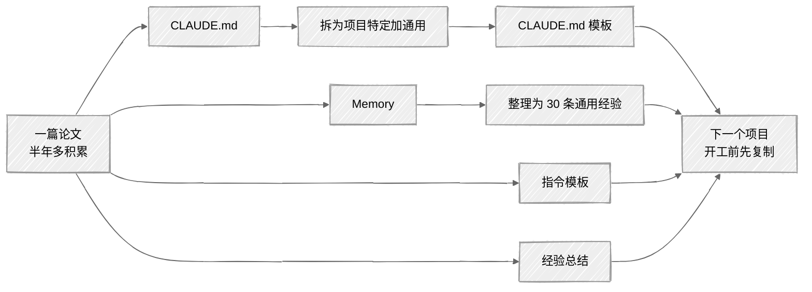

<ChapterAudience>

把 CLAUDE.md、Memory 与指令模板整理成可复用的个人知识库；提取通用规则做成项目模板,使每个新项目站在上一个的基础上；通过 Skill 系统与提示词模板实现跨项目复用；维护"经验总结"文件,用完整事件记录积累过的经验。

</ChapterAudience>

至此本书的主要内容讨论完毕。但完成本篇论文之后呢?若继续读博、或工作后仍需做研究,这些经验能否带到下一个项目?

本章讨论如何把一次性经验转化为可复用资产。

## 16.1 建立个人知识库

<GhAlert type="note">

**定义 16.1 — 个人知识库**

</GhAlert>

>
> 研究者使用 Claude Code 过程中积累的可复用资产,包括 CLAUDE.md、Memory、指令模板与具体经验记录。核心价值是使每个新项目不从零开始,而是建立在已有积累的基础上。

### CLAUDE.md:科研工作手册

CLAUDE.md 是越用越厚的文件。我从最初十几行扩展至一百多行,内容包括术语锁定表、格式规范、导师偏好、文件结构、常见错误的防线。该文件对下一个项目的价值在于:它记录了在一个完整项目中遇到的所有问题,下一个项目不必重新经历。

具体做法是:论文完成后把 CLAUDE.md 中的规则分为两类。

- **项目特定的**(某篇论文的术语表、特定文件结构):下一个项目用不上
- **通用的**("修改正文时保留所有引用编号"、"改前先确认方案"、"图表标题格式"):每个项目都用得上

把通用规则提取出来做成模板。下次新建项目先复制该模板,再补充项目特定内容。我的模板见附录 D。

### Memory:跨项目的经验传递

Memory 系统(第 2 章)用于跨会话记忆,也可用于跨项目经验。例如在论文 A 中发现"LaTeX 比 DOCX 稳定",存入 Memory,论文 B 项目时 Claude Code 仍保留该信息。

我的 Memory 当前约三十条经验:工具层面("使用 Draw.io 制图"、"DOCX 操作前必须备份")、写作层面("一段一个主题"、"句子不超过两行")、流程层面("一个 session 只做一件事"、"长任务设检查点")。

这三十条来自半年多、一千多次会话的累积。若使用者直接把这些核心写入自己的 Memory 与 CLAUDE.md,等同于继承了半年的经验积累。

### 项目模板

我论文的文件夹结构:`chapters/` 各章正文、`tables/` 表格、`figures/` 图、`references/` BibTeX 与 PDF。该结构在 CLAUDE.md 中有说明。下一个项目采用类似结构,CLAUDE.md 中的路径说明可直接复用。

整理这些大约需要两到三小时。但这两到三小时可为后续每个项目节省十几小时配置时间。

## 16.2 跨项目复用经验

### Skill 的复用

第 9 章讨论了 Skill 用法。Skill 是全局安装的,不绑定项目文件夹。写一次,后续任何论文均可调用,还可分享给师弟师妹。

我常用的 Skill 有三个:论文润色、引用核查、图表制作。覆盖了写作中大部分重复任务。附录 C 列出推荐清单。

### 提示词模板的复用

我的模板库有十几个,按任务分类:改章节、查引用、画图、润色摘要、检查一致性。存于文本文件,需要时打开复制填充。

模板维护原则是:每次发现不够用即更新,不要等积累一批问题后再集中改。每次小修一处,模板逐步顺手。附录 A 列出常用模板。

### 经验文档的整理

我维护一份"经验总结"文件。每次遇到值得记录的内容,用两分钟写下来:发生了什么、原因是什么、下次如何避免。

<GhAlert type="tip">

**经验总结需写完整事件**

</GhAlert>

>
> 不要只写结论("先备份再改"),要写完整事件("某次让它改 DOCX,它直接覆盖原文件,导师批注全部丢失。从此改 DOCX 前先备份")。有事件的经验易于记忆,无事件的结论过两天即遗忘。

### 团队层面的建议

若课题组内有多名学生使用 Claude Code,可维护一份公共 CLAUDE.md 模板与公共 Skill 库。每名学生发现的有用规则提交到公共库,新人拉取一次即继承整个组的积累。

我们组目前尚未做到这一步,但这是值得探索的方向。对每年有学生毕业的课题组,知识传承一直是问题。以往依赖"师兄带师弟"口头传授,容易遗漏;固化到 CLAUDE.md 与 Skill 中即有了具体载体。

## 16.3 展望

AI 辅助科研写作在本书写作的 2026 年春天仍处早期阶段。工具迭代较快,Claude Code 半年内已更新多次,加入了并行 Agent、Hooks、更多 MCP 工具。

几个值得关注的方向:

- **上下文窗口持续扩大**:可同时处理整个项目的所有文件加所有参考文献,跨文件一致性检查更准
- **工具集成更深入**:调用 Zotero、学术数据库、绘图工具不再需要额外配置
- **多人协作场景**:支持团队共享 CLAUDE.md、Skill、Memory,课题组积累更便于传承

<GhAlert type="important">

**无论工具如何变化,以下不会变**

</GhAlert>

>
> 研究问题需自行思考,数据需自行运行,结论需自行确定,学术诚信的底线不能突破。工具越强大,使用者越需明确自己在做什么、为什么这么做。
>
> 导师在我答辩前说过一句话:"工具是手段,把研究成果写清楚、讲明白,才是目的。"该句话写在本书的前言中,在此重复一次作为结尾。

希望本书的经验能为你的论文写作提供参考。

## 本章小结

| 核心概念 | 核心内容 | 常见误解 | 为什么错 |
|:--|:--|:--|:--|
| 个人知识库 | CLAUDE.md、Memory、模板、经验四项 | 论文交完即归档 | 下一个项目从零开始等于浪费半年积累 |
| CLAUDE.md 模板 | 通用规则提取后复用 | 每个项目从头写 | 通用规则占大头,复用可节省十几小时 |
| 经验总结 | 写完整事件而非仅结论 | 一句话原则即够 | 无事件的原则过两天即遗忘 |
| Skill 跨项目 | 全局安装一次后随处可用 | 绑定在项目文件夹 | Skill 在 `~/.claude/skills/`,所有项目均可调用 |
| 团队公共库 | 课题组维护共享配置 | 各自积累 | 知识传承依靠口耳相传易丢失 |
| 工具变化中的常量 | 学术诚信与自行思考 | 工具好即可全部交付 | 研究问题、数据、结论只能由使用者完成 |

---

附录提供六份可直接使用的清单:常用提示词模板(附录 A)、快捷键速查(附录 B)、推荐 Skill 列表(附录 C)、CLAUDE.md 模板(附录 D)、常见错误速查(附录 E)、paper-to-beamer 实战(附录 F)。

---

[← 第 15 章 · 科研 Skill 的设计纪律](chap15.md) &nbsp;·&nbsp; [返回目录](../README.md) &nbsp;·&nbsp; [附录 A · 常用提示词模板 →](appendix-a.md)

